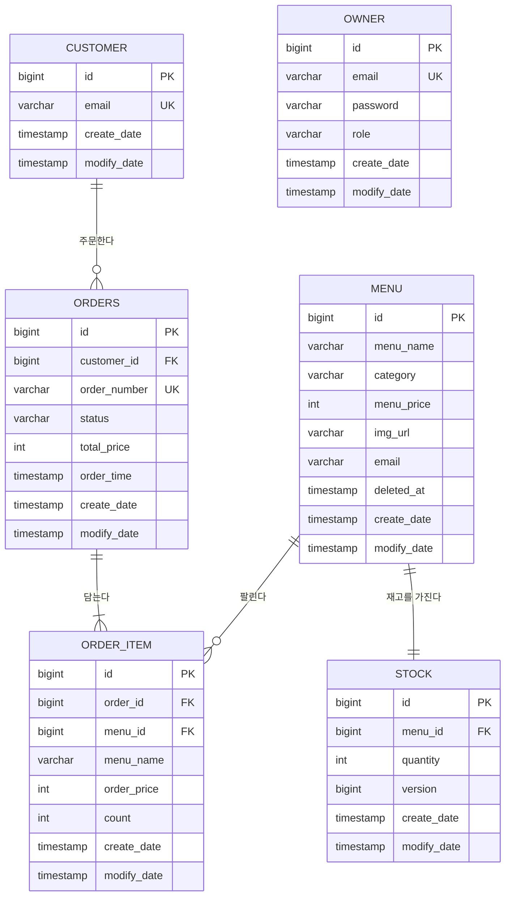

# cafe-kiosk ERD

최초 작성 2026-07-23

이 문서는 완성된 cafe-kiosk가 데이터를 어떤 모양으로 앉히는지를 담는다. 테이블과 컬럼과 제약, 그리고 그렇게 정한 이유가 여기 있다.

## 1. 개요

이 문서는 완성 기준 스키마만 적는다. 지금 코드가 목표에 못 미치는 지점은 `docs/REQUIREMENTS.md` 10절이 이미 소유하고 있으므로 여기서 되풀이하지 않는다. 요구사항의 근거는 `docs/REQUIREMENTS.md`가, HTTP 계약은 `docs/API.md`가, 제품의 방향은 `docs/IDEA.md`가 소유한다. 이 문서가 소유하는 것은 스키마의 모양과 그 판단의 근거뿐이다.

대상 DB는 PostgreSQL 16이다. 스키마는 Phase 3까지 JPA의 `ddl-auto`가 엔티티에서 만들고, Phase 4에서 Flyway로 옮긴다. NFR-OPS-01. 그때 첫 마이그레이션 스크립트가 담아야 할 것이 이 문서의 3절과 5절이다.

테이블은 여섯이다. owner, customer, menu, stock, orders, order_item.

## 2. 전체 ERD

owner에는 관계선이 없다. 점주 계정은 어떤 테이블과도 외래키로 이어지지 않는다. 메뉴를 등록한 사람은 `menu.email`에 문자열로 기록되지만 그것은 참조가 아니라 기록이다. 이유는 3-3에서 적는다. 관계를 실제보다 촘촘해 보이게 그리면 나중에 그 선을 믿고 조인을 짜는 사람이 생긴다. 그래서 없는 선은 그리지 않는다.

## 3. 테이블별 상세

모든 테이블은 `global/jpa/entity/BaseEntity`를 상속한다. 그래서 id, create_date, modify_date 셋을 공통으로 가진다. id는 bigint이고 DB가 IDENTITY로 채번한다. create_date와 modify_date는 JPA Auditing이 채운다. 아래 표에서 이 셋은 되풀이하지 않고 각 테이블 고유의 컬럼만 적는다.

### 3-1. owner, 점주 계정

| 컬럼 | 타입 | 제약 | 설명 |
| --- | --- | --- | --- |
| email | varchar(255) | NOT NULL, UNIQUE | 로그인 아이디 |
| password | varchar(60) 이상 | NOT NULL | BCrypt 해시 |
| role | varchar(20) | NOT NULL | ROLE_OWNER |

Phase 3에서 새로 생기는 테이블이다. FR-AUTH-01, FR-AUTH-02, FR-AUTH-03.

권한 테이블을 따로 쪼개지 않는다. 역할이 ROLE_OWNER 하나뿐이기 때문이다. FR-AUTH-07. 1인 매장을 기준으로 삼았고 바리스타와 점주를 하나로 묶었으므로, owner와 role을 잇는 중간 테이블은 지금 아무것도 표현하지 못한다. 역할이 둘 이상으로 늘어나는 날 쪼개면 된다. 그날이 오기 전에 미리 만든 조인 테이블은 조회를 한 번 더 하게 만들 뿐이다.

password 컬럼은 해시만 담는다. 평문을 넣는 경로를 두지 않는다. FR-AUTH-02. 길이를 60자 이상으로 잡는 것은 BCrypt 해시가 정확히 60자이기 때문이다. varchar(255)로 넉넉히 두면 알고리즘을 바꿔도 스키마를 건드리지 않는다.

role을 문자열로 저장한다. enum 순서값으로 저장하면 상수를 중간에 하나 끼워 넣는 순간 이미 저장된 행의 의미가 통째로 바뀐다. orders.status도 같은 이유로 문자열이다.

테이블 이름 owner는 PostgreSQL에서 비예약 키워드다. `ALTER TABLE ... OWNER TO`에 쓰이지만 식별자로 그대로 쓸 수 있다. 예약어인 order와는 처지가 다르다.

### 3-2. customer, 익명 주문 주체

| 컬럼 | 타입 | 제약 | 설명 |
| --- | --- | --- | --- |
| email | varchar(255) | NOT NULL, UNIQUE | 주문을 묶는 단위 |

customer는 회원이 아니다. 매장 키오스크 손님은 익명이어야 하므로 비밀번호도 역할도 없다. 이메일 하나만 있고, 그 이메일은 로그인 수단이 아니라 주문을 묶는 열쇠다. FR-KSK-01, FR-KSK-02. 회원가입과 마이페이지를 만들지 않는다는 결정이 이 테이블의 컬럼 수를 결정했다.

email 유니크 제약은 유지한다. 이 자리가 NFR-CON-06이 지목하는 곳이다. 같은 이메일로 첫 주문이 동시에 둘 들어오면 양쪽 다 조회에서 빈 결과를 받고 양쪽 다 INSERT를 시도해 한쪽이 유니크 위반으로 터진다. 그런데 제약을 푸는 것은 답이 아니다. 제약을 풀면 같은 손님이 행 여러 개로 쪼개지고 주문 묶음이 갈라진다. 이 충돌은 스키마가 아니라 서비스가 흡수해야 한다. 여기서 먼저 터지면 정작 증명하려던 재고 동시성이 그 예외에 가려진다. 마지막 한 잔을 두 손님이 눌렀는데 재고 로직에 닿기도 전에 customer INSERT에서 죽으면, 테스트가 무엇을 증명했는지 알 수 없게 된다.

### 3-3. menu

| 컬럼 | 타입 | 제약 | 설명 |
| --- | --- | --- | --- |
| menu_name | varchar(255) | NOT NULL | 메뉴 이름 |
| category | varchar(255) | NOT NULL | 분류 |
| menu_price | int | NOT NULL | 현재 판매가, 0 이상 10,000,000 이하 |
| img_url | varchar(255) | NULL 허용 | 호스트 없는 상대경로 |
| email | varchar(255) | NOT NULL | 등록자 기록 |
| deleted_at | timestamp | NULL 허용 | 판매 중단 시각, NULL이면 판매중 |

menu_price는 현재 판매가일 뿐 과거 주문 금액과 아무 관계가 없다. 과거 금액은 order_item이 스냅샷으로 들고 있다. 이 분리가 FR-MNU-05를 만든다. 가격 상한 10,000,000원은 FR-MNU-03이 요구하는 값인데 CHECK 제약으로 걸지 않는다. 상한은 정책이라 언제든 바뀌고, 바뀔 때마다 마이그레이션을 돌리게 만들 이유가 없다. 반면 5절에 적을 재고 음수 금지와 수량 양수는 정책이 아니라 불변식이라 DB에 새긴다. 정책은 코드에, 불변식은 스키마에 둔다.

img_url은 호스트를 붙이지 않은 상대경로다. FR-FILE-07. `http://localhost:8080`을 앞에 붙여 저장하면 그 문자열이 DB에 그대로 남아 배포 환경에서 이미지가 전부 깨진다. 서빙은 `global/config/WebConfig`의 `/uploads/**` 핸들러가 한다. NULL을 허용하는 것은 이미지 없는 메뉴를 등록할 수 있어야 하기 때문이다.

email은 등록자를 기록할 뿐 권한 판단에 쓰지 않는다. FR-MNU-06. 그래서 owner 테이블이 생겨도 이 컬럼을 외래키로 바꾸지 않는다. 참조 무결성을 거는 것은 그 값으로 무언가를 판단할 때 의미가 있는데, 인가는 서버가 검증한 신원에 근거하고 이 컬럼은 그 판단에서 완전히 빠진다. NFR-SEC-06. 값이 owner에 없는 이메일이어도 시스템은 아무 문제 없이 돌아간다. 그런 값에 외래키를 걸면 없는 규칙을 있는 것처럼 보이게 만든다.

deleted_at이 이 테이블에서 새로 생기는 컬럼이다. 메뉴를 하드 삭제하면 order_item과 stock이 그 행을 참조하고 있어 외래키 위반으로 삭제가 실패한다. 팔린 적 있는 메뉴는 영원히 지울 수 없다는 뜻이다. 그렇다고 참조를 끊고 지우면 과거 주문이 무엇을 팔았는지 알 수 없게 된다. 그래서 삭제를 행을 없애는 일이 아니라 판매를 중단하는 일로 다시 정의한다. 손님 화면의 메뉴 목록은 `deleted_at is null`인 행만 보고, 과거 주문은 삭제된 메뉴를 그대로 참조한다.

boolean이 아니라 nullable timestamp로 두는 이유는 둘이다. 언제 내렸는지가 함께 남고, 판매중 판정이 `deleted_at is null` 한 줄로 끝난다. boolean은 언제인지를 버리면서 컬럼 수는 똑같이 하나를 쓴다.

### 3-4. stock

| 컬럼 | 타입 | 제약 | 설명 |
| --- | --- | --- | --- |
| menu_id | bigint | NOT NULL, UNIQUE, FK menu.id | 대상 메뉴 |
| quantity | int | NOT NULL, CHECK quantity >= 0 | 현재 재고 수량 |
| version | bigint | NOT NULL, 기본값 0 | 낙관적 락 |

이 프로젝트의 목적지가 이 테이블 한 행 위에 있다. 마지막 한 잔을 두 손님이 동시에 누르는 순간에 벌어지는 일이 전부 여기서 벌어진다.

menu_id에 유니크를 거는 것으로 FR-STK-01의 1대1을 만든다. 별도 제약을 더 얹지 않아도 유니크 외래키 하나면 한 메뉴에 재고 행이 둘 생기는 경로가 사라진다. 반대 방향, 재고 행이 없는 메뉴가 생기는 경로도 막아야 한다. 그래서 메뉴 등록과 재고 행 생성은 한 트랜잭션에서 함께 일어난다. 재고 없는 메뉴는 팔 수 없는 메뉴이고, 손님 화면에서 담기 버튼을 눌렀을 때 무슨 일이 벌어져야 하는지 아무도 답할 수 없다.

재고를 menu 테이블의 컬럼으로 합치지 않고 테이블을 나눈 이유는 잠그는 대상을 좁히기 위해서다. 재고 차감은 행을 잠그는데, menu에 합쳐 두면 이름이나 가격을 고치는 일과 재고를 깎는 일이 같은 행을 두고 경쟁한다. 주문이 몰리는 동안 점주가 메뉴 이름을 못 고치는 상황은 만들 이유가 없다.

quantity에 `CHECK (quantity >= 0)`을 건다. 재고 증감 규칙은 Stock 엔티티가 소유하고 decrease가 부족하면 스스로 예외를 던진다. FR-STK-04. 그런데 FR-STK-06은 어떤 경로로도 재고가 음수가 되지 않는다고 적었다. 엔티티를 거치지 않는 경로는 언제나 생긴다. 벌크 UPDATE 쿼리, 네이티브 SQL, 운영자의 직접 조작이 그렇다. 그래서 방어를 두 겹으로 둔다. 엔티티가 1차이고 CHECK가 최후다. 이 제약이 걸리는 날은 락이 새는 날이고, 그 사실을 조용히 넘어가지 않고 예외로 드러내는 것이 이 프로젝트가 하려는 일이다.

version이 낙관적 락 컬럼이다. Phase 2에서 붙는다. 락 세 전략 중 낙관적 락에서만 쓰이지만 컬럼은 항상 존재해도 무해하다. `@Version`이 붙으면 모든 UPDATE에 version 조건이 따라붙는데, 비관적 락은 `SELECT FOR UPDATE`로 행 접근 자체를 직렬화하므로 버전 충돌이 애초에 일어나지 않는다. 분산 락도 마찬가지로 임계 구역이 하나뿐이라 충돌하지 않는다. 그래서 세 전략을 같은 스키마 위에서 갈아 끼우며 비교할 수 있다. 전략마다 스키마를 바꿔야 한다면 비교 자체가 공정하지 않다.

### 3-5. orders

| 컬럼 | 타입 | 제약 | 설명 |
| --- | --- | --- | --- |
| customer_id | bigint | NOT NULL, FK customer.id | 주문한 손님 |
| order_number | varchar(20) | UNIQUE, NULL 허용 | 대기번호 |
| status | varchar(20) | NOT NULL | 주문 상태 |
| total_price | int | NOT NULL | 아이템 소계의 합 |
| order_time | timestamp | NOT NULL | 주문 시각 |

테이블 이름이 order가 아니라 orders인 것은 ORDER가 SQL 예약어이기 때문이다. `ORDER BY`의 그 ORDER다. 따옴표로 감싸면 쓸 수는 있지만 그러면 모든 쿼리에서 계속 감싸야 한다.

이 테이블에서 가장 중요한 판단은 **order_number에 NOT NULL을 걸지 않는다**는 것이다. 대기번호는 주문 PK에서 파생한다. FR-ORD-07. 그런데 PK는 IDENTITY라 INSERT가 나가야 정해진다. 그래서 주문 생성은 반드시 두 걸음이다. 먼저 order_number가 비어 있는 채로 INSERT가 나가고, 채번된 PK로 번호를 만들어 UPDATE로 채운다. 근거는 `order/service/OrderService.java`의 save 직후 `assignOrderNumber` 호출이다. 여기에 NOT NULL을 걸면 첫 걸음의 INSERT가 제약 위반으로 죽는다. 주문 생성이 전부 실패한다는 뜻이다.

빠뜨리기 쉬운 함정이라 근거를 분명히 남긴다. FR-ORD-07과 NFR-DATA-03이 요구하는 것은 유일성이지 비어 있지 않음이 아니다. 유니크 제약만으로 요구사항은 전부 충족된다. 번호가 비어 있는 순간은 한 트랜잭션 안에서 두 문장 사이에만 존재하고, 커밋된 데이터에는 나타나지 않는다.

번호를 오늘 주문 수에 1을 더해 만드는 방식을 금지하는 것도 같은 절의 요구다. 세는 일과 넣는 일 사이에 다른 주문이 끼어들면 번호가 겹친다. 그건 이 프로젝트가 재고에서 의도적으로 다룰 문제이지 대기번호에서 실수로 만들 문제가 아니다.

customer_id는 NOT NULL이다. 손님 없는 주문은 성립하지 않는다. 익명 주문이라는 말은 로그인하지 않는다는 뜻이지 주문 주체가 없다는 뜻이 아니다.

status는 문자열로 저장한다. CONFIRMED, IN_PROGRESS, READY, COMPLETED, CANCELLED 다섯이다. FR-ORD-10. enum 순서값으로 저장하면 상수 사이에 하나를 끼워 넣는 순간 이미 저장된 모든 주문의 상태가 한 칸씩 밀려 다른 의미가 된다. PENDING은 예약 값이고 서버 흐름에서 진입하지 않으므로 이 컬럼에 저장되지 않는다.

total_price는 order_item 소계의 합이며 Order 엔티티의 addOrderItem으로만 늘어난다. FR-ORD-06. 서비스가 따로 더하는 경로를 두지 않는 이유는 total_price가 order_item과 어긋날 수 있는 길 자체를 없애기 위해서다. 합계를 컬럼으로 들고 있는 것은 중복이지만, 주방과 관리자 목록이 매번 아이템을 합산하지 않게 해 준다. 그 중복을 감수하는 대신 갱신 경로를 하나로 좁혔다.

order_time과 create_date는 값이 사실상 같다. 그래도 둘을 남긴다. create_date는 감사 정보라 프레임워크가 채우고, order_time은 도메인 값이라 주문이 언제 들어왔는지를 뜻한다. 주방 정렬이 읽는 것은 도메인 값 쪽이다. FR-KIT-02.

### 3-6. order_item

| 컬럼 | 타입 | 제약 | 설명 |
| --- | --- | --- | --- |
| order_id | bigint | NOT NULL, FK orders.id | 소속 주문 |
| menu_id | bigint | NOT NULL, FK menu.id | 팔린 메뉴 |
| menu_name | varchar(255) | NOT NULL | 주문 시점 이름 스냅샷 |
| order_price | int | NOT NULL | 주문 시점 가격 스냅샷 |
| count | int | NOT NULL, CHECK count > 0 | 수량 |

스냅샷이 둘이다. 가격과 이름이다.

가격 스냅샷은 FR-ORD-05가 이미 요구한 것이고 코드에도 있다. 이 값이 없으면 점주가 메뉴 가격을 올리는 순간 지난달 영수증 금액까지 함께 올라간다. 조회 시점에 `menu.menu_price`를 읽는 코드가 하나라도 있으면 그 순간 스냅샷은 무의미해지므로, 주문 조회 경로는 order_price만 읽는다.

이름 스냅샷은 새로 붙는다. 지금은 주문 내역을 보여줄 때 살아 있는 menu 행에서 이름을 읽는다. 근거는 `OrderService.toItemDTO`가 `orderItem.getMenu().getMenuName()`을 호출하는 것이다. 가격은 굳혀 놓고 이름은 그러지 않았으니 절반만 스냅샷인 셈이다. 메뉴 이름을 고치면 과거 주문의 품목명이 함께 바뀐다.

3-3의 소프트 삭제와 이 이름 스냅샷은 같은 목적의 두 겹이다. 하는 일은 서로 다르다. 소프트 삭제는 외래키를 영원히 유효하게 유지해 참조가 끊기지 않게 한다. 이름 스냅샷은 조회 경로가 애초에 menu 행을 읽지 않아도 되게 만든다. 앞의 것은 무결성을 지키고 뒤의 것은 결합을 끊는다. 둘 다 있으면 과거 주문은 메뉴 테이블에서 완전히 독립한다. 주문 내역 화면은 order_item만 읽고도 무엇이 얼마에 몇 개 팔렸는지 전부 말할 수 있다.

menu_id 외래키는 그래도 남긴다. 어떤 메뉴가 얼마나 팔렸는지 집계하려면 이름이 아니라 식별자로 묶어야 한다. 이름은 바뀌어도 id는 그대로다.

count에 `CHECK (count > 0)`을 건다. 0개짜리 주문 아이템은 어떤 경로로도 의미가 없다. 한 주문의 총 수량 1개 이상 100개 이하는 FR-KSK-07의 정책이라 애플리케이션이 검사한다. 여기 CHECK로 새기는 것은 아이템 하나의 수량이 양수여야 한다는 불변식뿐이다. 3-3에서 가격 상한을 CHECK로 걸지 않은 것과 같은 기준이다.

## 4. 관계와 카디널리티

| 관계 | 카디널리티 | 외래키 | 삭제 시 동작 |
| --- | --- | --- | --- |
| customer, orders | 1 대 N | orders.customer_id | 손님 삭제 경로를 두지 않는다 |
| orders, order_item | 1 대 N | order_item.order_id | 주문 삭제 경로를 두지 않는다. 취소는 삭제가 아니라 상태 전이다 |
| menu, order_item | 1 대 N | order_item.menu_id | 메뉴는 소프트 삭제라 참조가 끊기지 않는다 |
| menu, stock | 1 대 1 | stock.menu_id, 유니크 | 메뉴가 사라지지 않으므로 재고 행도 남는다 |
| owner, 나머지 | 없음 | 없음 | 관계 없음 |

**cascade delete를 어디에도 걸지 않는다.** 이 스키마에는 행을 지우는 흐름이 사실상 없기 때문이다. 메뉴는 소프트 삭제로 바뀌었고, 주문 취소는 CANCELLED 상태 전이이지 행 삭제가 아니며, 손님과 주문을 지우는 경로는 제품에 두지 않는다. 지우는 일이 없으면 연쇄 삭제도 필요 없다. 연쇄 삭제는 한 번 걸어 두면 나중에 실수로 부른 삭제 한 줄이 어디까지 번지는지 읽는 사람이 알기 어려워진다.

orders와 order_item은 1 대 1 이상이다. 아이템 없는 주문은 만들지 않는다. 총액이 아이템 소계의 합이라는 FR-ORD-06이 아이템 0개인 주문에서는 총액 0원짜리 빈 주문을 뜻하게 되는데, 그런 주문은 대기번호를 받을 이유가 없다. 이건 DB 제약으로 표현할 수 없고 주문 생성 경로가 지킨다.

menu와 stock은 재고 쪽에서만 참조한다. 단방향이다. 메뉴가 자기 재고를 알 필요가 없기 때문이다. 메뉴 목록에 남은 재고를 함께 내려주는 것은 FR-KSK-08의 요구지만, 그건 조회할 때 조인하면 되는 일이지 엔티티가 서로를 들고 있어야 할 이유가 아니다. 양방향으로 두면 메뉴를 읽을 때마다 재고 행이 따라 올라올 여지가 생긴다.

## 5. 제약과 인덱스

### 유니크 제약

| 대상 | 이유 |
| --- | --- |
| owner.email | 로그인 아이디의 유일성 |
| customer.email | 한 손님이 행 여럿으로 쪼개지지 않게 한다. NFR-CON-06의 자리 |
| menu_id, stock 테이블 | 메뉴 하나에 재고 하나. FR-STK-01 |
| orders.order_number | 대기번호 유일. FR-ORD-07, NFR-DATA-03 |

### CHECK 제약

| 대상 | 조건 | 이유 |
| --- | --- | --- |
| stock.quantity | quantity >= 0 | 어떤 경로로도 재고가 음수가 되지 않는다. FR-STK-06, NFR-DATA-04 |
| order_item.count | count > 0 | 0개짜리 아이템은 의미가 없다 |

CHECK로 새기는 것과 코드가 검사하는 것을 가르는 기준은 하나다. 불변식은 스키마에, 정책은 코드에 둔다. 메뉴 가격 상한 10,000,000원과 주문 총 수량 100개는 언제든 바뀔 수 있는 정책이라 코드가 검사한다. 재고 음수 금지는 값이 바뀌는 종류의 규칙이 아니다.

### 인덱스

추측으로 늘리지 않는다. 아래는 지금 리포지토리가 실제로 던지는 쿼리에서 역산한 것이다.

| 인덱스 | 근거 |
| --- | --- |
| orders(status, order_time) | `OrderRepository.findByStatusOrderByOrderTimeAsc`. 주방 목록의 상태 필터와 FIFO 정렬. FR-KIT-02, FR-KIT-03 |
| orders(order_time) | `OrderRepository.findAllByOrderByOrderTimeAsc`. 필터 없는 전체 목록 |
| order_item(order_id) | 주문별 아이템 조회. 목록 화면이 주문마다 아이템을 읽는다 |
| order_item(menu_id) | 메뉴별 판매 집계와 외래키 검사 |
| menu(deleted_at) | 판매중 메뉴만 거르는 목록 조회 |

유니크 제약이 걸린 컬럼은 인덱스가 따라오므로 따로 적지 않았다. customer.email, stock.menu_id, orders.order_number가 그렇다. stock 조회는 `findByMenuId` 하나뿐이고 그 컬럼에 이미 유니크 인덱스가 있다.

menu(deleted_at)은 값이 대부분 NULL이라 일반 인덱스의 효용이 낮다. 판매중 메뉴만 읽는 것이 목적이므로 `WHERE deleted_at IS NULL` 부분 인덱스가 더 맞다. 다만 메뉴 수가 수십 개 수준이면 인덱스 없이 전체를 훑는 편이 빠르다. Flyway로 옮기는 Phase 4에서 실제 행 수를 보고 정한다. 이 항목은 지금 확정하지 않는다.

## 6. 동시성이 스키마에 남기는 것

Phase 2에서 락 세 전략을 차례로 붙이고 같은 동시성 테스트에 건다. NFR-CON-03. 각 전략이 스키마에 무엇을 요구하는지는 서로 다르다.

| 전략 | 스키마 요구 | 실제로 무엇이 지키나 |
| --- | --- | --- |
| 비관적 락 | 없음 | 조회 시점의 `SELECT FOR UPDATE`. DB가 행을 직렬화한다 |
| 낙관적 락 | stock.version | UPDATE의 version 조건. 충돌하면 예외가 나고 새 트랜잭션에서 재시도한다 |
| 분산 락 | 없음 | Redis의 키. 스키마 밖에 산다 |

세 전략 중 스키마를 요구하는 것은 낙관적 락 하나뿐이고, 그것도 컬럼 한 개다. 나머지 둘은 같은 테이블 위에서 접근 방식만 바꾼다. 그래서 셋을 갈아 끼우며 성공 건수와 재시도 횟수를 비교할 수 있다. NFR-CON-07.

스키마가 지키지 못하고 코드 규율이 지켜야 하는 것이 둘 있다. 문서에 남겨 두지 않으면 잊히는 종류다.

첫째는 데드락 회피다. NFR-CON-04. 여러 메뉴를 반대 순서로 주문하면 두 트랜잭션이 서로가 쥔 행을 기다린다. 손님 A가 1번과 3번을, 손님 B가 3번과 1번을 담으면 그렇다. 해법은 menu_id 오름차순으로 락을 잡아 접근 순서를 고정하는 것이다. 이건 컬럼으로 표현할 수 없고 재고를 잠그는 코드가 지켜야 한다.

둘째는 낙관적 락 재시도의 위치다. NFR-CON-05. 충돌로 롤백된 트랜잭션 안에서 재시도하면 그 트랜잭션은 이미 죽어 있어 아무것도 되지 않는다. 재시도는 롤백된 트랜잭션 밖 새 트랜잭션에서 이뤄져야 하고, 그러려면 컨트롤러에 `@Transactional`이 없어야 한다. 지금 `OrderController`에는 붙어 있다. Phase 1에서 걷어낸다.

재고 이력 테이블은 만들지 않는다. FR-STK-07. 락 세 전략을 비교하는 데 필요한 것은 이력 테이블이 아니라 성공 건수와 재시도 횟수를 세는 테스트다. 이력 테이블을 만들면 재고 차감마다 INSERT가 하나 더 붙어 측정하려던 경쟁 구간 자체가 달라진다.

## 7. 만들지 않는 테이블과 이유

안 만드는 이유를 남기는 것도 설계다.

| 테이블 | 이유 |
| --- | --- |
| cart | 장바구니는 브라우저 안에만 존재한다. 서버에 미제출 상태를 두지 않는다. FR-ORD-10 |
| payment | 결제를 모킹한다. 주문 생성이 곧 결제까지 끝난 CONFIRMED다. C-03 |
| stock_history | 현재 수량만 들고 있는다. 의도한 비요구사항이다. FR-STK-07 |
| refresh_token | Access 토큰 하나로 충분하다. FR-AUTH-10 |
| role, authority | 역할이 ROLE_OWNER 하나뿐이다. FR-AUTH-07 |
| uploaded_file | 업로드한 파일을 삭제하지 않으므로 관리할 대상이 없다. 경로는 menu.img_url 문자열이다. FR-FILE-08 |

## 8. 요구사항 추적

스키마 결정과 요구사항 번호를 잇는다. `docs/REQUIREMENTS.md`를 고칠 때 어느 테이블이 함께 흔들리는지 역으로 찾기 위한 표다.

| 요구사항 | 스키마에서 대응하는 것 |
| --- | --- |
| FR-KSK-02 | customer.email 하나뿐, 주소와 우편번호 컬럼 없음 |
| FR-KSK-08 | menu와 stock 조인으로 남은 재고와 품절 판정 |
| FR-ORD-01, FR-ORD-10 | orders.status 문자열 다섯 값 |
| FR-ORD-05 | order_item.order_price |
| FR-ORD-06 | orders.total_price |
| FR-ORD-07, NFR-DATA-03 | orders.order_number 유니크, NOT NULL 아님 |
| FR-MNU-05 | order_item.order_price가 menu.menu_price와 분리 |
| FR-MNU-06 | menu.email이 외래키가 아님 |
| FR-STK-01 | stock.menu_id 유니크 외래키 |
| FR-STK-06, NFR-DATA-04 | stock.quantity CHECK 제약 |
| FR-STK-07 | 재고 이력 테이블 없음 |
| FR-AUTH-01, FR-AUTH-02 | owner.email, owner.password 해시 |
| FR-AUTH-07 | owner.role 단일 컬럼, 권한 테이블 없음 |
| FR-AUTH-10 | refresh_token 테이블 없음 |
| FR-KIT-02, FR-KIT-03 | orders(status, order_time) 인덱스 |
| FR-FILE-07 | menu.img_url 상대경로 |
| NFR-CON-03 | stock.version |
| NFR-CON-06 | customer.email 유니크 유지 |
| C-03 | payment 테이블 없음 |
