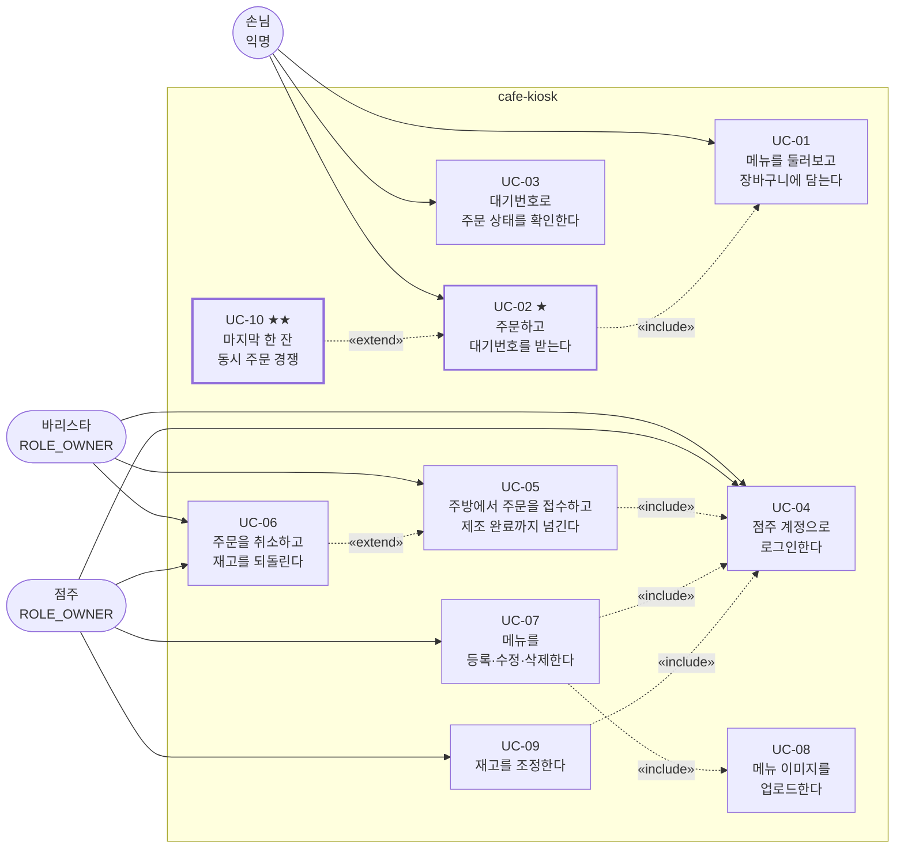
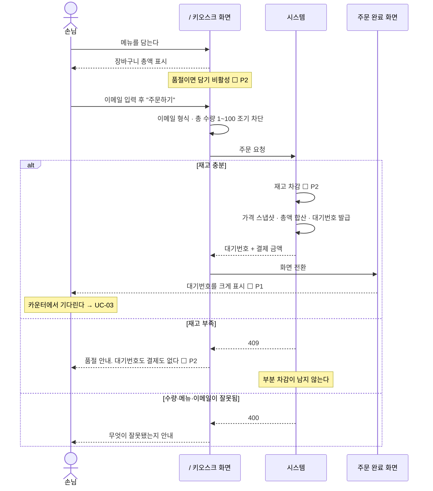
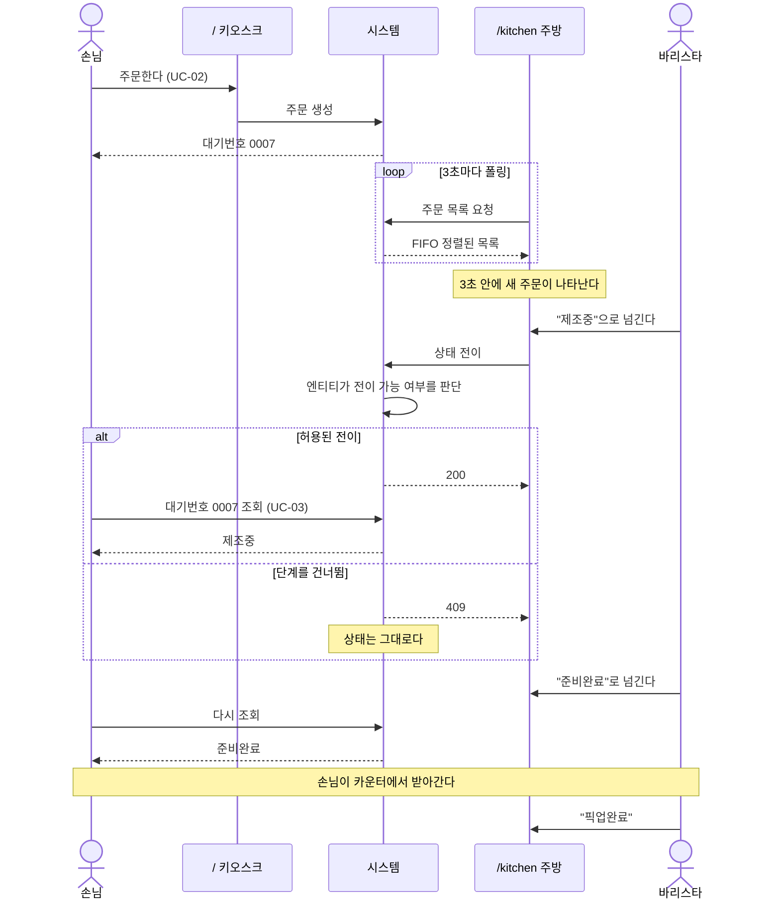
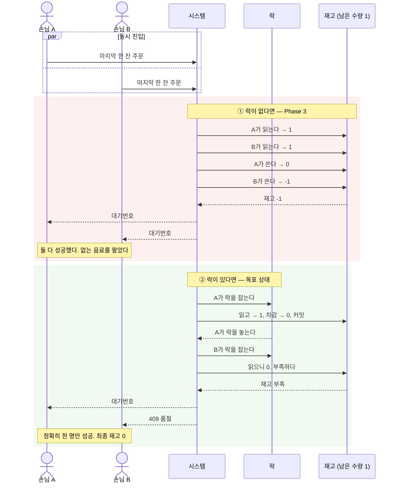

# cafe-kiosk 유스케이스 명세서

> 이 문서는 **"누가 어떤 순서로 시스템과 주고받는가"**를 담는다 — 액터의 목표 단위 흐름과 그 분기.
> **"왜"**는 [`PRODUCT.md`](PRODUCT.md), **"무엇을 만족해야 하나"**는 [`REQUIREMENTS.md`](REQUIREMENTS.md), **"언제·지금 어디"**는 [`ROADMAP.md`](ROADMAP.md), **"어떻게 조립돼 있는가"**는 [`design/architecture.md`](design/architecture.md)에 있다.
>
> 기준: 목표 상태(Phase 4 완료 시점) / 최초 작성: 2026-07-22

---

## 1. 이 문서의 역할

이 레포에는 이미 요구사항 목록도, 인수 기준도, 시퀀스 다이어그램도 있다. 그런데 **액터의 여정을 처음부터 끝까지, 분기까지 포함해 소유하는 문서는 없었다.**

| 있는 것 | 왜 부족했나 |
| --- | --- |
| `REQUIREMENTS.md §6`의 인수 기준 14개 | **검증용 단발 시나리오**다. "재고 부족이면 409"는 있지만, 그때 손님이 화면에서 무엇을 보고 그다음 무엇을 하는지가 없다 |
| `design/architecture.md §6`의 시퀀스 | **클래스 사이의 화살표**다. `OrderController → OrderService → DB`이지 손님의 여정이 아니다 |
| `roadmap/phase-*.md` | **작업 단위**다. PR 목록이지 흐름이 아니다 |

그래서 이런 질문에 답할 곳이 없었다 — *바리스타가 이미 제조를 시작한 주문을 취소할 수 있는가.* *점주가 이미지만 올리고 메뉴 등록을 안 하면 그 파일은 어떻게 되는가.* *동시 경쟁에서 진 손님의 화면에는 무엇이 뜨는가.* 개별 요구사항은 다 있는데 **분기가 이어붙지 않았다.**

### 소유 경계

**같은 내용을 두 곳에 적지 않는다** — 중복되면 둘 다 썩는다.

| 이 문서가 **소유**하는 것 | 이 문서가 **참조만** 하는 것 (정본은 딴 데) |
| --- | --- |
| 액터의 단계별 상호작용 순서 | 요구사항 진술 그 자체 → [`REQUIREMENTS.md §5`](REQUIREMENTS.md#5-기능-요구사항) |
| 대안 흐름 · 예외 흐름의 분기 조건 | 엔드포인트 목록 · 권한 매트릭스 → [`REQUIREMENTS.md §9`](REQUIREMENTS.md#9-인터페이스-요구사항) |
| 사전조건 · 사후조건 | 클래스 · 계층 구조 → [`architecture.md §5`](design/architecture.md) |
| 유스케이스 → 요구사항 추적 | 진행 상태 · PR 단위 → [`ROADMAP.md`](ROADMAP.md) |

**요구사항 문장을 옮겨 적지 않는다.** 각 단계 옆에는 ID만 단다. 코드 참조는 기존 규약대로 **파일 경로 + 메서드명까지만, 줄 번호 없이** 적는다.

**진행 상태의 정본은 여전히 ROADMAP이다.** 이 문서의 ✅/🔶/⬜ 표기는 작성 시점의 스냅샷이며, 둘이 어긋나면 ROADMAP과 실제 코드를 따른다. 이 문서가 소유하는 것은 **흐름 그 자체**이지 그 구현 여부가 아니다.

---

## 2. 표기 규약

**ID 체계** — `UC-{번호}`. 흐름 안의 분기는 `A{n}`(대안), `E{n}`(예외)로 매긴다.

**번호는 재사용하지 않는다.** 폐기된 유스케이스는 번호를 비우지 말고 "폐기" 행으로 남긴다 — REQUIREMENTS와 같은 규칙이다.

| 표기 | 뜻 |
| --- | --- |
| ✅ | 지금 코드에서 그대로 된다 |
| 🔶 | 일부만 된다. 무엇이 빠졌는지 해당 행에 적는다 |
| ⬜ `P{n}` | 아직 안 된다. `P2` = Phase 2에서 생긴다 |
| ★ | 이 레포의 주제와 직결된 유스케이스 |

**액터는 [`REQUIREMENTS.md §3`](REQUIREMENTS.md#3-액터와-시스템-경계)의 셋을 그대로 쓴다.**

| 액터 | 인증 | 화면 |
| --- | --- | --- |
| **손님** | 없음 — 익명 | `/` 키오스크 |
| **바리스타** | `ROLE_OWNER` | `/kitchen` 주방 |
| **점주** | `ROLE_OWNER` | `/admin` 관리자 |

바리스타와 점주는 **제품상 다른 역할이지만 인증상 하나**다. 1인 매장 기준의 의도된 단순화이며 근거는 [`roadmap/phase-1.md`](roadmap/phase-1.md)의 소유권 모델에 있다.

---

## 3. 유스케이스 다이어그램

**점선은 UML 관계다.** `«include»`는 항상 포함되는 필수 하위 흐름, `«extend»`는 특정 조건에서만 끼어드는 확장이다. UC-10이 UC-02의 확장인 것이 이 다이어그램의 핵심 — **동시성은 별개 기능이 아니라 주문 흐름이 경쟁 조건에 놓였을 때의 얼굴**이다.

### 목록

| ID | 유스케이스 | 액터 | 우선 | 현재 | 완성 Phase |
| --- | --- | --- | --- | --- | --- |
| [UC-01](#uc-01--메뉴를-둘러보고-장바구니에-담는다) | 메뉴를 둘러보고 장바구니에 담는다 | 손님 | 필수 | 🔶 | 2 |
| [UC-02](#uc-02--주문하고-대기번호를-받는다-) ★ | 주문하고 대기번호를 받는다 | 손님 | 필수 | 🔶 | 2 |
| [UC-03](#uc-03--대기번호로-자기-주문-상태를-확인한다) | 대기번호로 자기 주문 상태를 확인한다 | 손님 | 필수 | ⬜ | 1 |
| [UC-04](#uc-04--점주-계정으로-로그인한다) | 점주 계정으로 로그인한다 | 점주 · 바리스타 | 필수 | ⬜ | 1 |
| [UC-05](#uc-05--주방에서-주문을-접수하고-제조-완료까지-넘긴다) | 주방에서 주문을 접수하고 제조 완료까지 넘긴다 | 바리스타 | 필수 | 🔶 | 1 |
| [UC-06](#uc-06--주문을-취소하고-재고를-되돌린다) | 주문을 취소하고 재고를 되돌린다 | 바리스타 · 점주 | 필수 | 🔶 | 2 |
| [UC-07](#uc-07--메뉴를-등록수정삭제한다) | 메뉴를 등록·수정·삭제한다 | 점주 | 필수 | 🔶 | 1 |
| [UC-08](#uc-08--메뉴-이미지를-업로드한다) | 메뉴 이미지를 업로드한다 | 점주 | 필수 | 🔶 | 1 |
| [UC-09](#uc-09--재고를-조정한다) | 재고를 조정한다 | 점주 | 필수 | ⬜ | 2 |
| [UC-10](#uc-10--마지막-한-잔--동시-주문-경쟁-) ★★ | 마지막 한 잔 — 동시 주문 경쟁 | 손님 다수 | 필수 | ⬜ | 3 |

---

## 4. 유스케이스 명세

### UC-01 · 메뉴를 둘러보고 장바구니에 담는다

| 항목 | 내용 |
| --- | --- |
| **액터** | 손님 — 익명 |
| **목표** | 파는 것과 값을 보고, 살 것을 고른다 |
| **사전조건** | 키오스크 화면이 떠 있다. 로그인 상태는 요구하지 않는다 |
| **트리거** | 손님이 키오스크 앞에 선다 |
| **성공 사후조건** | 장바구니에 1개 이상 담겨 있고 총액이 화면에 보인다. 서버 상태는 아무것도 바뀌지 않는다 |
| **실패 사후조건** | 없음 — 조회와 장바구니는 브라우저 안에서만 일어난다 |
| **관련 요구사항** | FR-MNU-01 · FR-KSK-05 · FR-KSK-08 · FR-KSK-10 · FR-STK-07 · NFR-UX-02 |

**주 흐름**

| # | 주체 | 단계 | 상태 |
| --- | --- | --- | --- |
| 1 | 손님 | 키오스크 화면을 연다 | ✅ |
| 2 | 시스템 | 등록된 메뉴 전체를 이름·가격·카테고리·이미지와 함께 보여준다 — 인증을 요구하지 않는다 | ✅ FR-MNU-01 |
| 3 | 시스템 | 메뉴마다 **남은 재고와 품절 여부**를 함께 표시한다 | ⬜ `P2` FR-STK-07 |
| 4 | 손님 | 메뉴를 골라 수량과 함께 장바구니에 담는다 | ✅ |
| 5 | 시스템 | 장바구니 소계와 총액을 즉시 갱신한다 | ✅ |

**대안 흐름**

| # | 조건 | 결과 |
| --- | --- | --- |
| A1 | 손님이 담은 항목의 수량을 바꾸거나 뺀다 | 총액이 다시 계산된다. 서버 왕복 없음 ✅ |
| A2 | 등록된 메뉴가 하나도 없다 | 빈 목록을 보여준다. 오류가 아니다 ✅ |
| A3 | 손님이 아무것도 담지 않고 떠난다 | 아무 일도 일어나지 않는다. 장바구니는 서버에 저장되지 않는다 ✅ |

**예외 흐름**

| # | 조건 | 결과 | 근거 |
| --- | --- | --- | --- |
| E1 | 백엔드가 떠 있지 않다 | 메뉴를 못 불러왔다는 안내를 띄운다. 현재는 `alert`다 | 🔶 `frontend/src/app/page.tsx` |
| E2 | 담으려는 메뉴가 품절이다 | 담기 버튼이 비활성이고 품절 배지가 보인다 | ⬜ `P2` FR-KSK-08 |
| E3 | 총 수량이 100개를 넘도록 담는다 | 담기 단계에서 막고 안내한다 — 서버 왕복 전에 차단한다 | ✅ FR-KSK-07 |

> **⚠️ 지금 이 화면에는 손님이 봐선 안 될 것이 섞여 있다.** 메뉴 추가·수정·삭제 버튼이 손님용 상품 목록에 그대로 노출돼 있다. 화면 3분할(Phase 1)로 청산한다 — FR-KSK-05, FR-ADM-03.

---

### UC-02 · 주문하고 대기번호를 받는다  ★

**이 레포의 중심 유스케이스다.** UC-10은 이 흐름이 경쟁 조건에 놓였을 때의 확장이다.

| 항목 | 내용 |
| --- | --- |
| **액터** | 손님 — 익명. **로그인을 요구하면 제품 실패로 간주한다** |
| **목표** | 고른 메뉴를 결제하고, 카운터에서 음료를 받을 대기번호를 얻는다 |
| **사전조건** | 장바구니에 1개 이상 담겨 있다. 총 수량 1~100 |
| **트리거** | 손님이 "주문하기"를 누른다 |
| **성공 사후조건** | 주문이 `CONFIRMED`로 존재하고 · 대기번호가 발급됐고 · 재고가 주문 수량만큼 줄었고 · `총액 = Σ(스냅샷 가격 × 수량)`이다 |
| **실패 사후조건** | **주문도 재고 차감도 남지 않는다.** 부분 차감은 금지다 |
| **관련 요구사항** | FR-KSK-01 · FR-KSK-02 · FR-KSK-03 · FR-KSK-04 · FR-KSK-07 · FR-ORD-05 · FR-ORD-06 · FR-ORD-07 · FR-ORD-10 · FR-ORD-12 · FR-STK-02 · FR-STK-03 · NFR-DATA-02 · NFR-DATA-03 |
| **인수 기준** | AC-02 · AC-04 · AC-05 · AC-06 |

**주 흐름**

| # | 주체 | 단계 | 상태 |
| --- | --- | --- | --- |
| 1 | 손님 | 이메일을 입력한다 — **요구하는 정보는 이것 하나뿐이다.** 주소도 우편번호도 받지 않는다 | ✅ FR-KSK-02 |
| 2 | 손님 | "주문하기"를 누른다 | ✅ |
| 3 | 시스템 | BFF가 이메일 형식과 총 수량 1~100을 조기 차단한다 — UX용이며 정본은 백엔드다 | ✅ FR-KSK-07 |
| 4 | 시스템 | 결제를 처리한다. **실결제는 영구 스코프아웃이므로 성공을 가정한다** | ✅ C-03 |
| 5 | 시스템 | 이메일로 주문 주체를 찾고, 없으면 만든다 — 회원가입이 아니라 익명 주문 주체다 | ✅ |
| 6 | 시스템 | 주문을 `CONFIRMED` 상태로 만든다. 결제까지 끝난 상태라는 뜻이다 | ✅ FR-ORD-01 |
| 7 | 시스템 | **`menuId` 오름차순으로 정렬한 뒤** 아이템마다 재고를 차감한다 — 정렬은 데드락 회피용이다 | ⬜ `P2` FR-STK-02 |
| 8 | 시스템 | 아이템마다 **그 시점의 메뉴 가격을 스냅샷**해 붙인다. 나중에 메뉴 값이 바뀌어도 이 주문 금액은 안 변한다 | ✅ FR-ORD-05 |
| 9 | 시스템 | 아이템을 주문에 더하면서 총액을 누적한다. 총액이 늘어나는 경로는 여기 하나뿐이다 | ✅ FR-ORD-06 |
| 10 | 시스템 | **PK 채번 이후** 대기번호를 발급한다. 전역 유일하고 단조 증가한다 | ✅ FR-ORD-07 |
| 11 | 시스템 | 한 트랜잭션으로 커밋한다 — 주문 · 아이템 · 재고 차감이 전부 되거나 전부 안 된다 | 🔶 `P2` NFR-DATA-02 |
| 12 | 시스템 | 대기번호와 결제 금액을 응답한다 | ✅ FR-KSK-03 |
| 13 | 시스템 | **전용 완료 화면에 대기번호를 크게** 띄운다 | ⬜ `P1` FR-KSK-04 |
| 14 | 손님 | 대기번호를 확인하고 카운터에서 기다린다 | — |

> **7·8·9·10단계의 소유자는 서비스가 아니라 엔티티다.** 재고 차감은 `Stock`이, 가격 스냅샷은 `OrderItem` 생성자가, 총액 합산은 `Order.addOrderItem`이, 대기번호는 `Order.assignOrderNumber`가 소유한다. 서비스가 `totalPrice += price * count`를 계산하거나 `if (quantity < count)`를 검사하는 순간 이 설계가 무너진다 — NFR-DATA-01.

**대안 흐름**

| # | 조건 | 결과 |
| --- | --- | --- |
| A1 | 그 이메일로 주문한 적이 있다 | 기존 주문 주체를 재사용한다. 새로 만들지 않는다 ✅ |
| A2 | 한 주문에 여러 메뉴가 담겼다 | 아이템마다 스냅샷과 차감이 반복된다. 총액은 소계의 합이다 ✅ |
| A3 | 같은 메뉴를 여러 개 담았다 | 아이템 하나에 수량으로 실린다. 소계 = 스냅샷 가격 × 수량 ✅ |

**예외 흐름**

| # | 조건 | 결과 | 근거 |
| --- | --- | --- | --- |
| E1 | 이메일 형식이 틀렸다 | **400.** 주문이 생기지 않는다 | ✅ FR-KSK-02 |
| E2 | 총 수량이 0 이하이거나 100을 넘는다 | **400.** 대기번호도 금액도 없는 거절 응답이다 | ✅ FR-KSK-07 / AC-05 |
| E3 | 존재하지 않는 메뉴 ID가 섞여 있다 | **400.** 주문 전체가 성립하지 않는다 | ✅ FR-ORD-10 |
| E4 | **재고가 모자란다** | **409.** 주문 전체가 실패하고 **앞서 차감한 다른 메뉴도 롤백된다** | ⬜ `P2` FR-STK-03 / AC-06 |
| E5 | 아이템 5개 중 3번째에서 재고가 모자란다 | 앞의 2개 차감도 되돌아간다. **부분 차감이 남으면 이 유스케이스는 실패한 것이다** | ⬜ `P2` FR-ORD-12 |
| E6 | **마지막 한 잔을 두 손님이 동시에 눌렀다** | → [UC-10](#uc-10--마지막-한-잔--동시-주문-경쟁-) | ⬜ `P3` NFR-CON-01 |
| E7 | 등록된 적 없는 같은 이메일로 동시에 여러 건이 들어온다 | 주문 주체 유니크 제약 위반으로 **500이 나면 안 된다.** 재고에 닿기도 전에 막히는 함정이다 | ⬜ `P3` NFR-CON-06 / AC-11 |
| E8 | 백엔드가 응답하지 않는다 | BFF가 오류 메시지를 `{ message }` 형태로 정규화해 내려준다 | ✅ NFR-UX-03 |

---

### UC-03 · 대기번호로 자기 주문 상태를 확인한다

| 항목 | 내용 |
| --- | --- |
| **액터** | 손님 — 익명 |
| **목표** | 내 음료가 지금 어디까지 왔는지 본다 |
| **사전조건** | 손님이 대기번호를 갖고 있다 |
| **트리거** | 손님이 조회 화면에 대기번호를 넣는다 |
| **성공 사후조건** | 자기 주문의 상태 · 금액 · 아이템이 보인다. **서버 상태는 바뀌지 않는다** |
| **실패 사후조건** | 없음 |
| **관련 요구사항** | FR-KSK-06 · FR-KSK-09 · FR-ORD-08 · FR-ORD-09 · FR-MNU-06 |
| **인수 기준** | AC-01 · AC-13 |

**주 흐름**

| # | 주체 | 단계 | 상태 |
| --- | --- | --- | --- |
| 1 | 손님 | 받은 대기번호를 입력한다 | ⬜ `P1` |
| 2 | 시스템 | 그 대기번호의 주문 하나만 찾는다 — **인증을 요구하지 않는다** | ⬜ `P1` FR-KSK-06 |
| 3 | 시스템 | 주문 번호 · 상태 · 주문 시각 · 총액 · 아이템 목록을 응답한다 | ✅ FR-ORD-08 |
| 4 | 시스템 | 금액은 **주문 시점 스냅샷**을 읽는다. 현재 메뉴 가격을 읽지 않는다 | ✅ FR-ORD-09 |
| 5 | 손님 | 상태를 확인한다 — 접수됨 · 제조중 · 준비완료 중 하나 | ⬜ `P1` |

**대안 흐름**

| # | 조건 | 결과 |
| --- | --- | --- |
| A1 | 바리스타가 그사이 상태를 넘겼다 | 다시 조회하면 바뀐 상태가 보인다. **UC-05와 만나는 지점이다** ⬜ `P1` AC-14 |
| A2 | 주문 뒤 메뉴 가격이 바뀌었다 | 조회 금액은 **여전히 주문 당시 금액**이다 ✅ AC-01 |

**예외 흐름**

| # | 조건 | 결과 | 근거 |
| --- | --- | --- | --- |
| E1 | 없는 대기번호를 넣었다 | **404.** 다른 손님의 주문이 새어 나가지 않는다 | ⬜ `P1` |
| E2 | 남의 이메일로 주문 내역을 통째로 보려 한다 | **그런 경로가 존재하지 않아야 한다** | ⬜ `P1→4` FR-KSK-09 / AC-13 |

> **⚠️ 지금은 E2가 뚫려 있다.** 유일한 조회 경로가 이메일을 본문에 실어 보내는 방식이라, **남의 이메일만 알면 그 사람의 주문 전체가 보인다.** 게다가 조회인데 `POST`다. 대기번호 단건 조회를 Phase 1에 신설하고, 이메일 기반 경로는 관리자 화면이 옮겨간 뒤 Phase 4에서 폐기한다 — [`REQUIREMENTS.md §9-1`](REQUIREMENTS.md#9-1-api--현재--목표).
>
> **빈 결과의 응답이 두 API에서 어긋나 있다** — 점주용 목록은 빈 배열도 200인데(FR-KIT-03), 손님용 이메일 조회는 결과가 비면 404다. 신설할 대기번호 조회는 **없는 번호 = 404**가 맞다. 단건 조회이므로 "빈 목록"이라는 개념 자체가 없기 때문이다.

---

### UC-04 · 점주 계정으로 로그인한다

| 항목 | 내용 |
| --- | --- |
| **액터** | 점주 · 바리스타 — 둘 다 `ROLE_OWNER` |
| **목표** | 주방 화면과 관리자 화면을 쓸 자격을 얻는다 |
| **사전조건** | 점주 계정이 존재한다. `dev` 프로필에서는 기동 시 시드된다 |
| **트리거** | 보호된 화면에 들어가려 한다 |
| **성공 사후조건** | Access 토큰이 발급되고 **BFF가 보관한다.** 서버 세션은 만들지 않는다 |
| **실패 사후조건** | 토큰이 없고, 보호된 API는 전부 401이다 |
| **관련 요구사항** | FR-AUTH-01 ~ FR-AUTH-10 · NFR-SEC-01 · NFR-SEC-04 · NFR-SEC-05 · NFR-SEC-06 |
| **인수 기준** | AC-12 |

**주 흐름**

| # | 주체 | 단계 | 상태 |
| --- | --- | --- | --- |
| 1 | 점주 | 이메일과 비밀번호를 넣는다 | ⬜ `P1` FR-AUTH-01 |
| 2 | 시스템 | 저장된 **해시**와 대조한다. 평문 비밀번호는 어디에도 없다 | ⬜ `P1` FR-AUTH-02 |
| 3 | 시스템 | HS256으로 서명한 Access 토큰을 발급한다. 서버 세션은 만들지 않는다 | ⬜ `P1` FR-AUTH-03 |
| 4 | 시스템 | 클레임에 **식별자와 역할만** 담는다. 페이로드는 암호화가 아니라 인코딩이므로 누구나 열어볼 수 있다 | ⬜ `P1` FR-AUTH-07 |
| 5 | 시스템 | **BFF가 토큰을 보관한다.** 브라우저가 백엔드로 토큰을 직접 보내지 않는다 | ⬜ `P1` FR-AUTH-09 |
| 6 | 시스템 | 이후 모든 점주 요청에 BFF가 `Authorization` 헤더를 붙인다 | ⬜ `P1` FR-AUTH-09 |

**대안 흐름**

| # | 조건 | 결과 |
| --- | --- | --- |
| A1 | 이미 유효한 토큰이 있다 | 로그인 화면을 건너뛴다 ⬜ `P1` |
| A2 | 토큰이 만료됐다 | **재로그인한다. Refresh 토큰은 두지 않는다** — 의도적 단순화 ⬜ `P1` FR-AUTH-10 |

**예외 흐름**

| # | 조건 | 결과 | 근거 |
| --- | --- | --- | --- |
| E1 | 비밀번호가 틀렸다 | 인증 실패. **어느 쪽이 틀렸는지 알려주지 않는다** | ⬜ `P1` |
| E2 | 토큰 없이 점주 API를 부른다 | **401.** `GET /api/orders` · 상태 변경 · 메뉴 쓰기 · 이미지 업로드 전부 | ⬜ `P1` FR-AUTH-04 / AC-12 |
| E3 | 서명이 위조됐거나 형식이 깨졌다 | **401.** 검증 실패는 전부 같은 결과다 | ⬜ `P1` |
| E4 | **손님 엔드포인트를 부른다** | **정상 동작한다.** 인증 도입이 손님 흐름을 막으면 이 유스케이스는 실패한 것이다 | ⬜ `P1` FR-AUTH-06 / AC-12 |

> **인가 판단의 근거는 "서버가 검증한 신원"이다**(NFR-SEC-06). 클라이언트가 보낸 식별자를 신뢰하지 않는다 — 지금 코드가 정확히 그 반대로 하고 있다. UC-07의 경고 참고.
>
> 발급·검증 클래스의 상세와 함정은 [`design/jwt-auth.md`](design/jwt-auth.md)가 정본이다.

---

### UC-05 · 주방에서 주문을 접수하고 제조 완료까지 넘긴다

| 항목 | 내용 |
| --- | --- |
| **액터** | 바리스타 |
| **목표** | 들어온 주문을 순서대로 만들어 손님에게 내준다 |
| **사전조건** | UC-04로 인증돼 있다 |
| **트리거** | 새 주문이 들어오거나, 바리스타가 주방 화면을 연다 |
| **성공 사후조건** | 주문이 `COMPLETED`에 도달하고, 손님 조회 화면에도 그 상태가 보인다 |
| **실패 사후조건** | 상태가 바뀌지 않는다. **거부된 전이는 아무 흔적도 남기지 않는다** |
| **관련 요구사항** | FR-KIT-01 ~ FR-KIT-06 · FR-ORD-01 · FR-ORD-03 · FR-ORD-04 · NFR-UX-01 |
| **인수 기준** | AC-03 · AC-14 |

**주 흐름**

| # | 주체 | 단계 | 상태 |
| --- | --- | --- | --- |
| 1 | 바리스타 | 주방 화면을 연다 | ⬜ `P1` FR-KIT-01 |
| 2 | 시스템 | 인증된 점주인지 확인한다 | ⬜ `P1` FR-KIT-06 |
| 3 | 시스템 | 주문 목록을 **주문 시각 오름차순(FIFO)**으로 내려준다 — 먼저 들어온 것을 먼저 만든다 | ✅ FR-KIT-02 |
| 4 | 시스템 | **3초마다 폴링**해 새 주문을 가져온다. WebSocket은 쓰지 않는다 | ⬜ `P1` FR-KIT-05 · NFR-UX-01 |
| 5 | 바리스타 | 접수된 주문을 골라 **제조중**으로 넘긴다 | 🔶 `P1` FR-KIT-04 |
| 6 | 시스템 | 전이가 허용되는지 **엔티티가 스스로 판단하고** 상태를 바꾼다 | ✅ FR-ORD-04 |
| 7 | 바리스타 | 음료가 완성되면 **준비완료**로 넘긴다 | 🔶 `P1` FR-KIT-04 |
| 8 | 손님 | 대기번호가 불리면 카운터에서 받아간다 → [UC-03](#uc-03--대기번호로-자기-주문-상태를-확인한다) | ⬜ `P1` |
| 9 | 바리스타 | **픽업완료**로 넘긴다. 주문이 끝난다 | 🔶 `P1` FR-KIT-04 |

> 5·7·9단계는 **API는 이미 있고 화면이 없다.** 상태머신은 잘 만들어져 있는데 아무도 호출하지 않는 코드였다 — 주방 화면이 Phase 1에서 그걸 처음으로 부른다.

**대안 흐름**

| # | 조건 | 결과 |
| --- | --- | --- |
| A1 | 특정 상태만 보고 싶다 | 상태로 필터링한다. **결과가 비어도 200 + 빈 배열**이지 404가 아니다 ✅ FR-KIT-03 |
| A2 | 대기 중인 주문이 하나도 없다 | 빈 주방 화면을 보여준다. 오류가 아니다 ✅ FR-KIT-03 |
| A3 | 주문을 만들 수 없다고 판단한다 | → [UC-06](#uc-06--주문을-취소하고-재고를-되돌린다) 🔶 `P2` |

**예외 흐름**

| # | 조건 | 결과 | 근거 |
| --- | --- | --- | --- |
| E1 | **단계를 건너뛰려 한다** — 접수됨에서 곧장 준비완료로 | **409.** 상태는 여전히 접수됨이다 | ✅ FR-ORD-03 / AC-03 |
| E2 | 이미 픽업완료된 주문을 또 넘기려 한다 | **409.** 상태 불변 | ✅ FR-ORD-03 |
| E3 | 존재하지 않는 주문을 넘기려 한다 | **400** | ✅ |
| E4 | 상태 값 자체가 잘못됐다 | **400** | ✅ |
| E5 | 토큰 없이 목록이나 전이를 부른다 | **401** | ⬜ `P1` FR-KIT-06 · FR-AUTH-04 |
| E6 | 브라우저의 사전 요청이 막힌다 | 상태 변경이 화면에서 아예 동작하지 않는다 | ⚠️ 아래 참고 |

> **⚠️ E6은 화면을 만들기 전에 반드시 고쳐야 한다.** 현재 CORS 허용 메서드에 `PATCH`가 빠져 있어서, 주방 화면을 지금 만들면 **상태 변경이 preflight에서 막힌다.** 원인이 화면 코드가 아니라 서버 설정이라 디버깅에 시간을 버리기 딱 좋은 자리다. Phase 1에서 CORS를 `SecurityConfig`로 옮기면서 함께 고친다 — [`roadmap/phase-1.md`](roadmap/phase-1.md).

---

### UC-06 · 주문을 취소하고 재고를 되돌린다

| 항목 | 내용 |
| --- | --- |
| **액터** | 바리스타 · 점주 |
| **목표** | 만들 수 없는 주문을 무르고, 잡아둔 재고를 다시 팔 수 있게 만든다 |
| **사전조건** | 주문이 **접수됨 또는 제조중**이다 |
| **트리거** | 재료 소진, 손님 요청, 오주문 |
| **성공 사후조건** | 주문이 `CANCELLED`이고 **재고가 정확히 그 주문 수량만큼** 돌아왔다 |
| **실패 사후조건** | 상태도 재고도 그대로다. **이중 복구가 절대 일어나지 않는다** |
| **관련 요구사항** | FR-ORD-02 · FR-ORD-03 · FR-ORD-11 · FR-STK-05 |
| **인수 기준** | AC-07 · AC-08 |

**주 흐름**

| # | 주체 | 단계 | 상태 |
| --- | --- | --- | --- |
| 1 | 바리스타 | 주문을 골라 취소한다 | 🔶 `P1` |
| 2 | 시스템 | **엔티티가 먼저 전이 가능 여부를 판단한다.** 접수됨과 제조중에서만 취소된다 | ✅ FR-ORD-02 |
| 3 | 시스템 | 전이가 **성공했을 때만** 그 주문의 아이템을 돌며 재고를 되돌린다 | ⬜ `P2` FR-STK-05 |
| 4 | 시스템 | 한 트랜잭션으로 커밋한다 | ⬜ `P2` |
| 5 | 손님 | 조회 화면에서 취소를 확인한다 | ⬜ `P1` |

> **3단계의 순서가 이 유스케이스의 전부다.** 전이 검증이 먼저고 재고 복구가 나중이다. 순서를 뒤집으면 취소되지 않은 주문의 재고가 늘어나 **없는 재고가 생겨난다.**

**대안 흐름**

| # | 조건 | 결과 |
| --- | --- | --- |
| A1 | **제조중인 주문을 취소한다** | **허용된다.** 이미 만들기 시작했어도 무를 수 있다 ✅ FR-ORD-02 |
| A2 | 여러 메뉴가 담긴 주문을 취소한다 | 아이템마다 각각 되돌린다 ⬜ `P2` |
| A3 | 재고가 0이던 메뉴가 복구된다 | 품절이 풀리고 다시 주문할 수 있게 된다 ⬜ `P2` FR-KSK-08 |

**예외 흐름**

| # | 조건 | 결과 | 근거 |
| --- | --- | --- | --- |
| E1 | **준비완료 주문을 취소하려 한다** | **409.** 이미 다 만든 음료다 | ✅ FR-ORD-02 |
| E2 | **픽업완료 주문을 취소하려 한다** | **409이고 재고도 복구되지 않는다** — 이중 복구 금지 | ✅ / ⬜ `P2` AC-08 |
| E3 | 이미 취소된 주문을 또 취소한다 | **409.** 재고가 두 번 늘어나지 않는다 | ✅ FR-ORD-02 |
| E4 | 토큰이 없다 | **401** | ⬜ `P1` FR-AUTH-04 |

> **E2와 E3이 이 유스케이스의 회귀 방지선이다.** 전이 규칙을 엔티티가 소유하는 덕에 이중 복구 경로가 **구조적으로** 막혀 있다. 재고 복구를 서비스에서 상태 검사 없이 호출하도록 바꾸는 순간 이 보호가 사라진다 — 그래서 [`roadmap/phase-2.md`](roadmap/phase-2.md)가 "그 사실을 테스트로 확인한다"고 못박아 뒀다.

---

### UC-07 · 메뉴를 등록·수정·삭제한다

| 항목 | 내용 |
| --- | --- |
| **액터** | 점주 |
| **목표** | 파는 것과 값을 바꾼다 |
| **사전조건** | UC-04로 인증돼 있다 |
| **트리거** | 신메뉴 출시, 가격 조정, 단종 |
| **성공 사후조건** | 메뉴가 바뀌고 손님 화면에 반영된다. **과거 주문 금액은 그대로다** |
| **실패 사후조건** | 메뉴가 바뀌지 않는다 |
| **관련 요구사항** | FR-MNU-01 ~ FR-MNU-08 · FR-ADM-01 · FR-ADM-03 · FR-ADM-04 · FR-AUTH-05 · NFR-SEC-06 |
| **인수 기준** | AC-01 |

**주 흐름**

| # | 주체 | 단계 | 상태 |
| --- | --- | --- | --- |
| 1 | 점주 | 관리자 화면을 연다 — **손님 화면이 아니다** | ⬜ `P1` FR-ADM-01 · FR-ADM-03 |
| 2 | 시스템 | **필터가 인증된 점주인지 확인한다.** 요청 본문의 이메일을 보지 않는다 | ⬜ `P1` FR-AUTH-05 |
| 3 | 점주 | 이름 · 카테고리 · 가격을 넣고, 필요하면 이미지를 올린다 → [UC-08](#uc-08--메뉴-이미지를-업로드한다) | ✅ |
| 4 | 시스템 | 이름 · 카테고리 · 가격을 **서버에서** 검증한다. 가격은 0원 이상 1,000만원 이하 | ✅ FR-MNU-03 · FR-MNU-04 |
| 5 | 시스템 | 메뉴를 저장한다 | ✅ |
| 6 | 시스템 | 등록자 이메일을 **기록으로만** 남긴다. 권한 판단에 쓰지 않는다 | ⬜ `P1` FR-MNU-08 |
| 7 | 손님 | 다음 조회부터 바뀐 메뉴를 본다 | ✅ FR-MNU-01 |

**대안 흐름**

| # | 조건 | 결과 |
| --- | --- | --- |
| A1 | 가격을 수정한다 | **과거 주문 금액은 변하지 않는다.** 새 주문부터 새 가격이다 ✅ FR-MNU-06 / AC-01 |
| A2 | 메뉴를 삭제한다 | 손님 목록에서 사라진다. 그 메뉴가 담긴 과거 주문 내역은 유지된다 ✅ |
| A3 | 이미지 없이 등록한다 | 허용된다. 이미지는 필수가 아니다 ✅ |

**예외 흐름**

| # | 조건 | 결과 | 근거 |
| --- | --- | --- | --- |
| E1 | 이름이나 카테고리가 비었다 | **400.** 서버가 잡는다 | ✅ FR-MNU-04 |
| E2 | 가격이 음수이거나 1,000만원을 넘는다 | **400** | ✅ FR-MNU-03 |
| E3 | 없는 메뉴를 수정하거나 삭제한다 | **404여야 한다** | 🔶 `P1` FR-MNU-05 |
| E4 | 토큰 없이 쓰기 요청을 한다 | **401** | ⬜ `P1` FR-AUTH-04 / AC-12 |
| E5 | 손님이 손님 화면에서 메뉴를 지우려 한다 | **그런 UI가 존재하지 않아야 한다** | ⬜ `P1` FR-KSK-05 · FR-ADM-03 |

> **⚠️ 이 유스케이스가 지금 가장 위험하다.** 인가가 **요청 본문의 이메일 문자열 비교**뿐이라, **이메일만 알면 남의 메뉴를 수정하고 삭제할 수 있다.** 화면 쪽은 더 노골적이어서, 삭제 권한 확인이 브라우저 입력창으로 이메일을 묻는 방식이다 — FR-ADM-04가 이걸 금지한다.
>
> **E3도 지금은 어긋나 있다.** 수정 경로는 없는 메뉴에서 예외가 우연히 404로 매핑되고, 삭제 경로는 없는 메뉴든 권한 없음이든 **똑같이 401**로 뭉갠다. Phase 1에서 인가를 필터로 옮기면 401 분기 자체가 사라지므로, 그때 **의도한 404**로 바로잡는다.

---

### UC-08 · 메뉴 이미지를 업로드한다

> `«include»` — [UC-07](#uc-07--메뉴를-등록수정삭제한다)의 3단계에서 호출된다.

| 항목 | 내용 |
| --- | --- |
| **액터** | 점주 |
| **목표** | 메뉴 사진을 올리고 그 주소를 메뉴에 붙인다 |
| **사전조건** | UC-04로 인증돼 있다 |
| **트리거** | 점주가 메뉴 등록·수정 중 파일을 고른다 |
| **성공 사후조건** | 파일이 저장되고 **호스트 없는 상대경로**가 반환된다 |
| **실패 사후조건** | 파일이 저장되지 않는다 |
| **관련 요구사항** | FR-FILE-01 ~ FR-FILE-07 · NFR-OPS-05 |

**주 흐름**

| # | 주체 | 단계 | 상태 |
| --- | --- | --- | --- |
| 1 | 점주 | 이미지 파일을 고른다 | ✅ |
| 2 | 시스템 | 화면에서 형식과 크기를 먼저 거른다 — UX용 조기 차단이다 | ✅ |
| 3 | 시스템 | **BFF를 거쳐** 업로드를 백엔드로 보낸다 | ⬜ `P4` FR-FILE-05 |
| 4 | 시스템 | 인증된 점주인지 확인한다 | ⬜ `P1` FR-FILE-04 |
| 5 | 시스템 | **이미지인지, 5MB 이하인지** 서버에서 다시 검증한다 — 이쪽이 정본이다 | ✅ FR-FILE-02 |
| 6 | 시스템 | 파일명을 UUID로 새로 지어 저장한다. 같은 이름의 파일이 서로를 덮어쓰지 않는다 | ✅ FR-FILE-03 |
| 7 | 시스템 | **호스트를 뺀 상대경로**를 반환한다 | ✅ FR-FILE-07 |
| 8 | 점주 | 그 경로를 실은 채로 메뉴를 저장한다 → UC-07 | ✅ FR-FILE-01 |

> **7단계가 코드가 아니라 데이터를 지키는 단계다.** 여기서 호스트를 붙이면 그 문자열이 **메뉴 행에 그대로 저장돼**, 배포 환경에서 이미지가 전부 깨진다. 코드의 하드코딩은 검색으로 걷어낼 수 있지만 이미 저장된 행은 그렇지 않다. 그래서 요구사항을 "BFF를 거쳐라"가 아니라 **"호스트를 저장하지 마라"**로 세웠다 — [`REQUIREMENTS.md §5-8`](REQUIREMENTS.md#5-8-fr-file--이미지-업로드).

**대안 흐름**

| # | 조건 | 결과 |
| --- | --- | --- |
| A1 | 커밋된 시드 이미지를 본다 | 클래스패스에서 서빙된다. clone 직후에도 보인다 ✅ FR-FILE-06 |
| A2 | 런타임에 올린 이미지를 본다 | 파일시스템에서 서빙된다. 두 위치를 같은 경로로 함께 서빙한다 ✅ FR-FILE-06 |

**예외 흐름**

| # | 조건 | 결과 | 근거 |
| --- | --- | --- | --- |
| E1 | 파일이 비어 있다 | **400** | ✅ FR-FILE-02 |
| E2 | 이미지가 아니다 | **400** | ✅ FR-FILE-02 |
| E3 | 5MB를 넘는다 | **400** | ✅ FR-FILE-02 |
| E4 | 디스크 쓰기에 실패한다 | **500** | ✅ |
| E5 | **토큰 없이 업로드한다** | **401** | ⬜ `P1` FR-FILE-04 |
| E6 | 업로드만 하고 메뉴를 저장하지 않는다 | 파일이 디스크에 남는다. **정리 규칙이 없다** | ⚠️ §8-1 |

> **⚠️ E5는 화면 분리 작업에 묻혀 빠뜨리기 쉬운 엔드포인트다.** 지금은 **누구나 서버 디스크에 파일을 쓸 수 있다.** 게다가 이 요청만 브라우저가 백엔드를 직접 호출해 BFF 규약도 어기고 있다.

---

### UC-09 · 재고를 조정한다

| 항목 | 내용 |
| --- | --- |
| **액터** | 점주 |
| **목표** | 입고된 만큼 재고를 채우거나, 실사와 맞춘다 |
| **사전조건** | UC-04로 인증돼 있다 |
| **트리거** | 입고, 폐기, 재고 실사 |
| **성공 사후조건** | 재고 수량이 바뀌고 손님 화면의 품절 표시가 따라온다 |
| **실패 사후조건** | 재고가 그대로다 |
| **관련 요구사항** | FR-STK-01 · FR-STK-04 · FR-STK-06 · FR-STK-07 · FR-STK-08 · FR-STK-09 · FR-ADM-02 · NFR-DATA-04 |

**주 흐름**

| # | 주체 | 단계 | 상태 |
| --- | --- | --- | --- |
| 1 | 점주 | 관리자 화면에서 메뉴별 현재 재고를 본다 | ⬜ `P2` FR-ADM-02 |
| 2 | 점주 | 조정할 수량을 넣는다 | ⬜ `P2` FR-STK-08 |
| 3 | 시스템 | 인증된 점주인지 확인한다 | ⬜ `P2` FR-AUTH-04 |
| 4 | 시스템 | **엔티티의 증감 메서드로** 수량을 바꾼다. 서비스가 수량을 직접 대입하지 않는다 | ⬜ `P2` FR-STK-04 |
| 5 | 손님 | 품절이 풀리거나 새로 걸린 것을 본다 | ⬜ `P2` FR-KSK-08 · FR-STK-07 |

**대안 흐름**

| # | 조건 | 결과 |
| --- | --- | --- |
| A1 | 품절 메뉴를 채운다 | 품절이 풀리고 다시 담을 수 있게 된다 ⬜ `P2` |
| A2 | 재고를 0으로 내린다 | 품절로 표시되고 담기가 막힌다. 메뉴 자체는 남는다 ⬜ `P2` |

**예외 흐름**

| # | 조건 | 결과 | 근거 |
| --- | --- | --- | --- |
| E1 | 결과가 음수가 되는 조정 | 거부된다. **재고는 어떤 경로로도 음수가 되지 않는다** | ⬜ `P2` FR-STK-06 · NFR-DATA-04 |
| E2 | 토큰이 없다 | **401** | ⬜ `P2` FR-AUTH-04 |
| E3 | 재고가 언제 왜 바뀌었는지 되짚으려 한다 | **불가능하다. 이력을 남기지 않는다** — 현재 수량만 다룬다 | FR-STK-09 |

> **E3은 결함이 아니라 의도된 비요구사항이다.** 재고 이력 테이블은 학습 주제인 동시성과 무관해서 영구 스코프아웃했다. 이력 테이블이 생기는 날에는 요구사항 문서를 먼저 고친다.

---

### UC-10 · 마지막 한 잔 — 동시 주문 경쟁  ★★

> `«extend»` — [UC-02](#uc-02--주문하고-대기번호를-받는다-)가 경쟁 조건에 놓였을 때의 확장. **이 프로젝트의 목적지다.**

| 항목 | 내용 |
| --- | --- |
| **액터** | 손님 여럿 — 동시에 |
| **목표** | *제품 목표*: 남은 것보다 많이 팔지 않는다. *학습 목표*: 깨지는 것을 먼저 눈으로 보고, 세 가지 락으로 고친다 |
| **사전조건** | 어떤 메뉴의 재고가 N이다. `dev` 시드의 마지막 메뉴가 **3개**인 것은 우연이 아니라 이 시나리오의 재현 조건이다 |
| **트리거** | 재고 N인 메뉴에 M건(M > N)의 주문이 동시에 들어온다 |
| **성공 사후조건** | **정확히 N건 성공 · M−N건 409 · 최종 재고 정확히 0.** 음수도, 1 이상도 아니다 |
| **실패 사후조건** | 재고가 음수이거나 성공 건수가 N을 넘는다 — **없는 음료를 판 것이다** |
| **관련 요구사항** | NFR-CON-01 ~ NFR-CON-07 · FR-STK-06 · NFR-DATA-04 · NFR-TEST-03 · NFR-TEST-04 |
| **인수 기준** | **AC-09** · AC-10 · AC-11 |

**주 흐름 — 목표 상태**

| # | 주체 | 단계 | 상태 |
| --- | --- | --- | --- |
| 1 | 손님 다수 | 마지막 남은 잔을 동시에 누른다 | — |
| 2 | 시스템 | 각 요청이 아이템을 **`menuId` 오름차순으로 정렬**한다 — 모든 트랜잭션이 같은 순서로 락을 잡게 만든다 | ⬜ `P3` NFR-CON-04 |
| 3 | 시스템 | 재고 차감을 **직렬화**한다. 락 전략은 셋 중 하나다 | ⬜ `P3` NFR-CON-03 |
| 4 | 시스템 | 먼저 잡은 요청이 차감하고 커밋한다 | ⬜ `P3` |
| 5 | 시스템 | 남은 요청은 재고 부족을 만나 **409**로 거절된다 | ⬜ `P3` NFR-CON-01 |
| 6 | 시스템 | 최종 재고가 **정확히 0**이다 | ⬜ `P3` FR-STK-06 |
| 7 | 이긴 손님 | 대기번호를 받는다 | ✅ |
| 8 | 진 손님 | **품절 안내를 받는다.** 대기번호도 결제도 없다 | ⬜ `P2` |

**락 전략 셋 — 세 가지 각각에서 위 흐름이 성립해야 한다**

| 전략 | 어떻게 막나 | 관측할 것 |
| --- | --- | --- |
| **비관적 락** | DB가 행을 잠근다. 가장 확실하다 | **락 대기로 총 소요시간이 늘어난다** — 그 대기를 측정해 남긴다 |
| **낙관적 락** | 버전으로 충돌을 감지하고 재시도한다 | **재시도 횟수를 센다** — 경쟁이 잦을수록 늘어난다 |
| **분산 락** | 애플리케이션 앞단에서 잡는다. **여기서 Redis가 처음 쓰인다** | 서버가 여러 대일 때 DB 락만으로 부족한 경우가 무엇인지 정직하게 설명한다 |

**대안 흐름**

| # | 조건 | 결과 |
| --- | --- | --- |
| A1 | 동시 주문 수가 재고보다 적다 | 전부 성공한다. 경쟁은 있었지만 아무도 지지 않는다 ⬜ `P3` |
| A2 | 서로 다른 메뉴를 동시에 주문한다 | 경쟁하지 않는다. 락이 메뉴 단위이기 때문이다 ⬜ `P3` |
| A3 | **여러 메뉴를 담은 주문 둘이 서로 반대 순서로 들어온다** | 교착 없이 둘 다 완료된다 — 2단계의 정렬이 이걸 막는다 ⬜ `P3` NFR-CON-04 / AC-10 |

**예외 흐름**

| # | 조건 | 결과 | 근거 |
| --- | --- | --- | --- |
| E1 | **락이 없다** | **재고가 음수로 떨어지고 성공 건수가 N을 넘는다.** 없는 음료를 팔았다 | ⬜ `P3` |
| E2 | 등록된 적 없는 같은 이메일로 동시에 들어온다 | **재고에 닿기 전에 유니크 제약 위반으로 먼저 터진다** | ⬜ `P3` NFR-CON-06 / AC-11 |
| E3 | 재시도를 **롤백된 트랜잭션 안에서** 한다 | 재시도가 전부 실패한다. 충돌은 커밋 시점에 터지므로 새 트랜잭션이어야 한다 | ⬜ `P3` NFR-CON-05 |
| E4 | 스레드 수가 커넥션 풀보다 많다 | **락이 아니라 커넥션을 못 얻어서** 실패한다. 락 문제로 오해하기 쉽다 | ⬜ `P3` NFR-TEST-04 |

> **E1은 아직 관측된 사실이 아니라 예측이다.** Phase 3의 첫 작업이 **실패하는 테스트를 실패하는 채로 커밋하는 것**이고, 그 커밋이 남는 순간 이 행은 관측 기록이 된다(NFR-CON-02). **해결책부터 배우지 않는 것**이 이 Phase의 학습 설계이므로, 순서를 앞당겨 락부터 넣으면 이 유스케이스의 학습 목표가 사라진다.
>
> **E2~E4는 재고 자체와 무관한 함정인데도 여기 적어둔다.** 재고 동시성을 보러 갔다가 엉뚱한 곳에서 막히는 자리들이고, [`roadmap/phase-3.md`](roadmap/phase-3.md)가 "여기가 이 Phase의 진짜 가치"라고 부르는 부분이다.
>
> **여기서 목표는 정확성이지 처리량이 아니다.** 부하 테스트 도구는 영구 스코프아웃이다.

---

## 5. 시퀀스 다이어그램 — 액터 관점

`architecture.md §6`은 **클래스 사이**를 그린다. 여기는 **액터와 화면 사이**를 그린다. 참여자가 다르므로 중복이 아니다.

### S-1 · 주문 생성 — 손님이 보는 것

> **현재는 마지막에 `alert`가 뜬다.** 완료 화면으로의 전환이 Phase 1에서 생긴다 — FR-KSK-04.

### S-2 · 끝에서 끝까지 — 손님과 바리스타가 만나는 지점

**AC-14를 한 장으로 그린 것이다.** 두 액터가 같은 그림에 있는 이유는, 이 흐름이 이어지는 것이 Phase 1의 완료 조건이기 때문이다.

> **이 그림의 모든 화살표 중 지금 실제로 도는 것은 백엔드 쪽뿐이다.** 주방 화면도, 손님 조회 화면도, 폴링도 아직 없다. 그래서 Phase 1의 완료 기준이 "브라우저에서 실제로 돈다 + 스크린샷"인 것이다 — 자동 테스트가 프론트를 검증하지 않기 때문이다.

### S-3 · 마지막 한 잔 — 두 손님이 동시에 누른다  ★★

> **①은 아직 예측이다.** 실패하는 테스트가 커밋되는 순간 관측 기록이 된다 — NFR-CON-02.
> **②는 세 가지 락 각각에서 성립해야 한다.** 세 전략의 트레이드오프는 말이 아니라 **실측 수치**로 정리한다 — NFR-CON-07.

---

## 6. 추적표 — 유스케이스 → 요구사항

[`REQUIREMENTS.md §11`](REQUIREMENTS.md#11-추적표)이 **Phase → 요구사항**이라면 이 표는 **유스케이스 → 요구사항**이다. 역방향 인덱스이므로 중복이 아니다.

| UC | 기능 요구사항 | 비기능 요구사항 | 인수 기준 | 완성 Phase |
| --- | --- | --- | --- | --- |
| UC-01 | FR-MNU-01 · FR-KSK-05 · FR-KSK-08 · FR-KSK-10 · FR-STK-07 | NFR-UX-02 | — | 2 |
| **UC-02** ★ | FR-KSK-01,02,03,04,07 · FR-ORD-05,06,07,10,12 · FR-STK-02,03 | NFR-DATA-02 · NFR-DATA-03 · NFR-UX-03 | AC-02 · AC-04 · AC-05 · AC-06 | 2 |
| UC-03 | FR-KSK-06 · FR-KSK-09 · FR-ORD-08 · FR-ORD-09 · FR-MNU-06 | — | AC-01 · AC-13 | 1 |
| UC-04 | FR-AUTH-01 ~ 10 | NFR-SEC-01 · NFR-SEC-04 · NFR-SEC-05 · NFR-SEC-06 | AC-12 | 1 |
| UC-05 | FR-KIT-01 ~ 06 · FR-ORD-01,03,04 | NFR-UX-01 | AC-03 · AC-14 | 1 |
| UC-06 | FR-ORD-02 · FR-ORD-03 · FR-ORD-11 · FR-STK-05 | — | AC-07 · AC-08 | 2 |
| UC-07 | FR-MNU-01 ~ 08 · FR-ADM-01,03,04 · FR-AUTH-05 | NFR-SEC-06 | AC-01 | 1 |
| UC-08 | FR-FILE-01 ~ 07 | NFR-OPS-05 | — | 1 → 4 |
| UC-09 | FR-STK-01,04,06,07,08,09 · FR-ADM-02 | NFR-DATA-04 | — | 2 |
| **UC-10** ★★ | FR-STK-06 | NFR-CON-01 ~ 07 · NFR-DATA-04 · NFR-TEST-03 · NFR-TEST-04 | **AC-09** · AC-10 · AC-11 | 3 |

**인수 기준 14개는 전부 어느 유스케이스에든 걸린다.** 걸리지 않는 AC가 생긴다면 그건 유스케이스가 빠졌다는 뜻이다.

---

## 7. 유스케이스에 닿지 않는 요구사항

추적표를 만들면 반드시 남는 것들이다. **누락이 아니라 성격이 다르다** — 액터가 시스템에 무언가를 요구하는 형태가 아니라, 시스템이 스스로 지켜야 하는 규율이기 때문이다.

| 요구사항 | 왜 유스케이스가 아닌가 |
| --- | --- |
| NFR-OPS-01 ~ 05 | 배포·운영 관심사다. 손님도 점주도 이걸 "한다"고 말할 수 없다 |
| NFR-TEST-01 · 02 · 05 · 06 | 검증 방식의 규약이다. 제품 사용자에게 보이지 않는다 |
| NFR-SEC-02 · 03 | 로그와 CORS 설정. 흐름이 아니라 구성이다 |
| NFR-DATA-01 | **불변식을 엔티티가 소유한다**는 코드 설계 원칙이다. UC-02·UC-06의 여러 단계가 이걸 전제하지만, 그 자체로는 액터의 목표가 아니다 |
| FR-MNU-07 | API 경로와 응답 포맷의 통일. 손님도 점주도 이걸 경험하지 않는다 |
| FR-STK-09 | 의도적 비요구사항이다. UC-09의 E3에 "불가능하다"로만 나타난다 |
| C-01 ~ C-08 | 제약과 가정이지 요구사항이 아니다 |

> **NFR-DATA-01만은 유스케이스 전반에 스며 있다.** UC-02의 7~10단계, UC-06의 2~3단계 순서, UC-09의 4단계가 전부 "엔티티가 규칙을 소유한다"에 기대고 있다. 서비스로 규칙을 옮기는 리팩터링은 이 유스케이스들의 예외 흐름을 조용히 무너뜨린다.

---

## 8. 이 문서를 쓰면서 드러난 빈칸

흐름을 끝에서 끝까지 이어보니, **개별 요구사항으로는 보이지 않던 틈**이 나왔다. 여기 적어두는 것은 지금 고치자는 뜻이 아니라 **판단이 필요하다는 표시**다. 결론이 나면 REQUIREMENTS에 ID를 부여하고 이 절에서 지운다.

### 8-1. 업로드됐지만 어느 메뉴에도 붙지 않은 이미지

UC-08의 E6이다. 점주가 파일을 올린 뒤 메뉴 저장을 취소하면 **파일은 디스크에 남고 아무도 참조하지 않는다.** 메뉴를 삭제할 때도 이미지 파일은 그대로 남는다. 정리 규칙이 요구사항에 없다.

판단이 필요한 것 — 방치할 것인가, 저장 전략을 정할 때(NFR-OPS-05) 함께 결론 낼 것인가. **학습 프로젝트 규모에서는 방치가 합리적일 수 있다.** 그렇다면 그 판단을 비요구사항으로 남기는 편이 낫다.

### 8-2. 손님이 자기 주문을 스스로 취소하는 경로

주문 취소 규칙의 주석은 "점주 거부 **또는 손님 취소**"라고 적고 있는데, **손님이 취소하는 경로가 요구사항에도 화면에도 없다.** UC-06의 액터가 바리스타와 점주뿐인 것은 그래서다.

판단이 필요한 것 — 손님 취소를 제품에 넣을 것인가. 넣는다면 대기번호만으로 취소할 수 있어야 하는데, 그러면 **남의 대기번호로 남의 주문을 취소하는 문제**가 생긴다. 익명 손님 모델과 정면으로 부딪히는 지점이라 가볍게 결정할 일이 아니다. 넣지 않기로 한다면 주석을 고쳐야 한다.

### 8-3. 픽업하지 않은 준비완료 주문

UC-05의 주 흐름은 손님이 반드시 받아간다고 가정한다. **손님이 오지 않으면 그 주문은 준비완료에 영원히 머문다.** 취소도 안 된다 — 준비완료에서는 취소가 막혀 있기 때문이다(UC-06 E1).

판단이 필요한 것 — 폐기 상태를 둘 것인가, 바리스타가 픽업완료로 눌러 정리하게 둘 것인가. **후자가 단순하고 이 레포의 주제와도 멀지 않다.** 다만 그 경우 "픽업완료"가 실제로는 "이 주문 끝"의 의미가 된다는 점을 어딘가에 적어두는 편이 낫다.

### 8-4. 빈 결과의 응답 코드가 API마다 다르다

UC-03의 경고에 적은 것이다. 점주용 목록은 빈 배열도 200인데 손님용 이메일 조회는 결과가 비면 404다. **FR-KIT-03이 목록 쪽만 규정하고 있어서** 손님 쪽에는 근거가 없다.

이메일 조회 경로 자체가 Phase 4에서 폐기되므로 **저절로 사라질 문제**다. 다만 신설할 대기번호 조회에서 같은 혼동을 반복하지 않도록, 단건 조회는 404가 맞다는 것을 UC-03에 명시해 뒀다.

---

> 유스케이스를 추가·변경할 때는 **UC ID를 새로 부여하고 §6 추적표에도 행을 추가한다.** 흐름에 필요한데 대응하는 요구사항이 없다면 ID를 지어내지 말고 **§8에 빈칸으로 적는다** — 요구사항의 정본은 언제나 [`REQUIREMENTS.md`](REQUIREMENTS.md)다.
