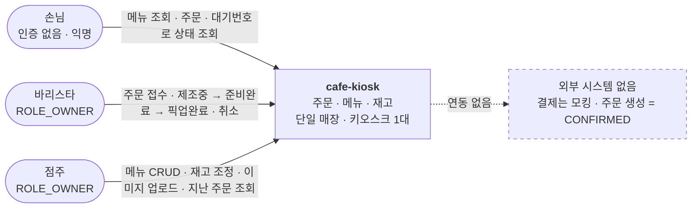
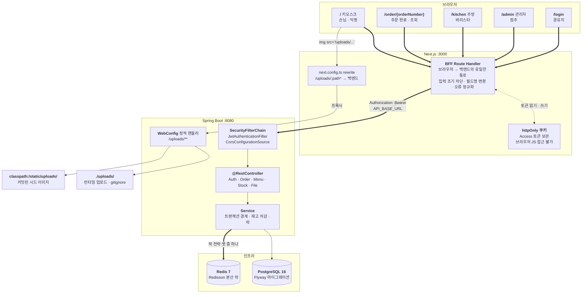
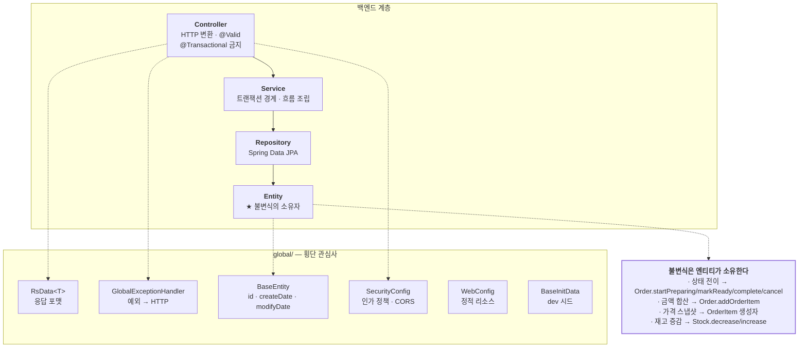
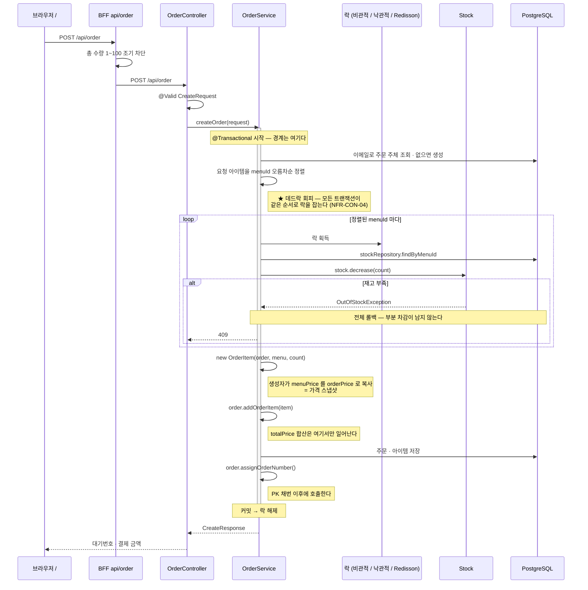
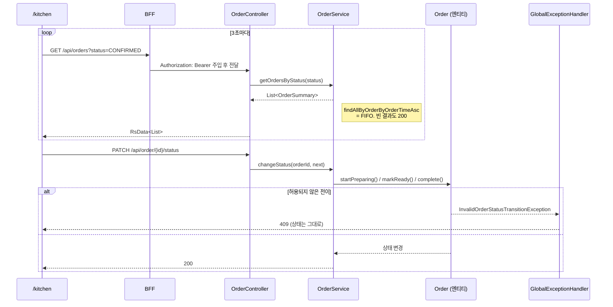
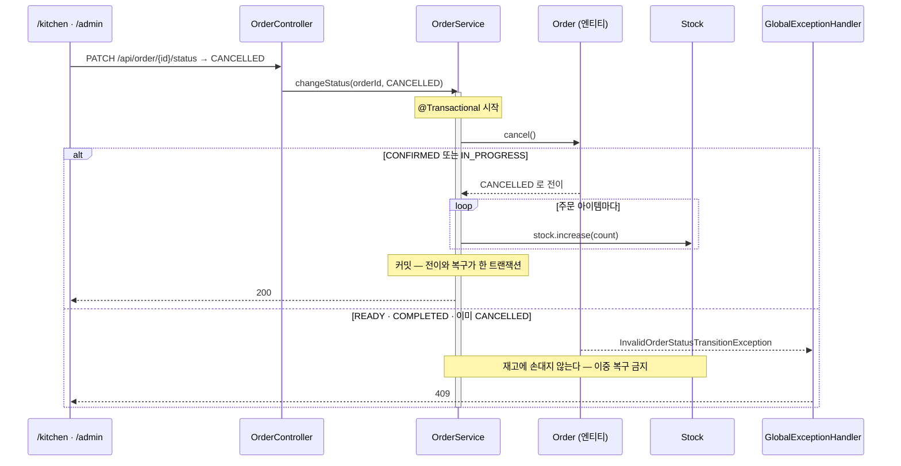
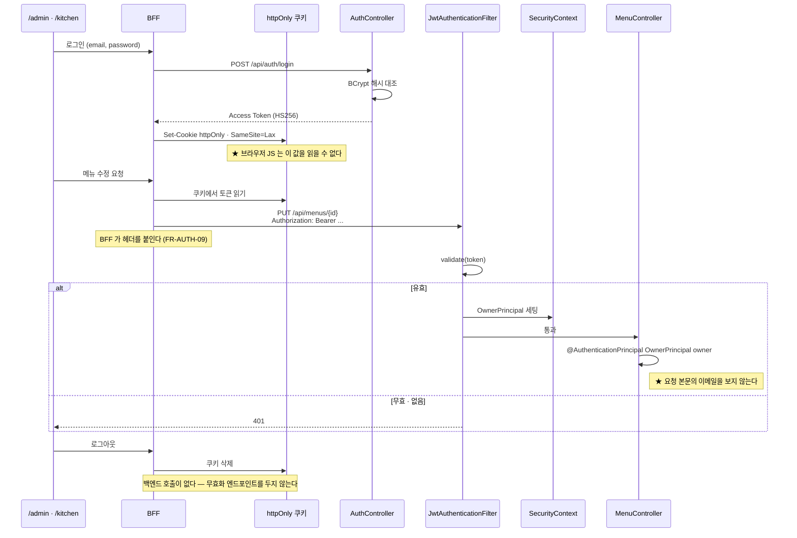
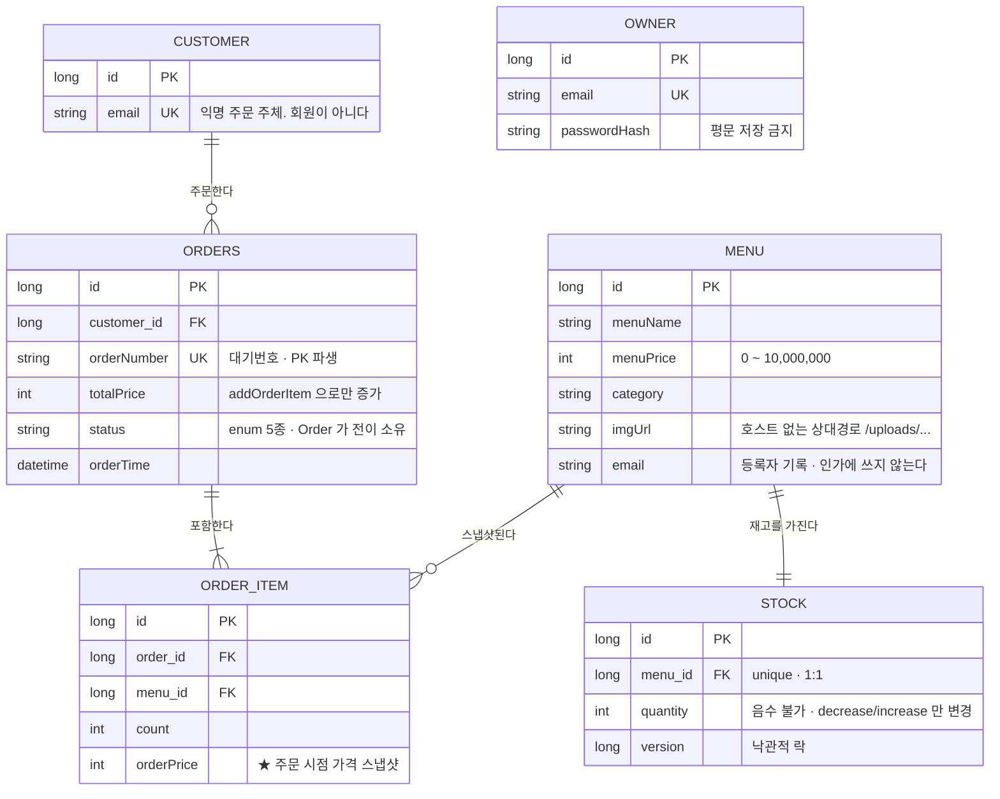

# cafe-kiosk 시스템 구성도

> 이 문서는 **"어떻게 조립돼 있는가"**를 담는다 — 프로세스가 몇 개고 어느 포트에 뜨며, 요청이 어떤 화살표를 타고 어느 클래스를 지나는가.
> **"왜"**는 [`PRODUCT.md`](../PRODUCT.md), **"무엇을 만족해야 하나"**는 [`REQUIREMENTS.md`](../REQUIREMENTS.md), **"누가 어떤 순서로"**는 [`USECASES.md`](../USECASES.md), **"언제·지금 어디"**는 [`ROADMAP.md`](../ROADMAP.md)에 있다.
>
> 기준: **프로젝트 완성 시점** / 최초 작성: 2026-07-21 · 완성 기준 전환: 2026-07-22

---

## 1. 이 문서의 역할

**이 문서가 소유하는 것은 화살표와 경계뿐이다.** 아래는 다른 문서가 정본이므로 여기서 다시 적지 않는다.

| 알고 싶은 것 | 정본 |
| --- | --- |
| API 엔드포인트 목록 | [`REQUIREMENTS.md §9-1`](../REQUIREMENTS.md#9-1-api) |
| 어느 엔드포인트에 인증이 필요한가 | [`REQUIREMENTS.md §9-2`](../REQUIREMENTS.md#9-2-권한-매트릭스) |
| 각 기능이 무엇을 만족해야 하는가 | [`REQUIREMENTS.md §5`](../REQUIREMENTS.md#5-기능-요구사항) |
| 액터가 어떤 순서로 쓰는가 · 예외 흐름의 분기 | [`USECASES.md`](../USECASES.md) |
| 엔티티 필드의 불변식과 소유자 | [`REQUIREMENTS.md §8`](../REQUIREMENTS.md#8-데이터-요구사항) |
| 지금 어디까지 됐는가 | [`ROADMAP.md`](../ROADMAP.md) + [`roadmap/phase-*.md`](../roadmap/) |
| JWT 발급·검증 클래스 상세 | [`jwt-auth.md`](jwt-auth.md) |

**같은 내용을 두 곳에 적지 않는다** — 중복되면 둘 다 썩는다. 코드 참조는 **파일 경로 + 메서드명까지만** 적고 줄 번호는 적지 않는다.

**이 문서는 완성된 구성을 그린다.** 진행 상태는 담지 않는다.

---

## 2. 시스템 컨텍스트

액터는 셋인데 역할(Role)은 둘이다. 그리고 **경계 바깥에 아무것도 없다** — 결제(PG)를 연동하지 않으므로 외부 시스템과 주고받는 것이 없다.



**손님에게 로그인을 요구하는 것은 제품 실패로 간주한다.** 바리스타와 점주를 `ROLE_OWNER` 하나로 묶는 것은 1인 매장 기준의 의도된 단순화다.

---

## 3. 런타임 구성

프로세스는 넷이다 — 브라우저 · Next.js · Spring Boot · PostgreSQL. 여기에 **분산 락 전용 Redis**가 붙는다. 캐시가 아니다.



### 3-1. 브라우저 → 백엔드 경로가 **둘**이다

구성도에서 가장 중요한 부분. 성격이 다른 둘뿐이고, **직통 경로는 없다.**

| # | 무엇 | 통과 지점 |
| --- | --- | --- |
| ① | 메뉴 · 주문 · 인증 · 재고 · **이미지 업로드** | 화면 → BFF Route Handler → 백엔드 |
| ② | 이미지 **표시** | `` → `next.config.ts` rewrite → 백엔드 정적 핸들러 |

②가 성립하는 조건은 **저장된 URL이 호스트를 포함하지 않는 것**이다(FR-FILE-07). 절대 URL이 저장되면 rewrite는 한 번도 타지 않는 죽은 설정이 되고, 이미지가 뜨는 것은 rewrite 덕분이 아니라 **브라우저가 백엔드를 직접 때리기 때문**이 된다. `` 태그에는 CORS가 적용되지 않아 그 상태가 조용히 성공한다는 점이 이 함정을 오래 살려두는 이유다.

**진짜 위험은 그 절대 URL이 `Menu.imgUrl` 컬럼에 저장된다는 것이다.** 코드의 하드코딩은 `grep`으로 걷어낼 수 있지만 이미 저장된 행은 그렇지 않다. 그래서 요구사항을 "BFF를 거쳐라"가 아니라 **"호스트를 저장하지 마라"**로 세웠다 — [`REQUIREMENTS.md §5-8`](../REQUIREMENTS.md#5-8-fr-file--이미지-업로드).

### 3-2. `/uploads/**`가 두 곳을 보는 이유

`WebConfig.addResourceHandlers`가 **파일시스템과 클래스패스를 순서대로** 뒤진다.

| 위치 | 무엇 | 왜 여기인가 |
| --- | --- | --- |
| `file:./uploads/` | 런타임에 업로드된 파일 | 상대경로라 작업 디렉토리 기준으로 풀린다. gitignore 대상 |
| `classpath:/static/uploads/` | 커밋된 시드 이미지 | 작업 디렉토리가 무엇이든, jar로 패키징돼도 항상 찾을 수 있다 |

시드 이미지를 앞쪽에 두면 안 되는 이유 — 앞쪽은 gitignore되어 있어 **clone한 사람에게 파일이 전달되지 않는다.**

이 이중 서빙이 C-07의 절충을 지탱한다. **인스턴스가 재생성되면 앞쪽은 비지만 뒤쪽은 남는다** — 업로드 이미지는 사라져도 시드 이미지는 살아남아 데모가 깨지지 않는다.

### 3-3. 설정 · 프로필

| 항목 | 구성 |
| --- | --- |
| 활성 프로필 | 환경변수로 정한다. `dev` / `test` / `prod` |
| 비밀값 주입 | `jwt.secret` · `DB_PASSWORD`는 배포 환경의 시크릿으로. `.env.example`에는 키 이름만 |
| 스키마 | **Flyway 마이그레이션.** `ddl-auto`를 쓰지 않는다 |
| 시드 | `BaseInitData`가 `dev`에서만 — 메뉴 3개 + 재고 **100 / 50 / 3** + 점주 계정 1개 |
| CORS | `SecurityConfig`의 `CorsConfigurationSource`. 허용 출처는 환경변수, 허용 메서드에 **`PATCH` 포함** |
| 백엔드 주소 | 프론트는 환경변수로 받는다. 하드코딩 0곳 |
| 로깅 | `prod`에서 SQL과 바인딩 파라미터를 끈다 — 손님 이메일이 로그에 남지 않도록 |

**CORS가 `WebConfig`가 아니라 `SecurityConfig`에 있는 이유**는 순서다. Security 필터체인은 `WebMvcConfigurer`의 CORS 설정보다 앞서 돌기 때문에, `.cors()`로 연결하지 않으면 preflight가 401이 된다. `/uploads/**` 정적 리소스 핸들러만 `WebConfig`에 남는다.

**`PATCH`가 허용 메서드에 없으면** 주방 화면의 상태 변경과 관리자 화면의 재고 조정이 preflight에서 막힌다. 원인이 화면 코드가 아니라 서버 설정이라 디버깅에 시간을 버리기 딱 좋은 자리다.

마지막 시드 재고가 **3**인 것은 우연이 아니라 [AC-09(마지막 한 잔)](../REQUIREMENTS.md#6-인수-기준)의 재현 조건이다.

---

## 4. 논리 계층과 패키지 구조

### 4-1. 계층



**서비스는 규칙을 검사하지 않는다.** 엔티티를 조회해 메서드를 호출할 뿐이다. 총액이 아이템과 어긋날 수 있는 **경로 자체를 없애는 것**이 목적이다(NFR-DATA-01).

**컨트롤러에 `@Transactional`이 없다.** 트랜잭션 경계가 컨트롤러까지 올라가면 서비스의 `@Transactional`은 바깥 트랜잭션에 합류할 뿐 자기 경계를 갖지 못하고, 낙관적 락 재시도가 구조적으로 불가능해진다(NFR-CON-05). §5-1 참고.

예외 → HTTP 매핑은 `GlobalExceptionHandler`가 독점한다. 컨트롤러에서 try/catch로 상태코드를 만들지 않는다.

| 예외 | HTTP |
| --- | --- |
| `NoSuchElementException` | 404 |
| `MethodArgumentNotValidException` · `IllegalArgumentException` · `MethodArgumentTypeMismatchException` · `HttpMessageNotReadableException` | 400 |
| `InvalidOrderStatusTransitionException` | **409** |
| `OutOfStockException` | **409** |

### 4-2. 패키지 — 도메인별 수직 슬라이스

```
com.cafekiosk
├── order/
│   ├── controller/  OrderController
│   ├── service/     OrderService
│   ├── dto/         OrderDto
│   ├── entity/      Order · OrderItem · Customer · OrderStatus
│   ├── exception/   InvalidOrderStatusTransitionException
│   └── repository/  OrderRepository · OrderItemRepository · CustomerRepository
├── menu/
│   ├── controller/  MenuController
│   ├── service/     MenuService
│   ├── dto/         MenuDto · CreateMenuRequestDto
│   ├── entity/      Menu
│   └── repository/  MenuRepository
├── stock/
│   ├── controller/  StockController
│   ├── service/     StockService
│   ├── entity/      Stock                 ← decrease / increase 를 소유
│   ├── exception/   OutOfStockException
│   └── repository/  StockRepository
├── auth/
│   ├── controller/  AuthController
│   ├── service/     AuthService
│   ├── jwt/         JwtTokenProvider
│   ├── OwnerPrincipal
│   └── JwtAuthenticationFilter
├── owner/
│   ├── entity/      Owner
│   └── repository/  OwnerRepository
├── file/
│   └── controller/  FileUploadController
└── global/
    ├── config/                  SecurityConfig · WebConfig
    ├── globalExceptionHandler/  GlobalExceptionHandler
    ├── initData/                BaseInitData
    ├── jpa/entity/              BaseEntity
    ├── rsData/                  RsData
    └── springDoc/               SpringDocConfig
```

**`order`가 `stock`을 호출하는 방향이 있다.** `OrderService`가 `StockRepository`를 직접 잡지 않고 `StockService`를 거친다 — 도메인 경계를 넘을 때는 서비스를 통한다.

**모든 응답은 `RsData<T>`다.** 예외 없다 — [`REQUIREMENTS.md §9-5`](../REQUIREMENTS.md#9-5-응답-규약).

새 도메인을 추가할 땐 이 패턴을 따른다 — 최상위에 feature 패키지를 만들고 그 안에 레이어를 둔다. 여러 feature가 공유하는 것만 `global/`로 간다.

### 4-3. 프론트

```
frontend/src/app
├── page.tsx                      /            키오스크 · 손님
├── order/[orderNumber]/page.tsx  /order/{n}   주문 완료 · 조회 · 손님
├── kitchen/page.tsx              /kitchen     주방 · 바리스타
├── admin/page.tsx                /admin       관리자 · 점주
├── login/page.tsx                /login       경유지
├── layout.tsx
└── api/                          ★ 페이지용 API가 아니라 백엔드 프록시(BFF)다
    ├── auth/login/route.ts       POST   토큰을 httpOnly 쿠키에 심는다
    ├── auth/logout/route.ts      POST   쿠키를 지운다. 백엔드 호출 없음
    ├── menu/route.ts             GET · POST
    ├── menu/[menuId]/route.ts    PUT · DELETE   params 가 Promise (Next 16)
    ├── order/route.ts            POST           총 수량 1~100 조기 차단
    ├── orders/route.ts           GET            점주용 목록 · 상태 필터
    ├── orders/[orderNumber]/route.ts  GET       대기번호 단건 조회
    ├── orders/[orderId]/status/route.ts  PATCH  상태 전이
    ├── stocks/[menuId]/route.ts  PATCH          재고 조정
    └── upload/route.ts           POST           이미지 업로드
```

BFF가 하는 일은 넷이다 — **입력 검증**(UX용 조기 차단), **필드명 변환**(핸들러마다 규칙이 다르다), **오류 메시지 정규화**(`message`/`msg`/`error` → `{ message }`), 그리고 **토큰 보관과 주입**.

**토큰이 여기 사는 것이 C-04의 핵심이다.** 브라우저가 토큰 문자열에 닿지 못하면 백엔드를 직접 부를 방법 자체가 없다 — FR-AUTH-11.

---

## 5. 요청 흐름

### 5-1. 주문 생성 ★



> **컨트롤러에 `@Transactional`이 없어야 이 그림이 성립한다**(NFR-CON-05). 낙관적 락 재시도는 롤백된 트랜잭션 **밖**, 새 트랜잭션에서 이뤄져야 하기 때문이다. 같은 빈 안에서 self-invocation 하면 프록시를 타지 않아 재시도가 전부 같은 트랜잭션에서 돈다.

### 5-2. 주방 폴링과 상태 전이



전이 규칙은 `Order`가 소유한다.

```
CONFIRMED ──startPreparing──> IN_PROGRESS ──markReady──> READY ──complete──> COMPLETED
    │                              │
    └──────── cancel ──────────────┴──> CANCELLED
```

**`READY` 이후에는 취소가 없다.** 이미 만든 음료의 재고를 되돌리면 없는 재고가 생긴다. 손님이 찾아가지 않은 주문도 바리스타가 `COMPLETED`로 눌러 정리한다 — 그래서 `COMPLETED`는 "손님이 받아갔다"가 아니라 **"이 주문 끝"**을 뜻한다.

### 5-3. 주문 취소와 재고 복구

**순서가 이 흐름의 전부다.** 전이 검증이 먼저고 재고 복구가 나중이다.



> **순서를 뒤집으면 취소되지 않은 주문의 재고가 늘어나 없는 재고가 생겨난다.** 전이 규칙을 `Order`가 소유하는 덕에 이중 복구 경로가 **구조적으로** 막혀 있다 — 재고 복구를 상태 검사 없이 서비스에서 호출하도록 바꾸는 순간 이 보호가 사라진다.

### 5-4. 인증된 요청



클래스 상세는 [`jwt-auth.md`](jwt-auth.md)에 있다. 여기서 중요한 것은 둘이다 — **인가 판단의 근거가 "서버가 검증한 신원"이라는 것**(NFR-SEC-06), 그리고 **토큰이 브라우저가 아니라 BFF에 산다는 것**(FR-AUTH-11).

토큰 자체는 만료까지 유효하므로 stateless의 성질은 그대로다. 다만 쿠키가 지워지면 그 토큰을 다시 보낼 주체가 없어져 **실질 로그아웃이 성립한다** — Redis 블랙리스트가 필요 없는 이유다.

---

## 6. 데이터 모델

모든 엔티티가 `BaseEntity`(`id` · `createDate` · `modifyDate`)를 상속한다. PK는 `IDENTITY` 전략.



**`OWNER`는 다른 테이블과 관계를 갖지 않는다.** `Menu.email`이 등록자 기록이지만 FK가 아니다 — 1인 매장에서 메뉴별 소유자 분리는 실익이 없고 연쇄 수정 비용만 크다.

`Order`가 `Customer`를 `@ManyToOne(LAZY)`로, `OrderItem`을 `@OneToMany(cascade = ALL, orphanRemoval = true)`로 잡는다. `Customer`도 `Order`를 `cascade = {PERSIST, REMOVE}`로 들고 있어 **양방향**이다.

필드별 불변식과 소유자는 [`REQUIREMENTS.md §8`](../REQUIREMENTS.md#8-데이터-요구사항)이 정본이다.

---

## 7. 경계 규약

그림으로 표현되지 않지만 **깨지면 구조가 무너지는 것들**.

| 규약 | 내용 | 근거 |
| --- | --- | --- |
| **BFF 단일 통로** | 브라우저는 백엔드를 직접 호출하지 않는다. 백엔드 API를 바꾸면 BFF 핸들러도 같이 고친다 | C-04 |
| **토큰은 BFF가 보관한다** | `httpOnly` 쿠키에 두고 요청마다 헤더로 바꿔 붙인다. 브라우저 JS가 토큰에 닿지 않는다 | FR-AUTH-09, FR-AUTH-11 |
| **검증의 정본은 백엔드** | BFF 검증은 UX용 조기 차단이다. 지우면 UX가 나빠질 뿐 보안이 뚫리지는 않는다. 백엔드 검증을 지우면 뚫린다 | [§9-3](../REQUIREMENTS.md#9-3-검증-책임--어느-쪽이-정본인가) |
| **예외 → HTTP는 한 곳** | `GlobalExceptionHandler`가 독점한다. 컨트롤러 try/catch 금지 | §4-1 |
| **응답은 `RsData<T>`** | 예외 없이 | [§9-5](../REQUIREMENTS.md#9-5-응답-규약) |
| **컨트롤러에 `@Transactional` 금지** | 낙관적 락 재시도의 전제 | NFR-CON-05 |
| **불변식은 엔티티가 소유** | 서비스가 `if (quantity < count)`를 검사하지 않는다 | NFR-DATA-01 |
| **이미지 URL에 호스트를 담지 않는다** | 코드가 아니라 DB 행에 박히는 결함이라 되돌리기 어렵다 | FR-FILE-07 |

---

## 8. 테스트 구성

```
Backend/App/src/test/java/com/cafekiosk
├── support/AbstractIntegrationTest.java     ← Testcontainers PostgreSQL 기동. 모든 통합 테스트가 상속
├── order/entity/OrderTest.java              ← POJO. 컨텍스트 없이 상태 전이 검증
├── stock/entity/StockTest.java              ← POJO. 컨텍스트 없이 재고 증감 검증
├── order/controller/OrderControllerTest.java
├── order/service/OrderConcurrencyTest.java  ← ★ ExecutorService. MockMvc 미사용
├── menu/controller/MenuControllerTest.java
├── auth/AuthIntegrationTest.java            ← 로그인 성공/실패 · 토큰 없이 401
├── file/controller/FileUploadControllerTest.java
├── stock/repository/StockRepositoryIntegrationTest.java
└── CafeKioskApplicationTests.java
```

| 규약 | 내용 |
| --- | --- |
| **상속** | `@Testcontainers`/`@Container`를 개별 테스트에 붙이지 않는다. `AbstractIntegrationTest`를 상속한다. 이 조합은 테스트 클래스가 바뀔 때마다 컨테이너를 재시작해 `@DynamicPropertySource`가 잡아둔 포트를 무효화한다 (NFR-TEST-02) |
| **경계** | 순수 로직(상태 전이, 재고 증감)은 컨텍스트 없이 POJO로 (NFR-TEST-06) |
| **동시성** | `@Transactional`을 붙이지 않는다. 테스트 트랜잭션이 롤백되면 워커 스레드가 커밋한 내용을 검증할 수 없다. `ExecutorService`로 서비스를 직접 호출하고 뒷정리는 `@AfterEach`가 한다 (NFR-TEST-03) |
| **커넥션 풀** | 동시성 테스트는 풀 크기를 명시하고 스레드 수와의 관계를 주석으로 남긴다. **풀 고갈을 락 문제로 오해하지 않기 위해서다** (NFR-TEST-04) |
| **전제** | 테스트 실행에 **Docker 데몬이 필요하다** (C-06) |

`AbstractIntegrationTest`가 `@AutoConfigureMockMvc`를 베이스에 두지 않는 이유가 동시성 테스트다 — 그쪽은 MockMvc를 거치지 않고 서비스를 직접 부른다.

**CI는 백엔드 테스트와 프론트 lint·build를 모두 돌린다**(NFR-TEST-01). 다만 CI가 브라우저에서 화면이 실제로 도는 것까지 검증하지는 않으므로, AC-14는 수동 확인과 PR 스크린샷이 증거다.

---

> 구조를 바꾸는 PR은 이 문서의 해당 다이어그램을 함께 고친다. **코드와 어긋난 구성도는 없는 것보다 나쁘다.**
