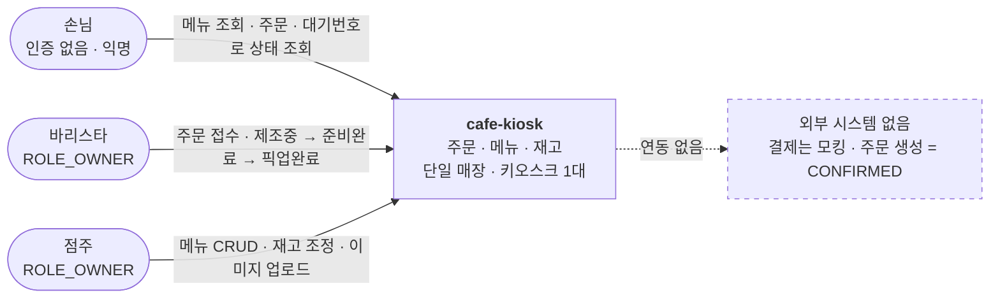
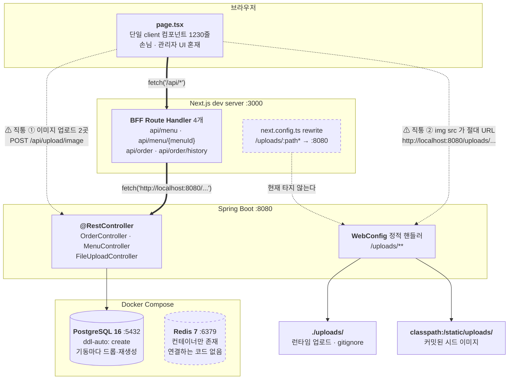
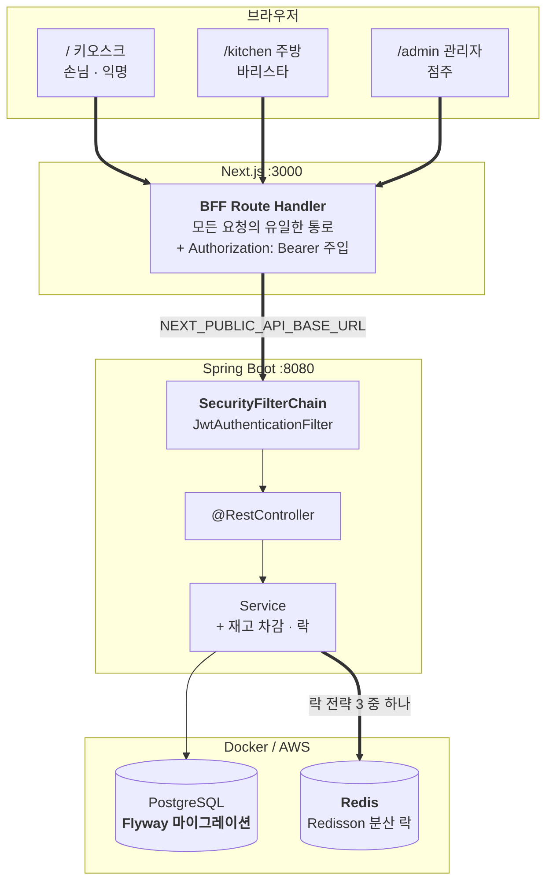
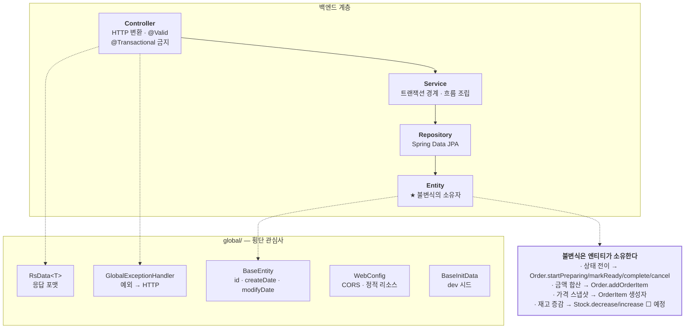
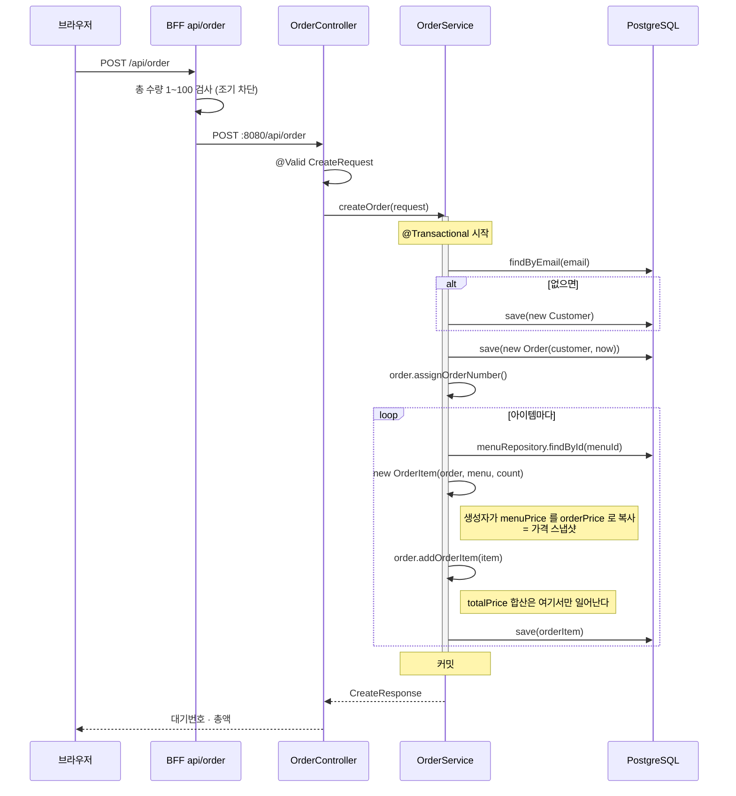
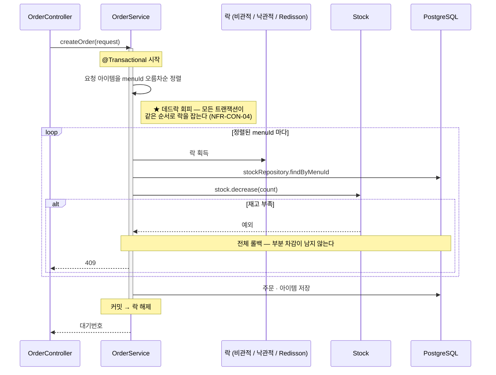
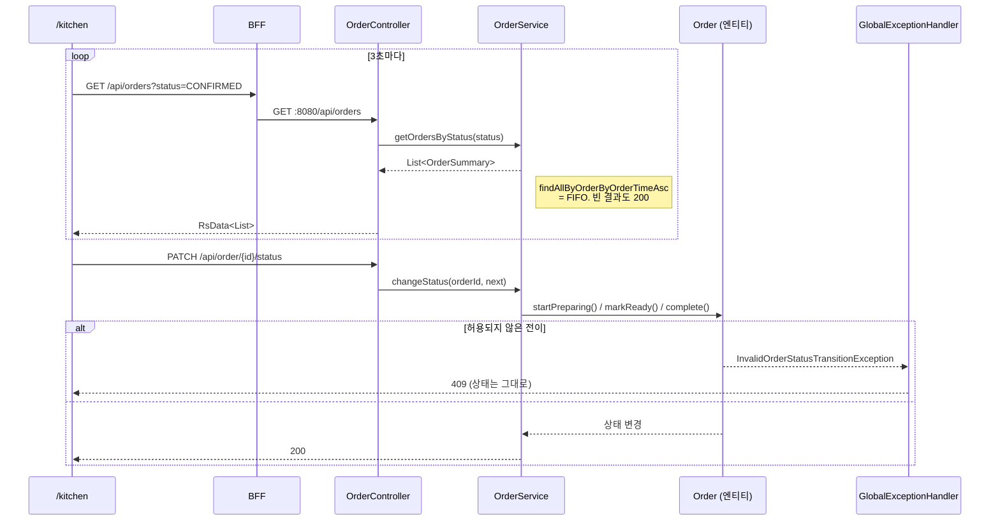
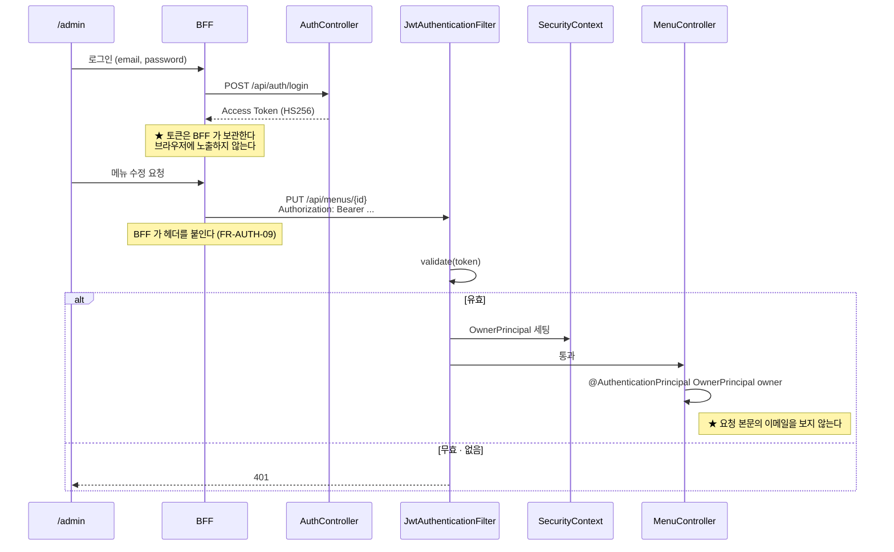
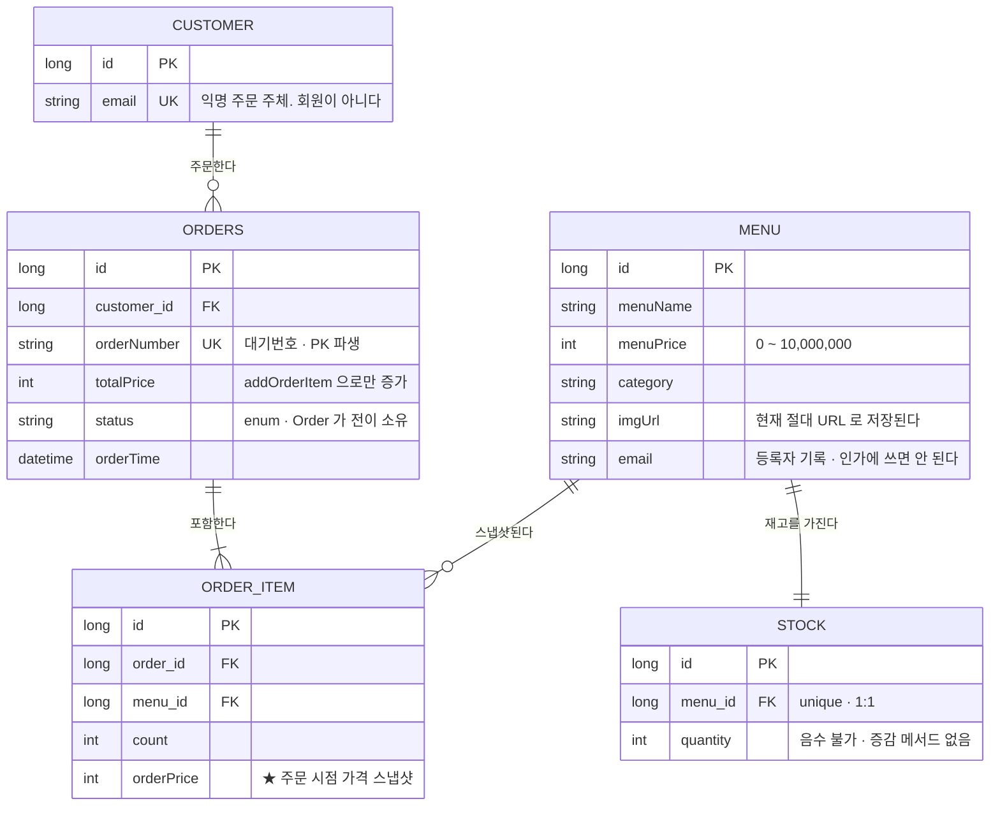

# cafe-kiosk 시스템 구성도

> 이 문서는 **"어떻게 조립돼 있는가"**를 담는다 — 프로세스가 몇 개고 어느 포트에 뜨며, 요청이 어떤 화살표를 타고 어느 클래스를 지나는가.
> **"왜"**는 [`PRODUCT.md`](../PRODUCT.md), **"무엇을 만족해야 하나"**는 [`REQUIREMENTS.md`](../REQUIREMENTS.md), **"언제·지금 어디"**는 [`ROADMAP.md`](../ROADMAP.md)에 있다.
>
> 기준: 현재 `main` 코드 (Phase 1 진행 중) / 최초 작성: 2026-07-21

---

## 1. 이 문서의 역할

**이 문서가 소유하는 것은 화살표와 경계뿐이다.** 아래는 다른 문서가 정본이므로 여기서 다시 적지 않는다.

| 알고 싶은 것 | 정본 |
| --- | --- |
| API 엔드포인트 목록 · 목표 경로 | [`REQUIREMENTS.md §9-1`](../REQUIREMENTS.md#9-1-api--현재--목표) |
| 어느 엔드포인트에 인증이 필요한가 | [`REQUIREMENTS.md §9-2`](../REQUIREMENTS.md#9-2-권한-매트릭스) |
| 각 기능이 구현됐는가 | [`REQUIREMENTS.md §5`](../REQUIREMENTS.md#5-기능-요구사항) |
| 엔티티 필드의 불변식과 소유자 | [`REQUIREMENTS.md §8`](../REQUIREMENTS.md#8-데이터-요구사항) |
| 언제 무엇을 하는가 | [`ROADMAP.md`](../ROADMAP.md) + [`roadmap/phase-*.md`](../roadmap/) |
| JWT 발급·검증 클래스 상세 | [`jwt-auth.md`](jwt-auth.md) |

**같은 내용을 두 곳에 적지 않는다** — 중복되면 둘 다 썩는다. 코드 참조는 **파일 경로 + 메서드명까지만** 적고 줄 번호는 적지 않는다.

---

## 2. 시스템 컨텍스트

액터는 셋인데 역할(Role)은 둘이다. 그리고 **경계 바깥에 아무것도 없다** — 결제(PG)를 연동하지 않으므로 외부 시스템과 주고받는 것이 없다.



**손님에게 로그인을 요구하는 것은 제품 실패로 간주한다.** 바리스타와 점주를 `ROLE_OWNER` 하나로 묶는 것은 1인 매장 기준의 의도된 단순화다.

---

## 3. 런타임 구성 — 현재

프로세스는 넷이다. 브라우저 · Next.js dev server(3000) · Spring Boot(8080) · PostgreSQL(5432). **Redis(6379)는 컨테이너만 떠 있고 코드가 연결하지 않는다** — `build.gradle.kts`에 Redis/Redisson 의존성 자체가 없다. Phase 3에서 처음 쓰인다.



### 3-1. 브라우저 → 백엔드 경로가 **셋**이다

구성도에서 가장 중요한 부분. 하나의 화살표가 아니라 성격이 다른 셋이고, **둘이 BFF 규약(C-04)을 어기고 있다.**

| # | 무엇 | 통과 지점 | C-04 |
| --- | --- | --- | --- |
| ① | 메뉴 · 주문 | `page.tsx` → BFF Route Handler → :8080 | ✅ 준수 |
| ② | 이미지 **업로드** | 없음. `page.tsx`가 브라우저에서 :8080 직접 호출 | ❌ 위반 |
| ③ | 이미지 **표시** | 없음. ``가 절대 URL이라 브라우저가 :8080에서 직접 받는다 | ❌ 위반 |

**③이 이 문서를 쓰면서 드러난 사실이다.** `next.config.ts`에 `/uploads/:path*` → :8080 rewrite가 있어서 이미지가 Next를 거쳐 프록시되는 것처럼 보이지만, 실제로는 그렇지 않다:

- `BaseInitData`의 시드 메뉴가 `imgUrl`을 **절대 URL**(`http://localhost:8080/uploads/...`)로 심는다
- `FileUploadController.uploadImage`도 응답 `imageUrl`에 `server.base-url`을 **앞에 붙여서** 절대 URL로 돌려준다
- `page.tsx`는 그 값을 ``에 그대로 꽂는다

→ 상대경로 `/uploads/...`가 만들어지는 경로가 없으므로 **rewrite는 사실상 죽은 설정**이다. 관리자가 폼에 상대경로를 손으로 입력했을 때만 동작한다. 이미지가 화면에 뜨는 것은 rewrite 덕분이 아니라 **브라우저가 :8080을 직접 때리기 때문**이다(`` 태그에는 CORS가 적용되지 않아 조용히 성공한다).

이 셋을 한 줄로 요약하면: **"브라우저는 8080을 직접 호출하지 않는다"는 규약이 현재 이미지 도메인 전체에서 깨져 있다.**

### 3-2. `/uploads/**`가 두 곳을 보는 이유

`WebConfig.addResourceHandlers`가 **파일시스템과 클래스패스를 순서대로** 뒤진다.

| 위치 | 무엇 | 왜 여기인가 |
| --- | --- | --- |
| `file:./uploads/` | 런타임에 업로드된 파일 | 상대경로라 작업 디렉토리 기준으로 풀린다. gitignore 대상 |
| `classpath:/static/uploads/` | 커밋된 시드 이미지 | 작업 디렉토리가 무엇이든, jar로 패키징돼도 항상 찾을 수 있다 |

시드 이미지를 앞쪽에 두면 안 되는 이유 — 앞쪽은 gitignore되어 있어 **clone한 팀원에게 파일이 전달되지 않는다.**

### 3-3. 설정 · 프로필

| 항목 | 현재 |
| --- | --- |
| 활성 프로필 | `dev` (`application.yml`에 하드코딩). 그 외 `test` |
| 비밀값 주입 | `spring.config.import`로 `.env` 읽기 — `Backend/App/.env` 또는 레포 루트 기준 두 경로를 optional로 |
| 스키마 | `ddl-auto: create` — 기동마다 드롭·재생성 후 `BaseInitData`가 시드 |
| 시드 | 메뉴 3개 + 재고 **100 / 50 / 3**. 가드는 `menuRepository.count() > 0` |
| CORS | `WebConfig.addCorsMappings` — `allowedOrigins`는 `localhost:3000` 하드코딩, **`allowedMethods`에 `PATCH`가 없다** |
| 로깅 | `org.hibernate.orm.jdbc.bind: TRACE` — **손님 이메일이 로그에 찍힌다** |

마지막 재고가 **3**인 것은 우연이 아니라 [AC-09(마지막 한 잔)](../REQUIREMENTS.md#6-인수-기준)의 재현 조건이다.

---

## 4. 런타임 구성 — 목표 (Phase 4 완료 시점)

바뀌는 것만 굵게. 프로세스 구성 자체는 같고, **경계가 제대로 서는 것**이 차이다.



### 무엇이 바뀌는가

| 변경 | 현재 | 목표 | Phase | 요구사항 |
| --- | --- | --- | --- | --- |
| 화면 | `/` 하나에 손님·관리자 혼재 | `/` · `/kitchen` · `/admin` 3분할 | 1 | FR-KSK-05, FR-KIT-01, FR-ADM-01 |
| 인증 | 없음. 요청 본문 이메일 비교 | `SecurityFilterChain` + `JwtAuthenticationFilter` | 1 | FR-AUTH-01~10 |
| 토큰 | — | **BFF가 붙인다.** 브라우저가 직접 보내지 않는다 | 1 | FR-AUTH-09 |
| CORS | `WebConfig`, `PATCH` 누락 | `SecurityConfig`의 `CorsConfigurationSource`, `PATCH` 포함 | 1 | — |
| 재고 | `OrderService`가 `Stock`을 참조조차 안 함 | 주문 트랜잭션 안에서 `Stock.decrease()` | 2 | FR-STK-02~06 |
| Redis | 컨테이너만 존재 | Redisson 분산 락으로 **처음 실사용** | 3 | NFR-CON-03 |
| 이미지 업로드 | 브라우저 → :8080 직통 | BFF 경유 | 4 | FR-FILE-05 |
| 이미지 표시 | 절대 URL로 :8080 직통 | 상대경로 + rewrite (또는 오브젝트 스토리지) | 4 | C-04, NFR-OPS-05 |
| 백엔드 주소 | 하드코딩 9곳 | 환경변수 0곳 | 4 | NFR-OPS-02 |
| 스키마 | `ddl-auto: create` | Flyway 마이그레이션 | 4 | NFR-OPS-01 |

---

## 5. 논리 계층과 패키지 구조

### 5-1. 계층



**서비스는 규칙을 검사하지 않는다.** 엔티티를 조회해 메서드를 호출할 뿐이다. 총액이 아이템과 어긋날 수 있는 **경로 자체를 없애는 것**이 목적이다(NFR-DATA-01).

예외 → HTTP 매핑은 `GlobalExceptionHandler`가 독점한다. 컨트롤러에서 try/catch로 상태코드를 만들지 않는다.

| 예외 | HTTP |
| --- | --- |
| `NoSuchElementException` | 404 |
| `MethodArgumentNotValidException` · `IllegalArgumentException` · `MethodArgumentTypeMismatchException` · `HttpMessageNotReadableException` | 400 |
| `InvalidOrderStatusTransitionException` | **409** |

### 5-2. 패키지 — 도메인별 수직 슬라이스

```
com.cafekiosk
├── order/
│   ├── controller/  OrderController
│   ├── service/     OrderService
│   ├── dto/         OrderDto
│   ├── entity/      Order · OrderItem · Customer · OrderStatus
│   ├── exception/   InvalidOrderStatusTransitionException
│   └── repository/  OrderRepository · OrderItemRepository · CustomerRepository
├── menu/
│   ├── controller/  MenuController
│   ├── service/     MenuService          ← ⚠ 인가를 요청 본문 이메일 비교로 한다
│   ├── dto/         MenuDto · CreateMenuRequestDto · DeleteMenuRequestDto
│   ├── entity/      Menu
│   └── repository/  MenuRepository
├── stock/
│   ├── entity/      Stock                ← ⚠ 증감 메서드가 없다
│   └── repository/  StockRepository      ← ⚠ service · controller 자체가 없다 (죽은 도메인)
├── file/
│   └── controller/  FileUploadController ← ⚠ service 없이 컨트롤러가 디스크에 직접 쓴다
└── global/
    ├── config/                  WebConfig
    ├── globalExceptionHandler/  GlobalExceptionHandler
    ├── initData/                BaseInitData
    ├── jpa/entity/              BaseEntity
    ├── rsData/                  RsData
    └── springDoc/               SpringDocConfig
```

**`auth/` 패키지는 아직 없다.** [`jwt-auth.md`](jwt-auth.md)가 예정 위치를 `com.cafekiosk.auth.jwt.JwtTokenProvider`로 잡아뒀다.

**응답 포맷이 3종 혼재한다** — `RsData<T>`(`GET /api/orders`), raw record(`POST /api/order`), raw `String`(`POST /api/menu`). 신규 API는 예외 없이 `RsData<T>`다.

### 5-3. 프론트

```
frontend/src/app
├── page.tsx              1230줄 단일 "use client" 컴포넌트 (손님 + 관리자 혼재)
├── layout.tsx
└── api/                  ★ 페이지용 API가 아니라 백엔드 프록시(BFF)다
    ├── menu/route.ts             GET · POST   snake_case → camelCase 변환
    ├── menu/[menuId]/route.ts    PUT · DELETE  params 가 Promise (Next 16)
    ├── order/route.ts            POST          총 수량 1~100 조기 차단
    └── order/history/route.ts    POST
```

BFF가 하는 일은 셋이다 — **입력 검증**(UX용 조기 차단), **필드명 변환**(핸들러마다 규칙이 다르다), **오류 메시지 정규화**(`message`/`msg`/`error` → `{ message }`).

---

## 6. 요청 흐름

### 6-1. 주문 생성 — 현재



> **⚠ `StockRepository`가 한 번도 등장하지 않는다.** 재고가 0이어도 무한히 주문된다. Phase 2에서 청산한다.

### 6-2. 주문 생성 — 목표 (Phase 2 + 3)



> **컨트롤러에 `@Transactional`이 없어야 한다**(NFR-CON-05). 낙관적 락 재시도는 롤백된 트랜잭션 **밖**, 새 트랜잭션에서 이뤄져야 하기 때문이다.

### 6-3. 주방 폴링과 상태 전이 (Phase 1)



> **⚠ `WebConfig`의 `allowedMethods`에 `PATCH`가 없다.** 지금 상태로 `/kitchen`을 만들면 상태 변경이 preflight에서 막힌다. Phase 1에서 CORS를 `SecurityConfig`로 옮기면서 함께 고친다.

전이 규칙은 `Order`가 소유한다. `PENDING`은 예약 값으로 서버 흐름에서 진입하지 않는다.

```
CONFIRMED ──startPreparing──> IN_PROGRESS ──markReady──> READY ──complete──> COMPLETED
    │                              │
    └──────── cancel ──────────────┴──> CANCELLED
```

### 6-4. 인증된 요청 (Phase 1 목표)



클래스 상세는 [`jwt-auth.md`](jwt-auth.md)에 있다. 여기서 중요한 것은 **인가 판단의 근거가 "서버가 검증한 신원"으로 옮겨간다**는 것뿐이다(NFR-SEC-06).

---

## 7. 데이터 모델

모든 엔티티가 `BaseEntity`(`id` · `createDate` · `modifyDate`)를 상속한다. PK는 `IDENTITY` 전략.



### 아직 없는 것

| 엔티티 / 필드 | 용도 | Phase |
| --- | --- | --- |
| `Owner` (`email`, `passwordHash`) | 점주 인증. 평문 저장 금지 | 1 |
| `Stock.version` (`@Version`) | 낙관적 락 | 3 |
| `Stock.decrease()` / `increase()` | 재고 불변식의 소유자 | 2 |

`Order`가 `Customer`를 `@ManyToOne(LAZY)`로, `OrderItem`을 `@OneToMany(cascade = ALL, orphanRemoval = true)`로 잡고 있다. `Customer`도 `Order`를 `cascade = {PERSIST, REMOVE}`로 들고 있어 **양방향**이다.

필드별 불변식과 소유자는 [`REQUIREMENTS.md §8`](../REQUIREMENTS.md#8-데이터-요구사항)이 정본이다.

---

## 8. 경계 규약

그림으로 표현되지 않지만 **깨지면 구조가 무너지는 것들**.

| 규약 | 내용 | 근거 |
| --- | --- | --- |
| **BFF 단일 통로** | 브라우저는 :8080을 직접 호출하지 않는다. 백엔드 API를 바꾸면 BFF 핸들러도 같이 고친다 | C-04 |
| **검증의 정본은 백엔드** | BFF 검증은 UX용 조기 차단이다. 지우면 UX가 나빠질 뿐 보안이 뚫리지는 않는다. 백엔드 검증을 지우면 뚫린다 | [§9-3](../REQUIREMENTS.md#9-3-검증-책임--어느-쪽이-정본인가) |
| **예외 → HTTP는 한 곳** | `GlobalExceptionHandler`가 독점한다. 컨트롤러 try/catch 금지 | §5-1 |
| **응답은 `RsData<T>`** | 신규 API는 예외 없이. 현재 3종 혼재는 부채 | FR-MNU-07 |
| **컨트롤러에 `@Transactional` 금지** | 낙관적 락 재시도의 전제 | NFR-CON-05 |
| **불변식은 엔티티가 소유** | 서비스가 `if (quantity < count)`를 검사하지 않는다 | NFR-DATA-01 |
| **토큰은 BFF가 붙인다** | 브라우저가 백엔드에 직접 토큰을 보내지 않는다 | FR-AUTH-09 |

---

## 9. 현재 구성의 균열

구성도에 ⚠로 표시된 것들의 목록. **새 코드에서 이 패턴을 따라하지 않는다.**

| 위치 | 무엇이 깨져 있나 | 구성도 | 청산 |
| --- | --- | --- | --- |
| `order/service/OrderService` | `Stock`을 참조조차 안 한다 — 재고 0이어도 무한 주문 | §6-1 | Phase 2 |
| `menu/service/MenuService` | 인가가 요청 본문 이메일 문자열 비교 — 이메일만 알면 남의 메뉴를 수정·삭제 | §5-2 | Phase 1 |
| `OrderController.changeStatus` · `FileUploadController` | 완전 공개 — 토큰 없이 호출 가능 | §4 | Phase 1 |
| `page.tsx` (업로드 2곳) | 브라우저 → :8080 직통 | §3-1 ② | Phase 4 |
| `imgUrl` 절대 URL | ``가 :8080을 직접 때린다. `next.config.ts` rewrite는 죽은 설정 | §3-1 ③ | Phase 4 |
| `WebConfig.addCorsMappings` | `allowedMethods`에 `PATCH` 없음 → 주방 화면 상태 변경이 preflight에서 막힌다 | §6-3 | Phase 1 |
| 프론트 전역 + `application.yml` | `localhost:8080` 하드코딩 — 프론트 9곳(`src/` 8 + `next.config.ts` 1) + 백엔드 `server.base-url` 1곳 | §3 | Phase 4 |
| `application.yml` | `ddl-auto: create` — 기동마다 데이터 소실 | §3-3 | Phase 4 |
| `application.yml` | 바인딩 파라미터 TRACE 로깅 — 손님 이메일이 로그에 남는다 | §3-3 | Phase 4 |
| `page.tsx` | 1230줄 단일 컴포넌트에 손님·관리자 UI 혼재 | §3 | Phase 1 |
| `stock/` · `file/` | 계층이 비어 있다 (service·controller 없음 / service 없음) | §5-2 | Phase 2 |

---

## 10. 테스트 구성

```
Backend/App/src/test/java/com/cafekiosk
├── support/AbstractIntegrationTest.java     ← Testcontainers PostgreSQL 기동. 모든 통합 테스트가 상속
├── order/entity/OrderTest.java              ← POJO. Spring 컨텍스트 없이 상태 전이 검증
├── order/controller/OrderControllerTest.java
├── menu/controller/MenuControllerTest.java
├── stock/repository/StockRepositoryIntegrationTest.java
└── CafeKioskApplicationTests.java
```

| 규약 | 내용 |
| --- | --- |
| **상속** | `@Testcontainers`/`@Container`를 개별 테스트에 붙이지 않는다. `AbstractIntegrationTest`를 상속한다 (NFR-TEST-02) |
| **경계** | 순수 로직(상태 전이, 재고 증감)은 컨텍스트 없이 POJO로 (NFR-TEST-06) |
| **동시성 (Phase 3)** | `@Transactional`을 붙이지 않는다. `ExecutorService`로 서비스를 직접 호출하고 뒷정리는 `@AfterEach`가 한다 (NFR-TEST-03) |
| **전제** | 테스트 실행에 **Docker 데몬이 필요하다** (C-06) |

**CI(`.github/workflows/ci.yml`)는 `./gradlew test`만 돌린다.** 프론트엔드는 lint조차 검증되지 않으므로 FE 변경은 `npm run dev`로 직접 확인하고 PR에 스크린샷을 첨부한다. 프론트를 CI에 넣는 것은 Phase 4다(NFR-TEST-01).

---

> 구조를 바꾸는 PR은 이 문서의 해당 다이어그램을 함께 고친다. **코드와 어긋난 구성도는 없는 것보다 나쁘다.**
