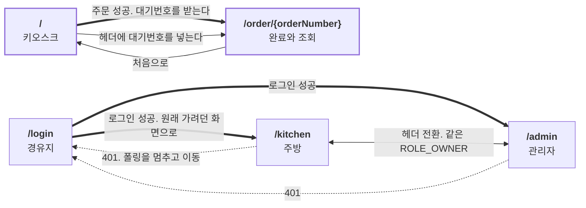

# cafe-kiosk 화면 와이어프레임

> 이 문서는 **"그래서 화면이 어떻게 생겼는가"**를 담는다. 다섯 화면의 요소 배치와 상태 변형.
> **"왜"**는 [`PRODUCT.md`](../PRODUCT.md), **"무엇을 만족해야 하나"**는 [`REQUIREMENTS.md`](../REQUIREMENTS.md), **"누가 어떤 순서로"**는 [`USECASES.md`](../USECASES.md), **"어떻게 조립돼 있는가"**는 [`architecture.md`](architecture.md), **"언제, 지금 어디"**는 [`ROADMAP.md`](../ROADMAP.md)에 있다.
>
> 기준: **프로젝트 완성 시점** / 최초 작성: 2026-07-22

---

## 1. 이 문서의 역할

이 레포에는 요구사항도, 유스케이스도, 시스템 구성도도 있다. 그런데 **화면을 소유하는 문서가 없었다.** 그래서 아래 세 가지가 문서 어디에도 정면으로 적혀 있지 않았다.

| 없던 것 | 어디까지만 있었나 |
| --- | --- |
| 손님이 대기번호를 **어디에 입력해서** 조회 화면에 닿는가 | UC-03의 1단계가 "대기번호를 입력한다"인데 그 입력란이 사는 화면이 없다 |
| 409를 받은 손님의 **화면에 무엇이 뜨는가** | 예외 흐름이 전부 HTTP 상태코드로 끝난다. 장바구니가 남는지는 S-1 각주 한 줄뿐이다 |
| `/kitchen`이 **어떤 구조인가** | UC-11의 각주 안에서 "칸반 3열"이 지나가듯 전제된다. 다른 화면 설명의 곁말로만 존재한다 |

Phase 1에 남은 작업이 정확히 화면 3분할이다. **와이어프레임이 없으면 세 PR이 각자 다른 화면을 상상하게 되고, 그 차이는 머지된 뒤에야 드러난다.**

### 소유 경계

**같은 내용을 두 곳에 적지 않는다.** 중복되면 둘 다 썩는다.

| 이 문서가 **소유**하는 것 | 이 문서가 **참조만** 하는 것 |
| --- | --- |
| 화면 요소의 배치, 영역 분할 | 요구사항 진술 그 자체 → [`REQUIREMENTS.md §5`](../REQUIREMENTS.md#5-기능-요구사항) |
| 상태 변형과 그 화면 표현 | 분기 조건, 예외 흐름 → [`USECASES.md §4`](../USECASES.md#4-유스케이스-명세) |
| 화면 사이의 전이 경로 | 엔드포인트, 권한 매트릭스 → [`REQUIREMENTS.md §9`](../REQUIREMENTS.md#9-인터페이스-요구사항) |
| 각 화면에 **없어야 하는 것** | 라우트 트리, BFF 구조 → [`architecture.md §4-3`](architecture.md) |

**요구사항 문장을 옮겨 적지 않는다.** 각 요소 옆에는 ID만 단다. 코드 참조는 기존 규약대로 **파일 경로 + 메서드명까지만, 줄 번호 없이** 적는다.

### 이 문서는 진행 상태를 담지 않는다

**완성된 화면을 그린다.** 어느 화면이 지금 존재하는지는 [`ROADMAP.md`](../ROADMAP.md)와 [`roadmap/phase-*.md`](../roadmap/)가 단독으로 소유한다. 이 문서가 소유하는 것은 **배치 그 자체**이지 그 구현 여부가 아니다.

---

## 2. 표기 규약

### 기호

| 기호 | 뜻 |
| --- | --- |
| `[ 라벨 ]` | 버튼 |
| `( 라벨 )` | 입력란 |
| `▸` | 그 화면에서 가장 중요한 요소 |
| `...` | 같은 모양의 반복 생략 |
| `▪ 비활성` | 눌리지 않는 상태 |

박스는 고정폭 기준으로 그렸다. 한글은 폭 2로 계산한다.

### ID 체계

상태 변형은 `V-{화면}-{번호}`다. 화면 코드는 요구사항 도메인 코드를 그대로 빌린다. `KSK` 키오스크, `ORD` 주문 조회, `LOG` 로그인, `KIT` 주방, `ADM` 관리자.

**번호는 재사용하지 않는다.** 폐기된 변형은 번호를 비우지 말고 "폐기" 행으로 남긴다. REQUIREMENTS, USECASES와 같은 규칙이다.

변형마다 그것을 부르는 유스케이스 분기 ID를 단다. `UC-02 E4`처럼 적는다.

### 기준 뷰포트

**가로 데스크톱 1200px.** 현재 `frontend/src/app/page.tsx`가 쓰는 `w-[1200px] max-w-[95vw]`를 그대로 잇는다.

세로 터치 키오스크 비율로 틀지 않는 이유는 하나다. Phase 1의 화면 3분할은 **권한 경계를 만드는 작업**이지 레이아웃 재설계가 아니다. 비율을 바꾸면 그 PR이 두 가지 일을 동시에 하게 되고, 리뷰에서 권한 경계가 레이아웃 diff에 묻힌다. 실제 매장 단말 비율은 이 레포의 주제인 동시성과 무관하다.

다섯 화면 모두 같은 폭을 쓴다. 아래 박스들은 실제 픽셀이 아니라 **영역의 비례**를 나타낸다.

---

## 3. 화면 목록과 전이도

### 목록

| 경로 | 이름 | 액터 | 인증 | 소유 유스케이스 |
| --- | --- | --- | --- | --- |
| `/` | 키오스크 | 손님 | 없음 | UC-01, UC-02, UC-10 |
| `/order/{orderNumber}` | 주문 완료와 조회 | 손님 | 없음 | UC-03 |
| `/login` | 로그인 | 점주, 바리스타 | 없음. 경유지다 | UC-04 |
| `/kitchen` | 주방 | 바리스타 | `ROLE_OWNER` | UC-05, UC-06 |
| `/admin` | 관리자 | 점주 | `ROLE_OWNER` | UC-07, UC-08, UC-09, UC-11 |

**여섯 번째 화면을 만들지 않는다.** 화면이 다섯이라는 사실은 [`REQUIREMENTS.md §3`](../REQUIREMENTS.md#3-액터와-시스템-경계)과 [`architecture.md §4-3`](architecture.md)이 함께 진술하고 있어서, 라우트가 하나 늘면 두 문서를 같이 고쳐야 한다.

### 전이도



**손님 화면 둘과 점주 화면 둘 사이에 화살표가 없다.** 이것이 이 그림의 요점이다. 손님이 점주 화면에 닿는 경로는 존재하지 않고, 점주가 손님 화면을 쓸 때는 그냥 손님이다. 화면 분리는 UI 정리가 아니라 **권한 경계**다. FR-KSK-05, FR-ADM-03.

### 이 문서가 새로 정하는 것

기존 문서가 답하지 않은 셋을 여기서 정한다. **셋 다 요구사항 신설이 아니라 이미 있는 요구사항의 배치 결정이다.** 그래서 `REQUIREMENTS.md`에 새 ID가 생기지 않는다.

**① 대기번호 조회 진입점은 `/` 헤더다.**
UC-03의 1단계가 "받은 대기번호를 입력한다"인데 그 입력란의 거처가 정해져 있지 않았다. 라우트를 새로 만들지 않고 키오스크 헤더에 입력란을 두어 `/order/{orderNumber}`로 보낸다. 조회 전용 화면을 세우면 화면이 여섯이 되고 위의 두 문서가 함께 거짓이 된다.

**② `/kitchen`은 칸반 3열이다.**
접수됨, 제조중, 준비완료. UC-11의 각주가 이미 이 구조를 전제하고 있었지만 어디에도 정면으로 그려진 적이 없다. §5-4가 그것을 그리고 근거를 함께 적는다.

**③ `/order/{orderNumber}`는 한 라우트에 얼굴이 둘이다.**
주문 직후에는 **대기번호**가 주인공이고, 나중에 조회하면 **상태**가 주인공이다. 갈리는 조건까지 §5-2에 그린다.

---

## 4. 공통 규칙

### 4-1. 헤더

화면마다 헤더의 오른쪽이 다르다. 왼쪽의 제품명은 같다.

| 화면 | 헤더 오른쪽 |
| --- | --- |
| `/` | 대기번호 입력란과 조회 버튼 |
| `/order/{orderNumber}` | 처음으로 |
| `/login` | 없음 |
| `/kitchen` | 폴링 표시, `/admin` 전환, 로그아웃 |
| `/admin` | `/kitchen` 전환, 로그아웃 |

**손님 화면에는 로그인 링크가 없다.** 점주는 주소창으로 `/kitchen`이나 `/admin`에 들어가고 거기서 `/login`으로 밀려난다. 손님 화면에 로그인 입구를 두면 FR-KSK-01이 말하는 "손님에게 로그인을 요구하지 않는다"가 화면에서부터 흐려진다.

### 4-2. 오류 표시

**모든 오류는 화면 안의 배너로 뜬다.** `alert`를 쓰지 않는다. FR-KSK-04가 대기번호에 대해 요구하는 것을 오류에도 똑같이 적용한다.

```
┌──────────────────────────────────────────────────────┐
│ ⚠  재고가 부족합니다. 콜드브루는 3잔까지 가능합니다. │
└──────────────────────────────────────────────────────┘
```

문구는 BFF가 정규화한 `{ message }`를 그대로 쓴다. 백엔드가 `message`로 주든 `msg`로 주든 `error`로 주든 화면은 한 가지 모양만 안다. NFR-UX-03. 텍스트는 한국어다. NFR-UX-02.

### 4-3. 갱신 규칙

**두 화면의 규칙이 정반대다.**

| 화면 | 갱신 | 왜 |
| --- | --- | --- |
| `/kitchen` | **3초 폴링** | 사람이 붙어 있는 작업 화면이다. NFR-UX-01, FR-KIT-05 |
| `/order/{orderNumber}` | **폴링 없음.** 다시 조회 버튼 | 키오스크는 공용 단말이라 손님이 머물지 않는다. NFR-UX-04 |
| `/`, `/admin` | 사용자 행동 뒤에만 | 없음 |

---

## 5. 화면

### 5-1. `/` 키오스크

손님이 메뉴를 고르고 주문한다. **로그인이 없다.** UC-01, UC-02.

```
┌─────────────────────────────────────────────────────────────────────────────┐
│ cafe-kiosk                        대기번호 (____) [ 주문 조회 ]             │
├──────────────────────────────────────────────────┬──────────────────────────┤
│ 메뉴                                             │ 장바구니                 │
│ [ 전체 ][ 커피 ][ 논커피 ][ 디저트 ]             │                          │
│                                                  │ 아메리카노          x2   │
│ ┌────────────┐ ┌────────────┐ ┌────────────┐     │   9,000원   [-][+][x]    │
│ │   이미지   │ │   이미지   │ │   이미지   │     │ 카페라떼            x1   │
│ │            │ │            │ │            │     │   5,000원   [-][+][x]    │
│ │ 아메리카노 │ │  카페라떼  │ │  콜드브루  │     │ ──────────────────────   │
│ │  4,500원   │ │  5,000원   │ │  6,000원   │     │ 총 수량           3개    │
│ │  남음 100  │ │  남음  50  │ │  남음   3  │     │ 총 금액     14,000원     │
│ │  [ 담기 ]  │ │  [ 담기 ]  │ │  [ 담기 ]  │     │                          │
│ └────────────┘ └────────────┘ └────────────┘     │ 이메일                   │
│                                                  │ (                    )   │
│ ┌────────────┐ ┌────────────┐                    │                          │
│ │    ...     │ │    ...     │                    │ ▸[     주문하기      ]   │
│ └────────────┘ └────────────┘                    │                          │
└──────────────────────────────────────────────────┴──────────────────────────┘
```

| 영역 | 요소 | 요구사항 | 유스케이스 |
| --- | --- | --- | --- |
| 헤더 | 대기번호 입력란, 조회 버튼 | FR-KSK-06 | UC-03 1단계 |
| 메뉴 | 이름, 가격, 카테고리, 이미지 | FR-MNU-01 | UC-01 2단계 |
| 메뉴 | **남은 재고와 품절 여부** | FR-STK-07, FR-KSK-08 | UC-01 3단계 |
| 메뉴 | 카테고리 필터 | 없음 | UC-01 |
| 장바구니 | 수량 증감, 삭제 | 없음 | UC-01 A1 |
| 장바구니 | 소계와 총액. **서버 왕복 없음** | 없음 | UC-01 5단계 |
| 장바구니 | 이메일 입력란. **요구하는 정보는 이것뿐** | FR-KSK-02 | UC-02 1단계 |
| 장바구니 | 주문하기 | FR-KSK-01, FR-KSK-03 | UC-02 2단계 |

> **장바구니가 서버에 없다는 사실이 이 화면의 설계를 지배한다.** 담고 빼고 세는 일이 전부 브라우저 안에서 끝나므로 이 영역에는 로딩 상태가 존재하지 않는다. UC-01의 성공 사후조건이 *"서버 상태는 아무것도 바뀌지 않는다"*인 이유이고, 주문 상태에 "장바구니 미제출"이 없는 이유이기도 하다. FR-ORD-13.
>
> **가격은 화면에서 합산하지만 그 값을 서버로 보내지 않는다.** 총액의 소유자는 `Order.addOrderItem`이다. 화면의 총액은 손님에게 보여주기 위한 것이고, 결제 금액의 정본은 응답으로 내려온 값이다. FR-ORD-06, NFR-DATA-01.

#### 상태 변형

**V-KSK-01 메뉴 로딩 중**

메뉴 자리에 자리표시자를 둔다. 장바구니는 처음부터 비어 있는 정상 상태다.

**V-KSK-02 등록된 메뉴가 0개** `UC-01 A2`

```
┌──────────────────────────────────────────────────┐
│                                                  │
│           등록된 메뉴가 없습니다.                │
│                                                  │
└──────────────────────────────────────────────────┘
```

**오류가 아니다.** 목록 조회는 결과가 비어도 200이다. REQUIREMENTS §9-5.

**V-KSK-03 메뉴를 못 불러옴** `UC-01 E1`

```
┌──────────────────────────────────────────────────┐
│ ⚠  메뉴를 불러오지 못했습니다.  [ 다시 시도 ]    │
└──────────────────────────────────────────────────┘
```

V-KSK-02와 **다른 화면이어야 한다.** 둘을 같은 빈 화면으로 처리하면 손님은 장애를 품절로 읽는다.

**V-KSK-04 품절 메뉴가 섞여 있다** `UC-01 E2` `FR-KSK-08`

```
┌────────────┐
│   이미지   │
│  [ 품절 ]  │
│  콜드브루  │
│  6,000원   │
│  남음   0  │
│▪[ 담기 ]   │      ← 비활성
└────────────┘
```

**메뉴가 목록에서 사라지지 않는다.** 재고가 채워지면 다시 팔 것이고, 사라졌다 나타나는 목록은 손님이 읽기 어렵다. UC-09 A1이 말하는 "품절이 풀린다"가 성립하려면 자리가 남아 있어야 한다.

**V-KSK-05 장바구니가 비어 있다**

```
│ 선택된 메뉴가 없습니다.  │
│ 총 금액          0원     │
│▪[    주문하기     ]      │      ← 비활성
```

**V-KSK-06 총 수량 100개 초과** `UC-01 E3` `AC-05`

```
┌──────────────────────────────────────────────────┐
│ ⚠  한 번에 100개까지 담을 수 있습니다.           │
└──────────────────────────────────────────────────┘
```

**담기 단계에서 막는다.** 서버 왕복 전에 차단하는 것이고, 이것은 UX용 조기 차단이지 규칙의 정본이 아니다. 정본은 `OrderController.createOrder`다. REQUIREMENTS §9-3.

**V-KSK-07 이메일 형식 오류** `UC-02 E1`

입력란 아래에 안내를 붙이고 주문하기를 비활성한다. 역시 조기 차단이며 정본은 DTO의 `@Email`이다.

**V-KSK-08 ★ 409 품절. 장바구니를 비우지 않는다** `UC-02 E4` `UC-02 E6` `UC-10 8단계`

```
┌─────────────────────────────────────────────────────────────┐
│ ⚠ 콜드브루의 재고가 부족합니다. 주문이 성립하지 않았습니다. │
├─────────────────────────────────────────────────────────────┤
│ 아메리카노          x2      ← 그대로 남는다                 │
│ 콜드브루            x4      ← 이것만 빼면 주문할 수 있다    │
│ ▸[     주문하기      ]                                      │
└─────────────────────────────────────────────────────────────┘
```

> **이 변형이 이 화면에서 가장 중요하다.** 마지막 한 잔을 두고 진 손님이 보는 화면이 바로 여기다. UC-10의 8단계, *"진 손님은 품절 안내를 받는다. 대기번호도 결제도 없다"*가 이 그림이다.
>
> **장바구니를 비우지 않는 이유는 부분 차감 금지의 짝이기 때문이다.** 서버는 주문 전체를 되돌렸고 아무것도 팔리지 않았다. 품절된 것은 담긴 것 중 하나일 뿐이므로, 손님이 그 메뉴만 빼고 나머지를 그대로 주문할 수 있어야 한다. 장바구니를 비우면 손님은 처음부터 다시 담아야 하고, 서버가 아무것도 바꾸지 않았다는 사실이 화면에서 거짓말이 된다. FR-STK-03, FR-ORD-12, USECASES S-1 각주.

**V-KSK-09 400 거절** `UC-02 E2` `UC-02 E3`

수량이 범위를 벗어났거나 없는 메뉴 ID가 섞였을 때다. 배너로 알리고 **대기번호도 금액도 표시하지 않는다.** 조기 차단을 뚫고 온 경우이므로 화면은 서버 응답을 그대로 보여준다.

**V-KSK-10 백엔드 무응답** `UC-02 E8`

주문하기를 누른 뒤 응답이 없을 때다. 배너로 알리고 장바구니를 유지한다. **주문 버튼을 잠가 이중 제출을 막는다.**

#### 이 화면에 없는 것

| 없는 것 | 근거 |
| --- | --- |
| 메뉴 추가, 수정, 삭제 UI | FR-KSK-05, FR-ADM-03. 관리자 기능은 `/admin`에만 있다 |
| 로그인 요구, 로그인 링크 | FR-KSK-01. 손님에게 로그인을 요구하면 제품 실패다 |
| 주소, 우편번호 입력 | FR-KSK-02. 이 레포는 배송 쇼핑몰이 아니다 |
| 이메일로 주문 내역을 통째로 보는 경로 | FR-KSK-09, AC-13 |
| 회원가입, 마이페이지 | 영구 스코프아웃. REQUIREMENTS §10 |
| `window.prompt` | FR-ADM-04. 인가는 서버가 한다 |

---

### 5-2. `/order/{orderNumber}` 주문 완료와 조회

**한 라우트에 얼굴이 둘이다.** 손님이 어떻게 도착했느냐로 갈린다. UC-03.

| 도착 경로 | 얼굴 | 주인공 |
| --- | --- | --- |
| `/`에서 주문에 성공해 전환됐다 | **완료 화면** V-ORD-01 | 대기번호 |
| 헤더에 대기번호를 넣어 들어왔다. 또는 새로고침했다 | **조회 화면** V-ORD-02 | 상태 |

두 얼굴의 데이터는 같다. `GET /api/orders/{orderNumber}` 하나가 둘을 먹인다. 다른 것은 **무엇을 크게 그리느냐**뿐이다.

**V-ORD-01 주문 직후. 대기번호가 주인공이다** `FR-KSK-04` `AC-14`

```
┌─────────────────────────────────────────────────────────────────────────────┐
│ cafe-kiosk                                              [ 처음으로 ]        │
├─────────────────────────────────────────────────────────────────────────────┤
│                                                                             │
│                          주문이 접수되었습니다                              │
│                                                                             │
│                         ┌───────────────────┐                               │
│                         │                   │                               │
│                         │  ▸    0 0 0 7     │   ← 화면에서 가장 큰 요소     │
│                         │                   │                               │
│                         └───────────────────┘                               │
│                          카운터에서 불러드립니다                            │
│                                                                             │
│                   결제 금액                    14,000원                     │
│                   아메리카노  x2                9,000원                     │
│                   카페라떼    x1                5,000원                     │
│                                                                             │
│                        [ 주문 상태 다시 확인 ]                              │
└─────────────────────────────────────────────────────────────────────────────┘
```

> **`alert`가 아니라 전용 화면인 것이 요구사항이다.** FR-KSK-04. `alert`는 확인을 누르는 순간 대기번호가 사라지고, 손님이 번호를 못 외웠으면 되찾을 방법이 없다. 지금 코드가 `alert`인 것은 알려진 결함이고 Phase 1에서 청산한다.
>
> **대기번호는 PK에서 파생돼 단조 증가한다.** FR-ORD-07. "오늘 몇 번째"가 아니므로 하루가 지나도 0001로 돌아가지 않는다. 화면은 받은 문자열을 그대로 크게 그린다.

**V-ORD-02 나중 조회. 상태가 주인공이다** `UC-03 주 흐름`

```
┌─────────────────────────────────────────────────────────────────────────────┐
│ cafe-kiosk                                              [ 처음으로 ]        │
├─────────────────────────────────────────────────────────────────────────────┤
│  대기번호 0007                                                              │
│                                                                             │
│                         ┌───────────────────┐                               │
│                         │  ▸    제조중      │   ← 화면에서 가장 큰 요소     │
│                         └───────────────────┘                               │
│                                                                             │
│  접수됨 ──────▶ 제조중 ──────▶ 준비완료 ──────▶ 픽업완료                    │
│    ✓             ●                                                          │
│                                                                             │
│  주문 시각   2026-07-22 14:03                                               │
│  결제 금액                                     14,000원                     │
│  아메리카노  x2                                 9,000원                     │
│  카페라떼    x1                                 5,000원                     │
│                                                                             │
│                        [ 주문 상태 다시 확인 ]                              │
└─────────────────────────────────────────────────────────────────────────────┘
```

| 영역 | 요소 | 요구사항 |
| --- | --- | --- |
| 본문 | `orderNumber`, `status`, `orderTime`, `totalPrice`, `items` | FR-ORD-08 |
| 금액 | **주문 시점 스냅샷.** 현재 메뉴 가격이 아니다 | FR-ORD-09, FR-MNU-06, AC-01 |
| 하단 | 다시 확인 버튼 | NFR-UX-04, UC-03 A1 |

**V-ORD-03 상태 배지 다섯 가지** `FR-ORD-13`

| 상태 | 배지 | 진행 막대 |
| --- | --- | --- |
| `CONFIRMED` | 접수됨 | 1번째 칸 |
| `IN_PROGRESS` | 제조중 | 2번째 칸 |
| `READY` | **준비완료** | 3번째 칸 |
| `COMPLETED` | 픽업완료 | 4번째 칸 |
| `CANCELLED` | 취소됨 | 막대를 그리지 않는다 |

**취소됨만 진행 막대를 그리지 않는다.** 취소는 흐름의 마지막 칸이 아니라 흐름에서 빠져나간 상태다. 막대의 끝에 그리면 픽업완료와 같은 자리에 놓여 "다 끝났다"로 읽힌다.

**상태는 다섯 개뿐이다.** 화면이 여섯 번째를 만들어내지 않는다. 손님이 찾아가지 않은 주문에도 별도 표시가 없고, 바리스타가 픽업완료로 눌러 정리한다. REQUIREMENTS §2, §10.

**V-ORD-04 없는 대기번호** `UC-03 E1`

```
┌─────────────────────────────────────────────────────┐
│           그런 대기번호의 주문이 없습니다.          │
│                  [ 처음으로 ]                       │
└─────────────────────────────────────────────────────┘
```

**단건 조회이므로 404다.** 빈 목록이라는 개념이 없다. REQUIREMENTS §9-5. 다른 손님의 주문이 새어 나가지 않는다는 것이 이 화면의 값어치다.

**V-ORD-05 다시 확인** `NFR-UX-04` `UC-03 A1`

버튼을 누를 때만 다시 조회한다. **자동 갱신이 없다.**

> **이 화면이 폴링하지 않는 이유는 부하가 아니라 제품 모델이다.** 키오스크는 공용 단말이라 주문을 마친 손님은 자리를 비켜야 하고 다음 손님이 그 화면을 쓴다. 머물지 않는 화면을 3초마다 갱신하는 것은 의미가 없다. 주방 화면이 정확히 반대 상황이라 규칙도 반대다.
>
> **그래도 A1은 성립한다.** 바리스타가 상태를 넘기고 손님이 다시 확인을 누르면 바뀐 상태가 보인다. 두 액터가 서로를 직접 보지 않으면서 같은 주문의 상태를 공유하는 지점이고, AC-14의 마지막 줄이 이것이다.

#### 이 화면에 없는 것

| 없는 것 | 근거 |
| --- | --- |
| 폴링, 자동 갱신 | NFR-UX-04 |
| **손님이 스스로 취소하는 버튼** | 영구 스코프아웃. 대기번호는 단조 증가해 추측이 쉬워서, 그것만으로 취소를 허용하면 남의 주문을 취소할 수 있다. REQUIREMENTS §10 |
| 현재 메뉴 가격 | FR-ORD-09. 금액은 전부 스냅샷이다 |
| 다른 주문으로 넘어가는 경로 | FR-KSK-09, AC-13. 손님은 자기 대기번호 하나만 본다 |

---

### 5-3. `/login` 경유지

**액터가 아니라 경유지다.** 보호된 화면에 인증 없이 들어가면 여기로 보낸다. UC-04.

```
┌─────────────────────────────────────────────────────────────────────────────┐
│                                                                             │
│                        ┌─────────────────────────┐                          │
│                        │  cafe-kiosk 점주 로그인 │                          │
│                        │                         │                          │
│                        │  이메일                 │                          │
│                        │  (                   )  │                          │
│                        │                         │                          │
│                        │  비밀번호               │                          │
│                        │  (                   )  │                          │
│                        │                         │                          │
│                        │ ▸[      로그인       ]  │                          │
│                        └─────────────────────────┘                          │
│                                                                             │
└─────────────────────────────────────────────────────────────────────────────┘
```

| 영역 | 요소 | 요구사항 |
| --- | --- | --- |
| 본문 | 이메일, 비밀번호 | FR-AUTH-01 |
| 성공 후 | **BFF가 `httpOnly` 쿠키에 토큰을 심고** 원래 가려던 화면으로 보낸다 | FR-AUTH-11, FR-AUTH-09 |

**V-LOG-02 인증 실패** `UC-04 E1`

```
┌─────────────────────────────────────────────────────┐
│ ⚠  이메일 또는 비밀번호가 올바르지 않습니다.        │
└─────────────────────────────────────────────────────┘
```

**어느 쪽이 틀렸는지 알려주지 않는다.** "그런 계정이 없습니다"와 "비밀번호가 틀렸습니다"를 나누면 계정의 존재 여부가 새어 나간다. 서명 위조와 형식 오류도 같은 문구로 끝난다. UC-04 E3.

**V-LOG-03 밀려온 경우** `UC-04 E5`

```
┌─────────────────────────────────────────────────────┐
│ 로그인이 필요한 화면입니다. 로그인 후 이동합니다.   │
└─────────────────────────────────────────────────────┘
```

어디로 가려 했는지를 기억했다가 로그인 성공 후 그리로 보낸다. **주방에서 밀려온 경우 폴링이 이미 멈춰 있어야 한다.** §5-4의 V-KIT-05 참고.

**이미 유효한 토큰이 있으면 이 화면을 건너뛴다.** UC-04 A1.

#### 이 화면에 없는 것

| 없는 것 | 근거 |
| --- | --- |
| 회원가입 링크 | 영구 스코프아웃. 손님은 익명이고 점주 계정은 시드된다 |
| 비밀번호 찾기 | 요구사항에 없다. 1인 매장 기준이다 |
| 손님용 진입 경로 | FR-AUTH-06. 손님 흐름은 인증에 영향받지 않는다 |
| **토큰이 화면에 보이는 자리** | FR-AUTH-11. 토큰은 BFF의 `httpOnly` 쿠키에만 있고 `localStorage`에 두지 않는다. 브라우저 개발자도구에서도 보이지 않아야 한다 |

---

### 5-4. `/kitchen` 주방

**칸반 3열이다.** 접수됨, 제조중, 준비완료. UC-05, UC-06.

```
┌─────────────────────────────────────────────────────────────────────────────┐
│ 주방                       ● 3초마다 갱신    [ 관리자 ]  [ 로그아웃 ]       │
├───────────────────────────┬───────────────────────────┬─────────────────────┤
│ 접수됨  3                 │ 제조중  1                 │ 준비완료  2         │
├───────────────────────────┼───────────────────────────┼─────────────────────┤
│ ┌───────────────────────┐ │ ┌───────────────────────┐ │ ┌─────────────────┐ │
│ │ 0007        14:03     │ │ │ 0006        14:01     │ │ │ 0004    13:58   │ │
│ │ 아메리카노        x2  │ │ │ 콜드브루          x1  │ │ │ 카페라떼    x1  │ │
│ │ 카페라떼          x1  │ │ │                       │ │ │                 │ │
│ │ [ 제조 시작 ] [ 취소 ]│ │ │ [ 준비완료 ] [ 취소 ] │ │ │ [ 픽업완료 ]    │ │
│ └───────────────────────┘ │ └───────────────────────┘ │ └─────────────────┘ │
│ ┌───────────────────────┐ │                           │ ┌─────────────────┐ │
│ │ 0008        14:05     │ │                           │ │ 0005    13:59   │ │
│ │         ...           │ │                           │ │      ...        │ │
│ └───────────────────────┘ │                           │ └─────────────────┘ │
│ ┌───────────────────────┐ │                           │                     │
│ │ 0009        14:06     │ │                           │                     │
│ └───────────────────────┘ │                           │                     │
└───────────────────────────┴───────────────────────────┴─────────────────────┘
      ▲ 위가 먼저 들어온 주문. 새 주문은 항상 아래에 붙는다
```

| 영역 | 요소 | 요구사항 | 유스케이스 |
| --- | --- | --- | --- |
| 열 | 접수됨, 제조중, 준비완료 세 열 | FR-KIT-01 | UC-05 1단계 |
| 열 안 | **주문 시각 오름차순 FIFO** | FR-KIT-02 | UC-05 3단계 |
| 헤더 | 3초 폴링 표시 | FR-KIT-05, NFR-UX-01 | UC-05 4단계 |
| 카드 | 대기번호, 주문 시각, 아이템과 수량 | FR-ORD-08 | 없음 |
| 카드 | **다음 단계 버튼 하나만** | FR-KIT-04 | UC-05 5, 7, 9단계 |
| 카드 | 취소. 접수됨과 제조중에만 있다 | FR-ORD-02 | UC-06 1단계 |

> **폴링이 카드를 흔들지 않는 이유가 FIFO 정렬이다.** 목록이 주문 시각 오름차순이라 새 주문은 항상 열의 끝에 붙는다. 바리스타가 누르려던 카드의 위치가 3초마다 바뀌면 이 화면은 쓸 수 없다. FR-KIT-02와 FR-KIT-05가 서로를 돕는 지점이다.
>
> **카드에 다음 단계 버튼 하나만 두는 것은 편의일 뿐 규칙이 아니다.** 전이 규칙의 소유자는 여전히 `Order` 엔티티다. 화면이 버튼을 감춰도 API를 직접 부르면 규칙은 서버가 지킨다. UI가 불변식을 소유하면 API를 부르는 순간 규칙이 사라진다. FR-ORD-04, UC-05 E1 각주.
>
> **준비완료 열에는 취소 버튼이 없다.** 다 만든 음료의 재고를 되돌리면 팔 수 없는 재고가 장부에 생긴다. 제조중은 취소되고 준비완료는 안 되는 경계는 임의가 아니다. FR-ORD-02, UC-06 E1과 A1.

#### 상태 변형

**V-KIT-01 주문이 하나도 없다** `UC-05 A2`

세 열을 그대로 두고 각 열에 빈 안내를 넣는다. **열 자체를 감추지 않는다.** 열이 사라지면 폴링으로 새 주문이 들어올 때 레이아웃이 통째로 흔들린다.

**V-KIT-02 상태 필터 결과가 빈 배열** `UC-05 A1` `FR-KIT-03`

```
┌───────────────────────────┐
│ 제조중  0                 │
├───────────────────────────┤
│   진행 중인 주문이 없음   │
└───────────────────────────┘
```

**200 + 빈 배열이지 404가 아니다.** 목록 조회의 규약이다. REQUIREMENTS §9-5.

**V-KIT-03 409 전이 거부** `UC-05 E1` `UC-05 E2` `UC-05 E6` `AC-03`

```
┌─────────────────────────────────────────────────────────────┐
│ ⚠  지금 상태에서는 넘길 수 없습니다. 상태는 그대로입니다.   │
└─────────────────────────────────────────────────────────────┘
```

**배너를 띄우고 곧바로 다시 조회한다.** 다른 탭에서 이미 넘겼을 때가 이 자리이므로, 폴링을 기다리지 않고 실제 상태를 즉시 가져와 카드를 옳은 열로 옮긴다. 화면이 서버와 어긋난 채로 3초를 버티지 않는다.

**V-KIT-04 취소 확인** `UC-06`

```
┌─────────────────────────────────────────────────┐
│  0007 주문을 취소하시겠습니까?                  │
│  담긴 수량만큼 재고가 되돌아갑니다.             │
│              [ 아니오 ]  [ 취소하기 ]           │
└─────────────────────────────────────────────────┘
```

**실수 방지이지 권한 확인이 아니다.** 권한은 이미 필터가 판단했다. 여기서 이메일을 묻는 순간 인가가 화면으로 되돌아온다. FR-ADM-04, FR-AUTH-05.

**V-KIT-05 401. 폴링을 멈추고 `/login`으로** `UC-04 E5`

**이동보다 폴링 정지가 먼저다.** 3초마다 도는 요청이 401을 만난 뒤에도 계속 나가면 로그인 화면에서 실패 요청이 끝없이 쌓인다. 화면을 떠나는 코드에 정지를 붙이는 것으로는 부족하고, 401 응답을 받은 자리에서 멈춘다.

**V-KIT-06 폴링 갱신 표시** `FR-KIT-05` `NFR-UX-01`

헤더에 갱신 중임을 작게 표시한다. **카드 목록을 통째로 로딩 상태로 덮지 않는다.** 3초마다 화면이 비면 바리스타는 아무것도 누를 수 없다.

#### 이 화면에 없는 것

| 없는 것 | 근거 |
| --- | --- |
| 지난 주문, 취소된 주문 열 | UC-11이 `/admin`에서 소유한다. 여기는 *지금 만들 것*을 보는 작업 화면이라 활성 주문만 다룬다 |
| 메뉴 관리, 재고 조정 | FR-ADM-01, FR-ADM-02. `/admin`이 소유한다 |
| 단계를 건너뛰는 버튼 | FR-ORD-01. 다음 단계 하나만 보인다 |
| 준비완료 카드의 취소 버튼 | FR-ORD-02, UC-06 E1 |
| WebSocket 실시간 표시 | 폴링 3초로 충분하다. 유예 스코프아웃 |

---

### 5-5. `/admin` 관리자

탭 셋이다. 메뉴, 재고, 주문. UC-07, UC-08, UC-09, UC-11.

```
┌─────────────────────────────────────────────────────────────────────────────┐
│ 관리자                                     [ 주방 ]  [ 로그아웃 ]           │
├─────────────────────────────────────────────────────────────────────────────┤
│ [ 메뉴 ] [ 재고 ] [ 주문 ]                              ▸[ 메뉴 등록 ]      │
├─────────────────────────────────────────────────────────────────────────────┤
│  사진      메뉴명            분류        가격            관리               │
├─────────────────────────────────────────────────────────────────────────────┤
│  [img]     아메리카노        커피        4,500원     [ 수정 ] [ 삭제 ]      │
│  [img]     카페라떼          커피        5,000원     [ 수정 ] [ 삭제 ]      │
│  [   ]     콜드브루          커피        6,000원     [ 수정 ] [ 삭제 ]      │
│            ...                                                              │
└─────────────────────────────────────────────────────────────────────────────┘
```

**V-ADM-02 메뉴 등록과 수정** `UC-07` `FR-MNU-08`

```
┌─────────────────────────────────────────────────┐
│  메뉴 등록                                  [X] │
├─────────────────────────────────────────────────┤
│  메뉴명                                         │
│  (                                       )      │
│  분류                                           │
│  (                                       )      │
│  가격                                           │
│  (                                       ) 원   │
│  이미지                                         │
│  [ 파일 선택 ]   미리보기 [img]                 │
│                                                 │
│                    [ 취소 ]  ▸[ 저장 ]          │
└─────────────────────────────────────────────────┘
```

> **이 폼에 이메일 입력란이 없다.** 등록자 이메일의 출처가 사용자 입력에서 **서버가 검증한 신원**으로 바뀌었기 때문이다. `Menu.email`은 "누가 등록했는가"의 기록으로만 남고 권한 판단에 쓰이지 않는다. FR-MNU-08, FR-AUTH-05, NFR-SEC-06.
>
> **폼에 이메일 칸이 남아 있으면 그 값이 다시 권한 판단에 쓰일 길이 열린다.** 이 레포가 실제로 그 상태였고, Phase 1에서 청산한다. UC-07 6단계 각주.

**V-ADM-03 이미지 업로드** `UC-08`

파일을 고르면 화면이 형식과 크기를 먼저 거르고, **BFF를 거쳐** 업로드한 뒤 미리보기를 붙인다. 응답으로 오는 것은 **호스트 없는 상대경로**다. FR-FILE-05, FR-FILE-07.

> **화면이 절대 URL을 만들어내지 않는다.** 업로드 응답의 문자열이 그대로 `Menu.imgUrl` 컬럼에 저장되므로, 여기서 호스트를 붙이면 배포 환경에서 이미지가 전부 깨진다. 코드의 하드코딩은 검색으로 걷어낼 수 있지만 이미 저장된 행은 그렇지 않다.

**V-ADM-04 업로드 거부** `UC-08 E1` `UC-08 E2` `UC-08 E3`

```
┌─────────────────────────────────────────────────────┐
│ ⚠  이미지 파일만, 5MB 이하만 올릴 수 있습니다.      │
└─────────────────────────────────────────────────────┘
```

조기 차단이고 정본은 `FileUploadController.uploadImage`다. REQUIREMENTS §9-3.

**V-ADM-05 삭제 확인** `FR-ADM-04`

```
┌─────────────────────────────────────────────────────┐
│  콜드브루를 삭제하시겠습니까?                       │
│  지난 주문 내역과 이미지 파일은 그대로 남습니다.    │
│                    [ 아니오 ]  [ 삭제 ]             │
└─────────────────────────────────────────────────────┘
```

> **`window.prompt`로 이메일을 묻지 않는다.** 이것이 FR-ADM-04의 전부다. 삭제 확인은 **실수 방지**이지 권한 확인이 아니다. 권한은 이미 필터가 판단했으므로 화면이 다시 물을 것은 "정말 지울 것인가"뿐이다.
>
> **안내 문구가 FR-FILE-08을 설명한다.** 메뉴를 지워도 그 메뉴가 담긴 과거 주문은 남고 그 주문을 조회할 때 이미지가 필요하다. 파일을 지우는 쪽이 오히려 데이터를 깨뜨린다. UC-07 A2.

**V-ADM-06 검증 실패 400** `UC-07 E1` `UC-07 E2`

이름이나 분류가 비었거나 가격이 0원 미만, 1,000만원 초과일 때다. 해당 입력란 아래에 안내를 붙인다. **정본은 서버의 `@Valid`다.** FR-MNU-03, FR-MNU-04.

**V-ADM-07 재고 탭** `FR-ADM-02` `UC-09`

```
┌─────────────────────────────────────────────────────────────────────────────┐
│ [ 메뉴 ] [ 재고 ] [ 주문 ]                                                  │
├─────────────────────────────────────────────────────────────────────────────┤
│  메뉴명            현재 재고      조정                    상태              │
├─────────────────────────────────────────────────────────────────────────────┤
│  아메리카노            100      (      ) [ 반영 ]         판매중            │
│  카페라떼               50      (      ) [ 반영 ]         판매중            │
│  콜드브루                3      (      ) [ 반영 ]         판매중            │
│  녹차라떼                0      (      ) [ 반영 ]         품절              │
└─────────────────────────────────────────────────────────────────────────────┘
```

**V-ADM-08 음수가 되는 조정 거부** `UC-09 E1` `FR-STK-06`

```
┌─────────────────────────────────────────────────────┐
│ ⚠  재고를 음수로 만들 수 없습니다.                  │
└─────────────────────────────────────────────────────┘
```

**점주의 조정이든 손님의 주문이든 재고를 건드리는 경로는 `Stock.decrease`와 `increase` 둘뿐이다.** 음수 금지가 한 곳에서만 지켜진다. FR-STK-04, NFR-DATA-01, NFR-DATA-04.

**V-ADM-09 주문 탭** `FR-ADM-05` `UC-11`

```
┌─────────────────────────────────────────────────────────────────────────────┐
│ [ 메뉴 ] [ 재고 ] [ 주문 ]                                                  │
├─────────────────────────────────────────────────────────────────────────────┤
│ 상태  [ 전체 ][ 접수됨 ][ 제조중 ][ 준비완료 ][ 픽업완료 ][ 취소됨 ]        │
├─────────────────────────────────────────────────────────────────────────────┤
│  대기번호   주문 시각          상태        아이템              금액         │
├─────────────────────────────────────────────────────────────────────────────┤
│  0004       2026-07-22 13:58   픽업완료    카페라떼 x1        5,000원       │
│  0005       2026-07-22 13:59   취소됨      콜드브루 x2       12,000원       │
│  0006       2026-07-22 14:01   제조중      콜드브루 x1        6,000원       │
│  0007       2026-07-22 14:03   접수됨      아메리카노 x2 외  14,000원       │
│             ...                                                             │
└─────────────────────────────────────────────────────────────────────────────┘
```

**주방 화면과 액터도 목적도 다르지만 API는 하나를 함께 쓴다.** `GET /api/orders`다. 여기는 완료와 취소를 포함한 전체가 대상이고 주문 시각 오름차순이다. FR-KIT-02, FR-KIT-03.

> **이 탭이 없으면 손님의 이메일 기반 주문 조회를 폐기할 수 없다.** 점주가 주문을 되짚을 경로가 그것뿐이던 시절의 잔재가 *"이메일만 알면 남의 주문이 보이는"* 구조였다. 대체 경로를 세워야 그 경로를 지울 수 있다. FR-KSK-09, AC-13.
>
> **금액은 전부 주문 시점 스냅샷이다.** 조회 중 메뉴 가격이 바뀌어도 목록의 금액은 변하지 않는다. FR-ORD-09, UC-11 A3, AC-01.

**V-ADM-10 401 리다이렉트** `UC-04 E5`

`/login`으로 보내고, 로그인 후 원래 보던 탭으로 돌아온다.

#### 이 화면에 없는 것

| 없는 것 | 근거 |
| --- | --- |
| **`window.prompt` 이메일 권한 확인** | FR-ADM-04. 현재 `page.tsx`에 살아 있는 결함이다 |
| 메뉴 등록 폼의 이메일 입력란 | FR-MNU-08, FR-AUTH-05 |
| 재고 이력 조회 | FR-STK-09, UC-09 E3. 현재 수량만 다룬다 |
| 메뉴별 소유자 선택 | 영구 스코프아웃. 1인 매장에서 실익이 없다 |
| 매출 통계, 대시보드 | 요구사항에 없다 |
| 손님 계정 관리 | 손님은 익명이다. 영구 스코프아웃 |

---

## 6. 상태 변형 인덱스

`USECASES.md §4`의 예외 흐름 전부를 왼쪽에 놓고 어느 화면의 어느 변형으로 나타나는지 적는다. **빈 칸이 남으면 화면이 빠졌다는 뜻이다.**

| 예외 흐름 | 조건 | 화면 변형 |
| --- | --- | --- |
| UC-01 E1 | 메뉴를 못 불러옴 | V-KSK-03 |
| UC-01 E2 | 품절 메뉴 | V-KSK-04 |
| UC-01 E3 | 총 수량 100 초과 | V-KSK-06 |
| UC-02 E1 | 이메일 형식 오류 | V-KSK-07 |
| UC-02 E2 | 수량 범위 위반 | V-KSK-09 |
| UC-02 E3 | 없는 메뉴 ID | V-KSK-09 |
| UC-02 E4 | 재고 부족 409 | **V-KSK-08** |
| UC-02 E5 | 아이템 일부에서 재고 부족 | V-KSK-08. 손님이 보는 결과는 E4와 같다 |
| UC-02 E6 | 동시 주문 경쟁에서 패배 | **V-KSK-08** |
| UC-02 E7 | 동시 첫 주문의 고객 생성 경쟁 | **화면 없음.** 아래 참고 |
| UC-02 E8 | 백엔드 무응답 | V-KSK-10 |
| UC-03 E1 | 없는 대기번호 | V-ORD-04 |
| UC-03 E2 | 남의 이메일로 주문 조회 | **화면 없음.** 그런 입력란이 존재하지 않는 것이 답이다 |
| UC-04 E1 | 비밀번호 틀림 | V-LOG-02 |
| UC-04 E2 | 토큰 없이 점주 API | V-KIT-05, V-ADM-10 |
| UC-04 E3 | 서명 위조, 형식 깨짐 | V-LOG-02. 문구가 같다 |
| UC-04 E4 | 손님 엔드포인트 호출 | **화면 없음.** 정상 동작이므로 변형이 아니다 |
| UC-04 E5 | 인증 없이 보호된 화면 | V-LOG-03, V-KIT-05, V-ADM-10 |
| UC-05 E1 | 단계 건너뜀 | V-KIT-03 |
| UC-05 E2 | 이미 픽업완료된 주문 | V-KIT-03 |
| UC-05 E3 | 없는 주문 | V-KIT-03. 문구만 다르다 |
| UC-05 E4 | 잘못된 상태 값 | V-KIT-03 |
| UC-05 E5 | 토큰 없이 목록, 전이 | V-KIT-05 |
| UC-05 E6 | 다른 탭에서 이미 전이 | **V-KIT-03.** 즉시 재조회가 이 자리다 |
| UC-06 E1 | 준비완료 취소 시도 | **버튼이 없다.** 준비완료 열에 취소를 두지 않는다 |
| UC-06 E2 | 픽업완료 취소 시도 | **버튼이 없다.** 픽업완료 카드는 열에서 사라진다 |
| UC-06 E3 | 이미 취소된 주문 | V-KIT-03 |
| UC-06 E4 | 토큰 없음 | V-KIT-05 |
| UC-07 E1 | 이름, 분류 비었음 | V-ADM-06 |
| UC-07 E2 | 가격 범위 위반 | V-ADM-06 |
| UC-07 E3 | 없는 메뉴 수정, 삭제 | V-ADM-06. 404 배너 |
| UC-07 E4 | 토큰 없이 쓰기 | V-ADM-10 |
| UC-07 E5 | 손님 화면에서 삭제 시도 | **화면 없음.** 그런 UI가 존재하지 않는다. §5-1 |
| UC-08 E1 | 빈 파일 | V-ADM-04 |
| UC-08 E2 | 이미지 아님 | V-ADM-04 |
| UC-08 E3 | 5MB 초과 | V-ADM-04 |
| UC-08 E4 | 디스크 쓰기 실패 500 | V-ADM-04. 문구만 다르다 |
| UC-08 E5 | 토큰 없이 업로드 | V-ADM-10 |
| UC-08 E6 | 인스턴스 재생성으로 이미지 유실 | **화면 없음.** 운영 관심사다. C-07 |
| UC-09 E1 | 음수가 되는 조정 | V-ADM-08 |
| UC-09 E2 | 토큰 없음 | V-ADM-10 |
| UC-09 E3 | 재고 이력 조회 | **화면 없음.** 그런 화면을 만들지 않는 것이 답이다. FR-STK-09 |
| UC-10 E1 | 락이 없어 재고가 음수 | **화면 없음.** 커밋 히스토리에 남는 관측이다. NFR-CON-02 |
| UC-10 E2 | 고객 유니크 제약 위반 | **화면 없음.** UC-02 E7과 같다 |
| UC-10 E3 | 롤백된 트랜잭션 안에서 재시도 | **화면 없음.** 서버 내부다. NFR-CON-05 |
| UC-10 E4 | 커넥션 풀 고갈 | **화면 없음.** 테스트 환경의 함정이다. NFR-TEST-04 |
| UC-11 E1 | 토큰 없음 | V-ADM-10 |
| UC-11 E2 | 잘못된 상태 값 | V-ADM-09. 필터가 정해진 값만 내보내므로 도달하기 어렵다 |
| UC-11 E3 | 손님이 목록에 접근 | **화면 없음.** 손님 화면에 그 경로가 없다 |

### 화면이 없는 것들이 왜 없는가

**빠뜨린 것이 아니라 성격이 다르다.** 셋으로 나뉜다.

| 부류 | 해당 | 왜 화면이 없나 |
| --- | --- | --- |
| **서버 내부 사건** | UC-02 E7, UC-10 E1, E2, E3, E4 | 손님이 보는 것은 성공 또는 409뿐이다. 유니크 제약 위반은 **화면에 나타나지 않게 만드는 것이 요구사항**이다. NFR-CON-06 |
| **경로의 부재가 답** | UC-03 E2, UC-07 E5, UC-09 E3, UC-11 E3 | 오류 화면을 그리면 그 기능이 있다는 뜻이 된다. **없는 것이 요구사항이다** |
| **운영 관심사** | UC-08 E6 | 인스턴스 재생성은 액터의 행동이 아니다. C-07, NFR-OPS-05 |

> **두 번째 부류가 이 문서에서 가장 조심할 자리다.** "권한이 없습니다" 화면을 그리고 싶어지지만, 손님 화면에 메뉴 삭제 시도가 도달할 경로 자체가 없다. 그 화면을 그리는 순간 버튼을 어딘가에 두게 되고, FR-KSK-05가 조용히 무너진다. 각 화면의 "이 화면에 없는 것" 표가 이 부류를 붙잡는 장치다.

---

## 7. 추적표: 화면 → 요구사항

[`REQUIREMENTS.md §11`](../REQUIREMENTS.md#11-추적표)이 요구사항 → 검증 수단, [`USECASES.md §6`](../USECASES.md#6-추적표-유스케이스--요구사항)이 유스케이스 → 요구사항이라면 이 표는 **화면 → 요구사항**이다. 축이 다르므로 중복이 아니다.

| 화면 | 기능 요구사항 | 비기능 요구사항 |
| --- | --- | --- |
| `/` | FR-KSK-01, 02, 03, 05, 06, 07, 08, 10, FR-MNU-01, FR-ORD-13, FR-STK-03, FR-STK-07 | NFR-UX-02, NFR-UX-03 |
| `/order/{orderNumber}` | FR-KSK-04, 06, 09, 10, FR-ORD-08, FR-ORD-09, FR-ORD-13, FR-MNU-06 | NFR-UX-02, NFR-UX-04 |
| `/login` | FR-AUTH-01, 06, 09, 10, 11, 12 | NFR-SEC-06, NFR-UX-02 |
| `/kitchen` | FR-KIT-01 ~ 06, FR-ORD-01, 02, 03, 04, FR-ORD-11, FR-STK-05, FR-AUTH-04 | NFR-UX-01, NFR-UX-02 |
| `/admin` | FR-ADM-01 ~ 05, FR-MNU-02 ~ 08, FR-STK-07, 08, 09, FR-FILE-01 ~ 08, FR-AUTH-04 | NFR-UX-02, NFR-UX-03 |

**FR-KSK, FR-KIT, FR-ADM, FR-FILE 계열은 전부 어느 화면엔가 걸린다.** 걸리지 않는 것이 생긴다면 화면이 빠졌다는 뜻이다.

### 화면에 닿지 않는 요구사항

**누락이 아니라 성격이 다르다.** [`USECASES.md §7`](../USECASES.md#7-유스케이스에-닿지-않는-요구사항)이 같은 이유로 같은 절을 갖고 있다.

| 요구사항 | 왜 화면이 아닌가 |
| --- | --- |
| FR-ORD-05, 06, 07, 10, 12 | 주문 성립의 내부 규칙이다. 화면은 결과만 받는다 |
| FR-STK-01, 02, 04, 06 | 재고 규칙의 소유자는 `Stock` 엔티티다 |
| FR-MNU-01 일부, FR-AUTH-02, 03, 05, 07, 08 | 서버가 지키는 규율이다. 화면에 그릴 것이 없다 |
| NFR-CON 전체 | 동시성은 화면의 문제가 아니다. **다만 그 결과가 V-KSK-08 하나로 나타난다** |
| NFR-SEC, NFR-DATA, NFR-OPS, NFR-TEST | 구성, 검증, 배포 관심사다 |

> **NFR-CON 계열이 화면에 남기는 흔적은 V-KSK-08 하나뿐이다.** 이 레포의 목적지인 동시성 제어가 손님에게는 *"품절입니다"* 배너 한 장으로만 보인다. 그 뒤에서 락이 무엇을 하는지는 [`USECASES.md` UC-10](../USECASES.md#uc-10-마지막-한-잔-동시-주문-경쟁-)과 [`roadmap/phase-3.md`](../roadmap/phase-3.md)가 소유한다.

---

> 화면이나 상태 변형을 추가, 변경할 때는 **V ID를 새로 부여하고 §6 인덱스와 §7 추적표에도 행을 추가한다.** 배치에 필요한데 대응하는 요구사항이 없다면 ID를 지어내지 말고 요구사항을 먼저 세운다. 정본은 언제나 [`REQUIREMENTS.md`](../REQUIREMENTS.md)다.
> **이 문서는 완성된 화면을 진술한다.** 지금 어디까지 됐는지는 [`ROADMAP.md`](../ROADMAP.md)가 소유한다.
